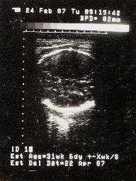
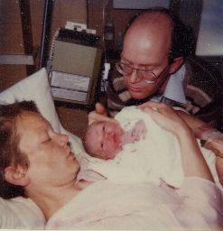
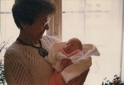
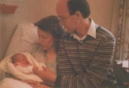
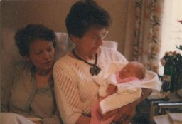
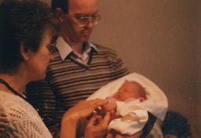

## April 1987

<table class="month">
<tr><th>Mo</th><th>Di</th><th>Mi</th><th>Do</th><th>Fr</th><th class="h2">Sa</th><th class="h1">So</th></tr>
<tr><td></td><td></td><td>1</td><td>2</td><td>3</td><td class="h2">4</td><td class="h1">5</td></tr>
<tr><td>6</td><td>7</td><td>8</td><td>9</td><td>10</td><td class="h2">11</td><td class="h1">12</td></tr>
<tr><td>13</td><td>14</td><td>15</td><td>16</td><td class="h1">17</td><td class="h2">18</td><td class="h1">19</td></tr>
<tr><td class="h1">20</td><td>21</td><td>22</td><td>23</td><td>24</td><td class="h2">25</td><td class="h1">26</td></tr>
<tr><td>27</td><td>28</td><td>29</td><td>30</td><td></td><td></td><td></td></tr>
</table>

Auch wenn diese erste Seite mit „April 1987“ überschrieben ist, das erste Bild von mir stammt vom 24. Februar 1987:

{:.gallery}
* [{: width="192" height="256"}<!--[-->](../files/1987-04/feb.jpg)

Das geschätzte Geburtsdatum ist dort mit 22. April angegeben, doch tatsächlich war es schon mehr als eine Woche früher so weit: Am 14. April, dem Dienstag der Karwoche, werde ich um die Mittagszeit geboren. Ich wiege 3290&nbsp;g und messe 48&nbsp;cm. Als Namen bekomme ich den zweiten Vornamen meines Papas, dieser Logik folgend würde ich Anna heißen, wenn ich ein Mädchen gewesen wäre.

{:.gallery}
* [{: width="247" height="256"}<!--[-->](../files/1987-04/geburt.jpg)

Zu Ostern kommen am 20. April Oma und Opa (= die Eltern meiner Mama; die Eltern meines Papas heißen Großmutter und Großvater, aus ökonomischen Überlegungen heraus: die kürzeren Namen gibt es für die mit der längeren Lebenserwartung) zu Besuch. Da auf den Fotos nur meine Oma zu sehen ist, nehme ich an, dass mein Opa die Bilder gemacht hat.

{:.gallery}
* [{: width="256" height="176"}<!--[-->](../files/1987-04/oma1.jpg)
* [{: width="256" height="175"}<!--[-->](../files/1987-04/oma2.jpg)
* [{: width="256" height="174"}<!--[-->](../files/1987-04/oma3.jpg)
* [{: width="256" height="176"}<!--[-->](../files/1987-04/oma4.jpg)

Bei der U2, der ersten Untersuchung durch meinen Kinderarzt, stellt dieser eine aurikuläre Fistelöffnung fest und impft mich gegen Tuberkulose.

Und mehr Bemerkenswertes ist in diesem Monat nicht mehr passiert.
