## Mai 1987

<table class="month">
<tr><th>Mo</th><th>Di</th><th>Mi</th><th>Do</th><th>Fr</th><th class="h2">Sa</th><th class="h1">So</th></tr>
<tr><td></td><td></td><td></td><td></td><td class="h1">1</td><td class="h2">2</td><td class="h1">3</td></tr>
<tr><td>4</td><td>5</td><td>6</td><td>7</td><td>8</td><td class="h2">9</td><td class="h1">10</td></tr>
<tr><td>11</td><td>12</td><td>13</td><td>14</td><td>15</td><td class="h2">16</td><td class="h1">17</td></tr>
<tr><td>18</td><td>19</td><td>20</td><td>21</td><td>22</td><td class="h2">23</td><td class="h1">24</td></tr>
<tr><td>25</td><td>26</td><td>27</td><td class="h1">28</td><td>29</td><td class="h2">30</td><td class="h1">31</td></tr>
</table>

Der Mai beginnt unspektakulär; es gibt ein paar Fotos, aber nichts wirklich Spannendes.

{:.gallery}
* [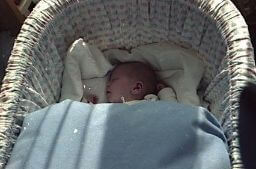{: width="256" height="169"}<!--[-->](../files/1987-05/bild1.jpg)
* [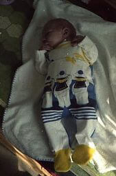{: width="169" height="256"}<!--[-->](../files/1987-05/bild2.jpg)
* [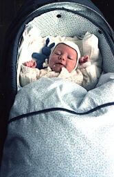{: width="166" height="256"}<!--[-->](../files/1987-05/bild3.jpg)
* [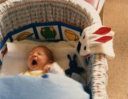{: width="256" height="199"}<!--[-->](../files/1987-05/bild4.jpg)

Auf dem letzten Bild kann auch sehen, dass ich bereits erste Bücher besitze – zumindest, wenn man Bilder-Leporellos aus mit Plastik ummanteltem Schaumstoff zu den Büchern zählt.

### Taufe

Ein Ereignis gibt es aber dann doch noch: Am 30. Mai werde ich getauft.

{:.gallery}
* [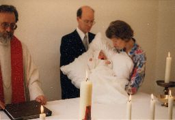{: width="256" height="176"}<!--[-->](../files/1987-05/taufe1.jpg)
* [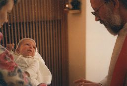{: width="256" height="173"}<!--[-->](../files/1987-05/taufe2.jpg)
* [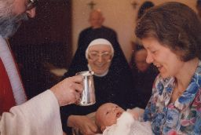{: width="256" height="172"}<!--[-->](../files/1987-05/taufe4.jpg)
* [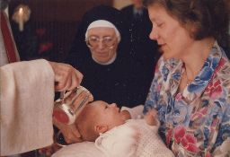{: width="256" height="175"}<!--[-->](../files/1987-05/taufe5.jpg)
* [{: width="256" height="173"}<!--[-->](../files/1987-05/taufe3.jpg)

Auf den Bildern sind neben mir und meinen Eltern natürlich auch der Priester zu sehen, aber der ist nicht irgendwer, sondern mein Onkel J. Er mag es immer ein paar ausgefallene Texte in seine Gottesdienste einzustreuen, so auch bei meiner Taufe. Daher wird statt der üblichen Lesung ein passender Auszug aus <i>Der Prophet</i> von Khalil Gibran gelesen. Als Evangelium folgt dann aber ganz klassisch Markus 10, 13–16, wenngleich nicht in der üblichen Einheitsübersetzung. Zur Überreichung der Taufkerze gibt es schließlich <i>Die sieben Flammen</i> von Huub Osterhuis.

Auch die Ordensschwester (die auch die Kapelle zur Verfügung gestellt hat) ist eine Verwandte, nämlich meine Tante I. Nicht zu sehen auf diesen Bildern ist meine Taufpatin und Cousine S., sowie die weitere Verwandtschaft väterlicherseits. Die ist erst auf den Fotos draußen zu sehen:

{:.gallery}
* [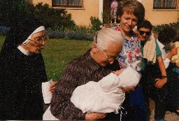{: width="256" height="173"}<!--[-->](../files/1987-05/taufe6.jpg)
* [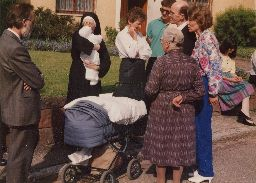{: width="256" height="183"}<!--[-->](../files/1987-05/taufe7.jpg)
* [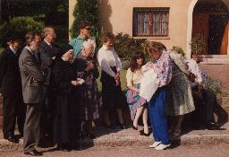{: width="256" height="175"}<!--[-->](../files/1987-05/taufe8.jpg)
* [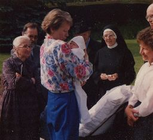{: width="256" height="234"}<!--[-->](../files/1987-05/taufe9.jpg)

Da gibt es meine Großeltern, die Großmutter hält mich auf dem ersten Bild im Arm und ist auch auf den anderen Bildern zu sehen, während mein Großvater (der mit dem Hut) sich eher im Hintergrund versteckt und meist mehr zu erahnen als zu sehen ist. Neben meinem Onkel J. (jetzt wieder in Zivil) und meiner Tante I. hat mein Papa noch zwei Geschwister: meine Tante W. und meinen Onkel A., der neben meinem Papa als einziger verheiratet ist. So habe ich noch eine Tante W. und zwei Cousinen, beide deutlich älter als ich. (Wer jetzt denkt, dass durch meine Abkürzungen sich die beiden Tanten nicht unterscheiden lassen, dem sei versichert, dass es auch mit vollem Namen nicht anders wäre.)

Auf dem ersten Foto ist die Taufkerze nur schwer zu erkennen, daher hier noch einige spätere Fotos in voller Größe:

{:.gallery}
* [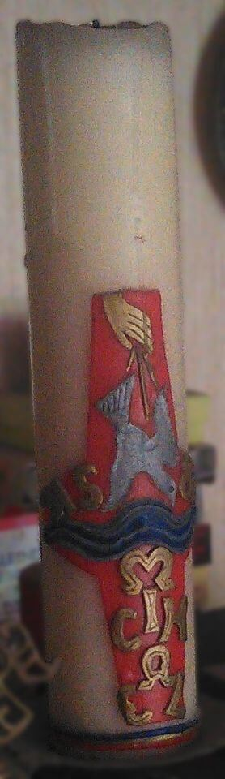{: width="278" height="960"}<!--[-->](../files/1987-05/taufkerze1.jpg)
* [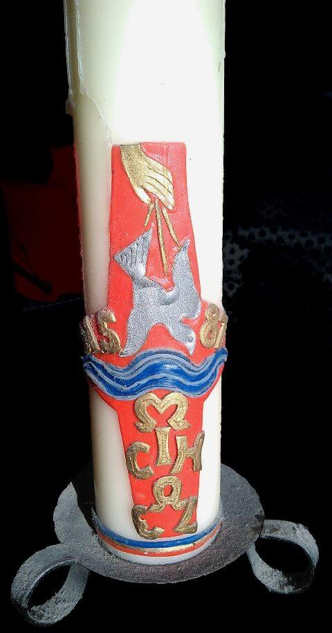{: width="480" height="913"}<!--[-->](../files/1987-05/taufkerze2.jpg)
* [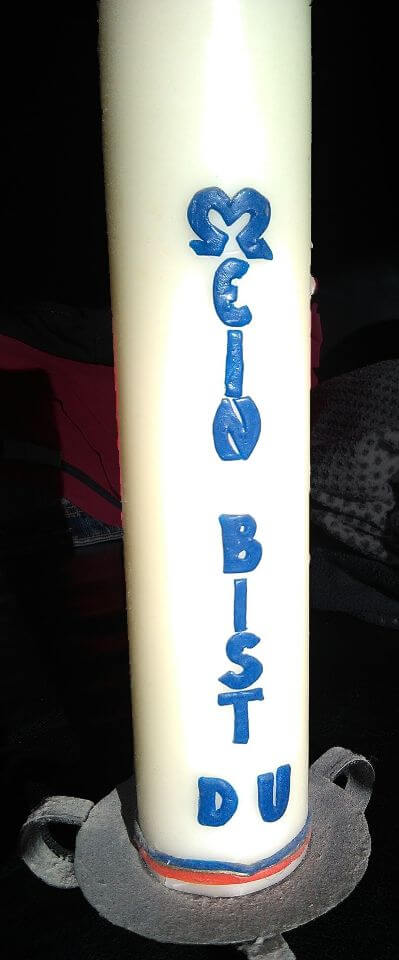{: width="399" height="960"}<!--[-->](../files/1987-05/taufkerze3.jpg)

Und nein, *ich* habe beim Datum keinen Fehler gemacht.