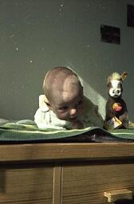
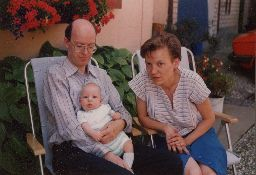

## Juni–Dezember 1987

<table class="month">
<caption>Juni</caption>
<tr><th>Mo</th><th>Di</th><th>Mi</th><th>Do</th><th>Fr</th><th class="h2">Sa</th><th class="h1">So</th></tr>
<tr><td>1</td><td>2</td><td>3</td><td>4</td><td>5</td><td class="h2">6</td><td class="h1">7</td></tr>
<tr><td class="h1">8</td><td>9</td><td>10</td><td>11</td><td>12</td><td class="h2">13</td><td class="h1">14</td></tr>
<tr><td>15</td><td>16</td><td class="h1">17</td><td class="h1">18</td><td>19</td><td class="h2">20</td><td class="h1">21</td></tr>
<tr><td>22</td><td>23</td><td>24</td><td>25</td><td>26</td><td class="h2">27</td><td class="h1">28</td></tr>
<tr><td>29</td><td>30</td><td></td><td></td><td></td><td></td><td></td></tr>
</table>
<table class="month">
<caption>Juli</caption>
<tr><th>Mo</th><th>Di</th><th>Mi</th><th>Do</th><th>Fr</th><th class="h2">Sa</th><th class="h1">So</th></tr>
<tr><td></td><td></td><td>1</td><td>2</td><td>3</td><td class="h2">4</td><td class="h1">5</td></tr>
<tr><td>6</td><td>7</td><td>8</td><td>9</td><td>10</td><td class="h2">11</td><td class="h1">12</td></tr>
<tr><td>13</td><td>14</td><td>15</td><td>16</td><td>17</td><td class="h2">18</td><td class="h1">19</td></tr>
<tr><td>20</td><td>21</td><td>22</td><td>23</td><td>24</td><td class="h2">25</td><td class="h1">26</td></tr>
<tr><td>27</td><td>28</td><td>29</td><td>30</td><td>31</td><td></td><td></td></tr>
</table>
<table class="month">
<caption>August</caption>
<tr><th>Mo</th><th>Di</th><th>Mi</th><th>Do</th><th>Fr</th><th class="h2">Sa</th><th class="h1">So</th></tr>
<tr><td></td><td></td><td></td><td></td><td></td><td class="h2">1</td><td class="h1">2</td></tr>
<tr><td>3</td><td>4</td><td>5</td><td>6</td><td>7</td><td class="h2">8</td><td class="h1">9</td></tr>
<tr><td>10</td><td>11</td><td>12</td><td>13</td><td>14</td><td class="h2">15</td><td class="h1">16</td></tr>
<tr><td>17</td><td>18</td><td>19</td><td>20</td><td>21</td><td class="h2">22</td><td class="h1">23</td></tr>
<tr><td>24</td><td>25</td><td>26</td><td>27</td><td>28</td><td class="h2">29</td><td class="h1">30</td></tr>
<tr><td>31</td><td></td><td></td><td></td><td></td><td></td><td></td></tr>
</table>
<table class="month">
<caption>September</caption>
<tr><th>Mo</th><th>Di</th><th>Mi</th><th>Do</th><th>Fr</th><th class="h2">Sa</th><th class="h1">So</th></tr>
<tr><td></td><td>1</td><td>2</td><td>3</td><td>4</td><td class="h2">5</td><td class="h1">6</td></tr>
<tr><td>7</td><td>8</td><td>9</td><td>10</td><td>11</td><td class="h2">12</td><td class="h1">13</td></tr>
<tr><td>14</td><td>15</td><td>16</td><td>17</td><td>18</td><td class="h2">19</td><td class="h1">20</td></tr>
<tr><td>21</td><td>22</td><td>23</td><td>24</td><td>25</td><td class="h2">26</td><td class="h1">27</td></tr>
<tr><td>28</td><td>29</td><td>30</td><td></td><td></td><td></td><td></td></tr>
</table>
<table class="month">
<caption>Oktober</caption>
<tr><th>Mo</th><th>Di</th><th>Mi</th><th>Do</th><th>Fr</th><th class="h2">Sa</th><th class="h1">So</th></tr>
<tr><td></td><td></td><td></td><td>1</td><td>2</td><td class="h2">3</td><td class="h1">4</td></tr>
<tr><td>5</td><td>6</td><td>7</td><td>8</td><td>9</td><td class="h2">10</td><td class="h1">11</td></tr>
<tr><td>12</td><td>13</td><td>14</td><td>15</td><td>16</td><td class="h2">17</td><td class="h1">18</td></tr>
<tr><td>19</td><td>20</td><td>21</td><td>22</td><td>23</td><td class="h2">24</td><td class="h1">25</td></tr>
<tr><td>26</td><td>27</td><td>28</td><td>29</td><td>30</td><td class="h2">31</td><td></td></tr>
</table>
<table class="month">
<caption>November</caption>
<tr><th>Mo</th><th>Di</th><th>Mi</th><th>Do</th><th>Fr</th><th class="h2">Sa</th><th class="h1">So</th></tr>
<tr><td></td><td></td><td></td><td></td><td></td><td></td><td class="h1">1</td></tr>
<tr><td>2</td><td>3</td><td>4</td><td>5</td><td>6</td><td class="h2">7</td><td class="h1">8</td></tr>
<tr><td>9</td><td>10</td><td>11</td><td>12</td><td>13</td><td class="h2">14</td><td class="h1">15</td></tr>
<tr><td>16</td><td>17</td><td class="h1">18</td><td>19</td><td>20</td><td class="h2">21</td><td class="h1">22</td></tr>
<tr><td>23</td><td>24</td><td>25</td><td>26</td><td>27</td><td class="h2">28</td><td class="h1">29</td></tr>
<tr><td>30</td><td></td><td></td><td></td><td></td><td></td><td></td></tr>
</table>
<table class="month">
<caption>Dezember</caption>
<tr><th>Mo</th><th>Di</th><th>Mi</th><th>Do</th><th>Fr</th><th class="h2">Sa</th><th class="h1">So</th></tr>
<tr><td></td><td>1</td><td>2</td><td>3</td><td>4</td><td class="h2">5</td><td class="h1">6</td></tr>
<tr><td>7</td><td>8</td><td>9</td><td>10</td><td>11</td><td class="h2">12</td><td class="h1">13</td></tr>
<tr><td>14</td><td>15</td><td>16</td><td>17</td><td>18</td><td class="h2">19</td><td class="h1">20</td></tr>
<tr><td>21</td><td>22</td><td>23</td><td class="h2">24</td><td class="h1">25</td><td class="h1">26</td><td class="h1">27</td></tr>
<tr><td>28</td><td>29</td><td>30</td><td class="h2">31</td><td></td><td></td><td></td></tr>
</table>

Im restlichen Jahr ist einfach so wenig passiert, dass ich die Monate zusammenfasse.

Eines meiner ersten Kuscheltiere ist ein Steiff-Pferd (das natürlich bei weitem nicht mein einziges Kuscheltier ist); das letzte Foto ist eine spätere Aufnahme um es noch einmal im Großformat zu zeigen:

{:.gallery}
* [{: width="168" height="256"}<!--[-->](../files/1987-06/pferd1.jpg)
* [{: width="168" height="256"}<!--[-->](../files/1987-06/pferd2.jpg)
* [{: width="219" height="256"}<!--[-->](../files/1987-06/pferd3.jpg)
* [{: width="480" height="360"}<!--[-->](../files/1987-06/pferd4.jpg)

Am 24. Juni bekomme ich ein Päckchen von meiner Oma mit dieser Karte:

{:.letter}
> 
24. 6. 87

>
> Lieber Michael!
>
> Das sind die Strampelhöschen, die Deine Oma schon vor Deiner Geburt gekauft hat, deswegen auch in gelb, u. eigentlich zu Ostern mitbringen wollte. Aber da Deine Oma Geschenke immer gut wegsteckt, (das wirst Du schon noch öfters erleben!) findet sie die Sachen meistens nicht zum geeigneten Zeitpunkt, sonder ab u. zu mal später. Im Allgemeinen ist das ja nicht so schlimm, aber bei Strampelhöschen in Gr. 68 kann es in diesem Fall doch etwas zu spät sein. Solltest Du dieser Größe bereits entwachsen sein, dann soll sie Deine Mami für’s Schwesterlein aufheben.
>
> Wir sind ja froh, wenn Du wächst und gedeihst; aber ich möchte mich auch gerne selbst davon überzeugen.
>
> Wann kommst Du endlich mal nach Landau?
>
> Im Garten blühen viele bunte Blumen u. die Kirschen u. Johannisbeeren werden reif. Bettel mal schön bei Deinen Eltern, damit sie mit Dir herfahren.
>
> Ansonsten liebe Grüße an alle u. für Dich einen süßen Schmatz 
> Deine Oma

Also unternehmen wir einen Ausflug. Zunächst geht es zu meiner Uroma.

{:.gallery}
* [{: width="256" height="175"}<!--[-->](../files/1987-06/ausflug1.jpg)
* [{: width="256" height="173"}<!--[-->](../files/1987-06/ausflug2.jpg)
* [{: width="256" height="176"}<!--[-->](../files/1987-06/ausflug3.jpg)
* [{: width="256" height="175"}<!--[-->](../files/1987-06/ausflug4.jpg)

Von meiner Uroma geht es dann zum Haus von Oma und Opa. Die beiden haben ein großes Haus, immerhin haben da mal vier Kinder darin gelebt, außer meiner Mama auch noch drei Onkel. Wie meine Oma geschrieben hat, gehört zum Haus auch ein Garten, in dem sind die Fotos entstanden.

{:.gallery}
* [{: width="256" height="175"}<!--[-->](../files/1987-06/ausflug5.jpg)
* [{: width="175" height="256"}<!--[-->](../files/1987-06/ausflug6.jpg)
* [{: width="174" height="256"}<!--[-->](../files/1987-06/ausflug7.jpg)

Ansonsten gibt es in diesem Jahr noch etliche Fotos, die daheim gemacht wurden.

{:.gallery}
* [{: width="171" height="256"}<!--[-->](../files/1987-06/bild01.jpg)
* [{: width="173" height="256"}<!--[-->](../files/1987-06/bild02.jpg)
* [{: width="173" height="256"}<!--[-->](../files/1987-06/bild03.jpg)
* [{: width="171" height="256"}<!--[-->](../files/1987-06/bild04.jpg)
* [{: width="174" height="256"}<!--[-->](../files/1987-06/bild05.jpg)
* [{: width="256" height="175"}<!--[-->](../files/1987-06/bild06.jpg)
* [{: width="256" height="173"}<!--[-->](../files/1987-06/bild07.jpg)
* [{: width="173" height="256"}<!--[-->](../files/1987-06/bild08.jpg)
* [{: width="174" height="256"}<!--[-->](../files/1987-06/bild09.jpg)
* [{: width="168" height="256"}<!--[-->](../files/1987-06/bild10.jpg)
* [{: width="174" height="256"}<!--[-->](../files/1987-06/bild11.jpg)
* [{: width="256" height="171"}<!--[-->](../files/1987-06/bild12.jpg)
* [{: width="256" height="170"}<!--[-->](../files/1987-06/bild13.jpg)

Die Lieblingstiere meines Papas sind übrigens Vögel im Allgemeinen und Hähne im Speziellen. (Mit anderen Worten, das Kissen im Hintergrund – unten noch einmal groß – ist *sein* Kissen.)

{:.gallery}
* [{: width="480" height="510"}<!--[-->](../files/1987-06/kissen.jpg)

Im Lauf des Jahres werde ich auch gegen Polio, Diphtherie und Tetanus geimpft.

Zu Nikolaus bekomme ich wieder ein Päckchen von meiner Oma:

{:.letter}
> 
Landau, 4. Dez. 87

>
> Lieber Michael!
>
> Normalerweise bekommt man vom Nikolaus den Stiefel gefüllt oder Strümpfe. Du bekommst dieses Jahr ein Mützchen, so wie es Deine Mutter gewünscht hat. Nur befürchte ich, daß es doch noch zu groß ist. Ich habe mich maschenzahlmäßig an die Beschreibung gehalten (sie ist bestimmt 30! Jahre alt) für 3–6 Monate. Onkel P. u. T. hatten bereits solche Mützen u. T. ja auch. Er bezweifelt, ob sowas noch „modern“ ist; auf jeden Fall praktisch. Das Entchen soll Dir beim Baden Gesellschaft leisten.
>
> Die „Versucherle“ sind vom ersten Weihnachtsgebäck für dieses Jahr. Liebe Grüße auch an Deine Eltern u. einen dicken Schmatz 
> von Deiner Oma