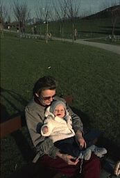
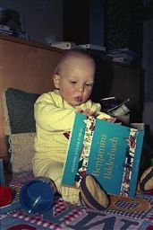
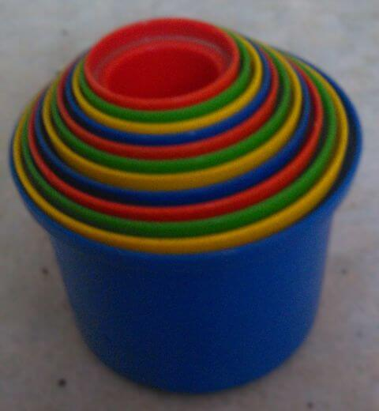

## Januar–April 1988

<table class="month">
<caption>Januar</caption>
<tr><th>Mo</th><th>Di</th><th>Mi</th><th>Do</th><th>Fr</th><th class="h2">Sa</th><th class="h1">So</th></tr>
<tr><td></td><td></td><td></td><td></td><td class="h1">1</td><td class="h2">2</td><td class="h1">3</td></tr>
<tr><td>4</td><td>5</td><td class="h1">6</td><td>7</td><td>8</td><td class="h2">9</td><td class="h1">10</td></tr>
<tr><td>11</td><td>12</td><td>13</td><td>14</td><td>15</td><td class="h2">16</td><td class="h1">17</td></tr>
<tr><td>18</td><td>19</td><td>20</td><td>21</td><td>22</td><td class="h2">23</td><td class="h1">24</td></tr>
<tr><td>25</td><td>26</td><td>27</td><td>28</td><td>29</td><td class="h2">30</td><td class="h1">31</td></tr>
</table>
<table class="month">
<caption>Februar</caption>
<tr><th>Mo</th><th>Di</th><th>Mi</th><th>Do</th><th>Fr</th><th class="h2">Sa</th><th class="h1">So</th></tr>
<tr><td>1</td><td>2</td><td>3</td><td>4</td><td>5</td><td class="h2">6</td><td class="h1">7</td></tr>
<tr><td>8</td><td>9</td><td>10</td><td>11</td><td>12</td><td class="h2">13</td><td class="h1">14</td></tr>
<tr><td class="h2">15</td><td>16</td><td>17</td><td>18</td><td>19</td><td class="h2">20</td><td class="h1">21</td></tr>
<tr><td>22</td><td>23</td><td>24</td><td>25</td><td>26</td><td class="h2">27</td><td class="h1">28</td></tr>
<tr><td>29</td><td></td><td></td><td></td><td></td><td></td><td></td></tr>
</table>
<table class="month">
<caption>März</caption>
<tr><th>Mo</th><th>Di</th><th>Mi</th><th>Do</th><th>Fr</th><th class="h2">Sa</th><th class="h1">So</th></tr>
<tr><td></td><td>1</td><td>2</td><td>3</td><td>4</td><td class="h2">5</td><td class="h1">6</td></tr>
<tr><td>7</td><td>8</td><td>9</td><td>10</td><td>11</td><td class="h2">12</td><td class="h1">13</td></tr>
<tr><td>14</td><td>15</td><td>16</td><td>17</td><td>18</td><td class="h2">19</td><td class="h1">20</td></tr>
<tr><td>21</td><td>22</td><td>23</td><td>24</td><td>25</td><td class="h2">26</td><td class="h1">27</td></tr>
<tr><td>28</td><td>29</td><td>30</td><td>31</td><td></td><td></td><td></td></tr>
</table>
<table class="month">
<caption>April</caption>
<tr><th>Mo</th><th>Di</th><th>Mi</th><th>Do</th><th>Fr</th><th class="h2">Sa</th><th class="h1">So</th></tr>
<tr><td></td><td></td><td></td><td></td><td class="h1">1</td><td class="h2">2</td><td class="h1">3</td></tr>
<tr><td class="h1">4</td><td>5</td><td>6</td><td>7</td><td>8</td><td class="h2">9</td><td class="h1">10</td></tr>
<tr><td>11</td><td>12</td><td>13</td><td>14</td><td>15</td><td class="h2">16</td><td class="h1">17</td></tr>
<tr><td>18</td><td>19</td><td>20</td><td>21</td><td>22</td><td class="h2">23</td><td class="h1">24</td></tr>
<tr><td>25</td><td>26</td><td>27</td><td>28</td><td>29</td><td class="h2">30</td><td></td></tr>
</table>

Auch im Jahr 1988 ist so wenig passiert, dass ich wieder mehrere Monate zusammenfasse.

Mit dem neuen Jahr beginne ich Zeitschriften – nun, nicht gerade zu *lesen* – anzuschauen und manchmal ein bisschen zu zerfleddern. Dem <i>Junior</i>-Heft vom Januar 1988 fehlen daher bald ein paar Seiten, während das <i>Medizini</i>-Heft des selben Monats sich besser hält. Beide Hefte werden im Laufe der Zeit regelmäßige Sammelstücke (und später, viel später auch Lektüre). Da die Wohnung meiner Großeltern über einem Salamander-Schuhgeschäft liegt, stammen auch meine ersten <i>Lurchi</i>-Hefte aus dieser Zeit.

Am 19. Januar bekomme ich meinen ersten Zahn, zwei Tage darauf den zweiten. Am 14. Februar bekomme ich zum ersten Mal Fleisch zu essen und am 25. Februar zum letzten Mal Muttermilch.

Außerdem gibt es jede Menge Fotos (manche davon sogar datiert):

{:.gallery}
* [{: width="169" height="256"}<!--[-->](../files/1988-01/bild01.jpg)

  31\. Januar
* [{: width="171" height="256"}<!--[-->](../files/1988-01/bild02.jpg)
* [{: width="171" height="256"}<!--[-->](../files/1988-01/bild03.jpg)
* [{: width="169" height="256"}<!--[-->](../files/1988-01/bild04.jpg)

  11\. Februar
* [{: width="170" height="256"}<!--[-->](../files/1988-01/bild05.jpg)
* [{: width="173" height="256"}<!--[-->](../files/1988-01/bild06.jpg)

  15\. Februar
* [{: width="173" height="256"}<!--[-->](../files/1988-01/bild07.jpg)

  29\. Februar
* [{: width="172" height="256"}<!--[-->](../files/1988-01/bild08.jpg)
* [{: width="172" height="256"}<!--[-->](../files/1988-01/bild09.jpg)

  6\. März bei Oma und Opa
* [{: width="172" height="256"}<!--[-->](../files/1988-01/bild10.jpg)
* [{: width="193" height="256"}<!--[-->](../files/1988-01/bild12.jpg)
* [{: width="205" height="256"}<!--[-->](../files/1988-01/bild11.jpg)
* [{: width="243" height="256"}<!--[-->](../files/1988-01/bild13.jpg)
* [{: width="173" height="256"}<!--[-->](../files/1988-01/bild14.jpg)

  wieder daheim
* [{: width="174" height="256"}<!--[-->](../files/1988-01/bild15.jpg)
* [{: width="170" height="256"}<!--[-->](../files/1988-01/bild16.jpg)

  10\. April
* [{: width="200" height="256"}<!--[-->](../files/1988-01/bild17.jpg)

Neben der Tatsache, dass ich inzwischen stehen kann, wenn ich mich irgendwo hochziehe, kann man auf den beiden letzten Fotos einen Steiff-Hahn mit Spieluhr, ein Igel-Mobile und ein Stickbild sehen, das meine Oma gemacht hat. Und auf den Bildern, die bei Oma und Opa gemacht wurden, zeigt sich sehr deutlich mein Interesse für Bücher, das ich von meinen Eltern geerbt habe.

Hier noch einmal der Hahn und das Stickbild in voller Größe auf späteren Fotos:

{:.gallery}
* [{: width="480" height="659"}<!--[-->](../files/1988-01/hahn.jpg)
* [{: width="480" height="550"}<!--[-->](../files/1988-01/stickbild.jpg)

Und apropos Kinderwagen: Mein Papa fährt mit mir oft an einem noblen Restaurant vorbei, wo wir meist ein bisschen stehen bleiben und den Köchen durchs Fenster zuschauen. Einmal bereiten sie dort Muscheln zu, und ich bekomme zwei wunderschöne große Muschelschalen geschenkt.

{:.gallery}
* [{: width="480" height="480"}<!--[-->](../files/1988-01/muschel.jpg)

### Geburtstag

Dann kommt mein erster Geburtstag.

{:.gallery}
* [{: width="172" height="256"}<!--[-->](../files/1988-01/geburtstag1.jpg)
* [{: width="172" height="256"}<!--[-->](../files/1988-01/geburtstag2.jpg)
* [{: width="175" height="256"}<!--[-->](../files/1988-01/geburtstag3.jpg)
* [{: width="171" height="256"}<!--[-->](../files/1988-01/geburtstag4.jpg)

Die Buchstaben-Decke, auf der ich sitze, hat meine Oma gestickt. Ich bekomme ein Bilderbuch geschenkt, <i>Benjamins Bilderbuch</i> von Susanne Müller-Firgau.

Außerdem gibt es als Spielzeug einen Satz Stapelbecher. Die sind wirklich klug durchdacht: 12 Becher in vier Farben, einer größer als der andere. Alle zeigen oben ein Tier, je größer der Becher, desto größer das Tier, vom kleinen Vögelchen bis zum Elefanten. Die Becher lassen sich passgenau ineinander stecken und nehmen dann nur wenig Platz weg. Wenn man sie aufstapelt, so halten sie durch einen erhöhten Rand stabil aufeinander fest. Man kann aber auch nur die Becher einer Farbe aufstapeln, durch einen Innenring stehen sie auch dabei stabil aufeinander. Wirklich, ein sehr klug konzipiertes Spielzeug. Daher hier nochmal in groß:

{:.gallery}
* [{: width="480" height="520"}<!--[-->](../files/1988-01/becher1.jpg)
* [{: width="480" height="675"}<!--[-->](../files/1988-01/becher2.jpg)
* [{: width="218" height="960"}<!--[-->](../files/1988-01/becher3.jpg)

Und ich bekomme noch einen Brief von meinen Großeltern und meiner Tante:

{:.letter}
> Lieber Michael, 
> Du wirst ein Jahr alt. Das ist ein wichtiger Gedenktag. Vor einem Jahr freuten wir uns alle sehr über Deine Geburt und diese Freude wird an jedem Geburtstag neu lebendig. Deine Großmutter und Dein Großvater sind darüber sehr glücklich, daß Du ein so gesundes, fröhliches Kind bist und wünschen Dir für’s neue Lebensjahr und die kommenden, daß Du wie an Alter so auch an Weisheit und Wohlgefallen vor Gott und den Menschen zunehmen mögest.
>
> Gott segne und behüte Dich. 
> Deine [Großmutter und Großvater] 
> und Deine Tante I.
>
> Mein lieber Michael!
>
> Zu Deinem 1. Geburtstag Gottes Gnade u. Segen u. die Begleitung Deines großen Namenspatrons wünscht Dir 
> Deine Dich s[e]g[nende] Großmutter
>
> Deine Eltern bitte ich Dir eine schöne W.-Krippe mit einem leuchtenden Stern zu kaufen.

Der Rest ist leider nicht zu lesen, da die Sehkraft meiner Großmutter deutlich abnimmt und die Schrift dadurch nur mit Mühe (und bisweilen gar nicht) zu entziffern ist.

Zwei Tage nach meinem Geburtstag ist es so warm, dass ich draußen auf einer Decke sitzen kann.

{:.gallery}
* [{: width="170" height="256"}<!--[-->](../files/1988-01/bild18.jpg)