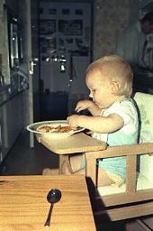
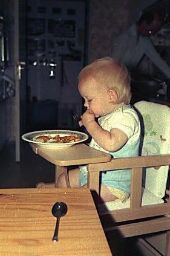
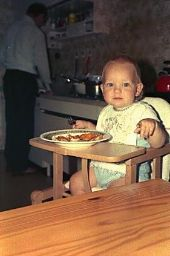
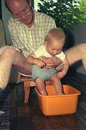
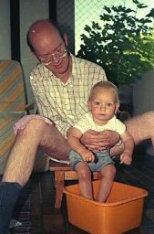
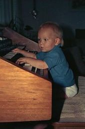
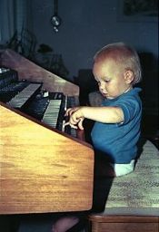
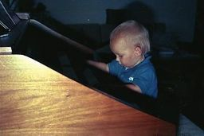

## Mai–August 1988

<table class="month">
<caption>Mai</caption>
<tr><th>Mo</th><th>Di</th><th>Mi</th><th>Do</th><th>Fr</th><th class="h2">Sa</th><th class="h1">So</th></tr>
<tr><td></td><td></td><td></td><td></td><td></td><td></td><td class="h1">1</td></tr>
<tr><td>2</td><td>3</td><td>4</td><td>5</td><td>6</td><td class="h2">7</td><td class="h1">8</td></tr>
<tr><td>9</td><td>10</td><td>11</td><td class="h1">12</td><td>13</td><td class="h2">14</td><td class="h1">15</td></tr>
<tr><td>16</td><td>17</td><td>18</td><td>19</td><td>20</td><td class="h2">21</td><td class="h1">22</td></tr>
<tr><td class="h1">23</td><td>24</td><td>25</td><td>26</td><td>27</td><td class="h2">28</td><td class="h1">29</td></tr>
<tr><td>30</td><td>31</td><td></td><td></td><td></td><td></td><td></td></tr>
</table>
<table class="month">
<caption>Juni</caption>
<tr><th>Mo</th><th>Di</th><th>Mi</th><th>Do</th><th>Fr</th><th class="h2">Sa</th><th class="h1">So</th></tr>
<tr><td></td><td></td><td>1</td><td class="h1">2</td><td>3</td><td class="h2">4</td><td class="h1">5</td></tr>
<tr><td>6</td><td>7</td><td>8</td><td>9</td><td>10</td><td class="h2">11</td><td class="h1">12</td></tr>
<tr><td>13</td><td>14</td><td>15</td><td>16</td><td class="h1">17</td><td class="h2">18</td><td class="h1">19</td></tr>
<tr><td>20</td><td>21</td><td>22</td><td>23</td><td>24</td><td class="h2">25</td><td class="h1">26</td></tr>
<tr><td>27</td><td>28</td><td>29</td><td>30</td><td></td><td></td><td></td></tr>
</table>
<table class="month">
<caption>Juli</caption>
<tr><th>Mo</th><th>Di</th><th>Mi</th><th>Do</th><th>Fr</th><th class="h2">Sa</th><th class="h1">So</th></tr>
<tr><td></td><td></td><td></td><td></td><td>1</td><td class="h2">2</td><td class="h1">3</td></tr>
<tr><td>4</td><td>5</td><td>6</td><td>7</td><td>8</td><td class="h2">9</td><td class="h1">10</td></tr>
<tr><td>11</td><td>12</td><td>13</td><td>14</td><td>15</td><td class="h2">16</td><td class="h1">17</td></tr>
<tr><td>18</td><td>19</td><td>20</td><td>21</td><td>22</td><td class="h2">23</td><td class="h1">24</td></tr>
<tr><td>25</td><td>26</td><td>27</td><td>28</td><td>29</td><td class="h2">30</td><td class="h1">31</td></tr>
</table>
<table class="month">
<caption>August</caption>
<tr><th>Mo</th><th>Di</th><th>Mi</th><th>Do</th><th>Fr</th><th class="h2">Sa</th><th class="h1">So</th></tr>
<tr><td>1</td><td>2</td><td>3</td><td>4</td><td>5</td><td class="h2">6</td><td class="h1">7</td></tr>
<tr><td>8</td><td>9</td><td>10</td><td>11</td><td>12</td><td class="h2">13</td><td class="h1">14</td></tr>
<tr><td>15</td><td>16</td><td>17</td><td>18</td><td>19</td><td class="h2">20</td><td class="h1">21</td></tr>
<tr><td>22</td><td>23</td><td>24</td><td>25</td><td>26</td><td class="h2">27</td><td class="h1">28</td></tr>
<tr><td>29</td><td>30</td><td>31</td><td></td><td></td><td></td><td></td></tr>
</table>

Aus den nächsten Monaten des Jahres 1988 gibt es wie immer ein paar Fotos.

Diese Fotos vom 19. Juli zeigen mich, wie ich in der Küche einen Teller Gemüse esse, im Hintergrund mein Papa, der bei uns der Koch ist.

{:.gallery}
* [{: width="170" height="256"}<!--[-->](../files/1988-05/kueche1.jpg)
* [{: width="170" height="256"}<!--[-->](../files/1988-05/kueche2.jpg)
* [{: width="170" height="256"}<!--[-->](../files/1988-05/kueche3.jpg)

Vier Tage darauf auf unserem Balkon:

{:.gallery}
* [{: width="170" height="256"}<!--[-->](../files/1988-05/balkon1.jpg)
* [{: width="169" height="256"}<!--[-->](../files/1988-05/balkon2.jpg)

Am 29. Juli (falls das Datum auf den Fotos stimmt, denn gerade an diesem Tag erhalte ich auch nachweislich einige Impfungen, unter anderem gegen Masern und Mumps) sind wir mal wieder bei Oma und Opa, und wäre da nicht das zweite Bild, könnte man fast meinen, ich könne auf der elektrischen Orgel tatsächlich spielen.

{:.gallery}
* [{: width="170" height="256"}<!--[-->](../files/1988-05/orgel1.jpg)
* [{: width="175" height="256"}<!--[-->](../files/1988-05/orgel2.jpg)
* [{: width="256" height="171"}<!--[-->](../files/1988-05/orgel3.jpg)

### Unsere Wohnung

Da es für diese Monate nicht so viele Fotos gibt, will ich die Seite noch etwas füllen, indem ich unsere Wohnung beschreibe. So kann man auch die Bilder besser einordnen.

Betritt man die Wohnung, so kommt man in den vorderen Flur. An seinen Wänden hängen viele Postkarten von mittelalterlichen Burgen. (Auf den obigen Fotos kann man sie durch die offene Küchentür erahnen.) Vom Flur gehen mehrere Zimmer ab: Nach rechts eine kleine Vorratskammer mit Gefrierschrank. Direkt geradeaus das Zimmer, das früher einmal das Zimmer meiner Mama war, jetzt aber immer mehr zu meinem Zimmer wird. Darin stehen unter anderem ein alter Kleiderschrank und ein Sofa. Vor dem Fenster führt die Bahnlinie vorbei. Neben meinem Zimmer befindet sich die Küche. Von der Küche könnte man eigentlich direkt ins Wohnzimmer gehen, aber diese Tür ist durch eine große Korkpinnwand verschlossen. So gelangt man nur vom Flur aus durch einen Vorhang ins Wohnzimmer. Außerdem kommt man vom Flur noch ins Gäste-WC, das bei uns „Elle“ heißt, weil an der Tür ein Poster mit einem Elefant hängt.

Kommen wir nun ins Wohnzimmer. Eine Wand ist im japanischen Stil gestaltet (teilweise zu sehen auf den Geburtstagsfotos vom letzten Mal), an der Wand zur Küche stehen Truhen, unter anderem mit Schallplatten. (Diese Schreinerarbeiten hat alle mein Großvater durchgeführt.) Ein Sofa gibt es auch. Vom Wohnzimmer aus gelangt man einerseits auf den Balkon (der schon auf vielen Fotos zu sehen war und der eigentlich nur teilweise ein Balkon, zum anderen Teil eine Loggia ist), andererseits durch einen weiteren Vorhang in den hinteren Flur. Dessen Wände sind mit Bildern aus dem Codex Manesse geschmückt und von ihm gehen die letzten drei Zimmer ab:

Zum einen das Arbeitszimmer meines Papas. Vor dem Fenster, das auf den Balkon blickt, steht sein Schreibtisch, daneben in den Raum ragend ein kleineres Tischchen mit Schreibmaschine. Vor allem aber gibt es Bücher, Bücher und nochmals Bücher, von Clare Turlay Newberrys Kinderbuch <i>Molly</i> bis hin zur signierten Originalausgabe von Arno Schmidts <i>Zettels Traum</i>, von Abraham a Santa Clara bis Anshelm von Zigler, vom Alten Testament auf Hebräisch bis zum Koran, von Lehrbüchern des Russischen über Mongolisch bis Japanisch, von <i>The Cantos</i> von Ezra Pound bis zu Federico Garcia Lorcas <i>Obras Completas</i>. Mit <i>Mittelalterliches Franken – ein Reisehandbuch</i> und <i>Unsere befestigten Städte des Mittelalters</i> auch zwei Bücher, die er selber geschrieben hat. Und jede Menge Bücher mehr. (Und natürlich gibt es auch in den meisten anderen Zimmern Bücher.)

Die beiden weiteren Zimmer sind das Schlafzimmer meiner Eltern und das Badezimmer mit Waschmaschine und Badewanne. Zur Wohnung gehört außerdem noch ein Kellerabteil, in dem es vor allem Wein gibt, aber auch einen Schlitten, den Weihnachtsbaumständer und den Stall für die Weihnachtskrippe.
