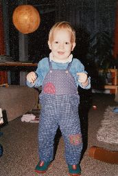

## September–Dezember 1988

<table class="month">
<caption>September</caption>
<tr><th>Mo</th><th>Di</th><th>Mi</th><th>Do</th><th>Fr</th><th class="h2">Sa</th><th class="h1">So</th></tr>
<tr><td></td><td></td><td></td><td>1</td><td>2</td><td class="h2">3</td><td class="h1">4</td></tr>
<tr><td>5</td><td>6</td><td>7</td><td>8</td><td>9</td><td class="h2">10</td><td class="h1">11</td></tr>
<tr><td>12</td><td>13</td><td>14</td><td>15</td><td>16</td><td class="h2">17</td><td class="h1">18</td></tr>
<tr><td>19</td><td>20</td><td>21</td><td>22</td><td>23</td><td class="h2">24</td><td class="h1">25</td></tr>
<tr><td>26</td><td>27</td><td>28</td><td>29</td><td>30</td><td></td><td></td></tr>
</table>
<table class="month">
<caption>Oktober</caption>
<tr><th>Mo</th><th>Di</th><th>Mi</th><th>Do</th><th>Fr</th><th class="h2">Sa</th><th class="h1">So</th></tr>
<tr><td></td><td></td><td></td><td></td><td></td><td class="h2">1</td><td class="h1">2</td></tr>
<tr><td>3</td><td>4</td><td>5</td><td>6</td><td>7</td><td class="h2">8</td><td class="h1">9</td></tr>
<tr><td>10</td><td>11</td><td>12</td><td>13</td><td>14</td><td class="h2">15</td><td class="h1">16</td></tr>
<tr><td>17</td><td>18</td><td>19</td><td>20</td><td>21</td><td class="h2">22</td><td class="h1">23</td></tr>
<tr><td>24</td><td>25</td><td>26</td><td>27</td><td>28</td><td class="h2">29</td><td class="h1">30</td></tr>
<tr><td>31</td><td></td><td></td><td></td><td></td><td></td><td></td></tr>
</table>
<table class="month">
<caption>November</caption>
<tr><th>Mo</th><th>Di</th><th>Mi</th><th>Do</th><th>Fr</th><th class="h2">Sa</th><th class="h1">So</th></tr>
<tr><td></td><td class="h1">1</td><td>2</td><td>3</td><td>4</td><td class="h2">5</td><td class="h1">6</td></tr>
<tr><td>7</td><td>8</td><td>9</td><td>10</td><td>11</td><td class="h2">12</td><td class="h1">13</td></tr>
<tr><td>14</td><td>15</td><td class="h1">16</td><td>17</td><td>18</td><td class="h2">19</td><td class="h1">20</td></tr>
<tr><td>21</td><td>22</td><td>23</td><td>24</td><td>25</td><td class="h2">26</td><td class="h1">27</td></tr>
<tr><td>28</td><td>29</td><td>30</td><td></td><td></td><td></td><td></td></tr>
</table>
<table class="month">
<caption>Dezember</caption>
<tr><th>Mo</th><th>Di</th><th>Mi</th><th>Do</th><th>Fr</th><th class="h2">Sa</th><th class="h1">So</th></tr>
<tr><td></td><td></td><td></td><td>1</td><td>2</td><td class="h2">3</td><td class="h1">4</td></tr>
<tr><td>5</td><td>6</td><td>7</td><td>8</td><td>9</td><td class="h2">10</td><td class="h1">11</td></tr>
<tr><td>12</td><td>13</td><td>14</td><td>15</td><td>16</td><td class="h2">17</td><td class="h1">18</td></tr>
<tr><td>19</td><td>20</td><td>21</td><td>22</td><td>23</td><td class="h2">24</td><td class="h1">25</td></tr>
<tr><td class="h1">26</td><td>27</td><td>28</td><td>29</td><td>30</td><td class="h2">31</td><td></td></tr>
</table>

Von den restlichen Monaten des Jahres 1988 gibt es wieder einige Fotos.

Ein paar Bilder vom September: (Unter der Annahme, dass die Daten korrekt sind, die auf der Rückseite notiert sind. Aber es gibt ein weiteres Foto von einer Kletterpflanze auf dem Balkon dazwischen, dessen Datum *nicht* zwischen den anderen Daten liegt, also sind diese nicht sonderlich vertrauenerweckend.)

{:.gallery}
* [{: width="172" height="256"}<!--[-->](../files/1988-09/kueche1.jpg)

  21\. September: Zumindest *stehen* kann ich schon ziemlich gut
* [{: width="171" height="256"}<!--[-->](../files/1988-09/kueche2.jpg)

  25\. September
* [{: width="172" height="256"}<!--[-->](../files/1988-09/kueche3.jpg)
* [{: width="171" height="256"}<!--[-->](../files/1988-09/kueche4.jpg)

Am 2. Oktober besuchen wir meine Großeltern, die Großmutter kommt mit auf den Spielplatz:

{:.gallery}
* [{: width="169" height="256"}<!--[-->](../files/1988-09/spielplatz1.jpg)
* [{: width="256" height="169"}<!--[-->](../files/1988-09/spielplatz2.jpg)
* [{: width="256" height="170"}<!--[-->](../files/1988-09/spielplatz3.jpg)

Weitere Bilder vom Oktober (vom 15. Oktober, um genau zu sein):

{:.gallery}
* [{: width="172" height="256"}<!--[-->](../files/1988-09/sofa1.jpg)
* [{: width="171" height="256"}<!--[-->](../files/1988-09/sofa2.jpg)

Das Kissen in Mondform, das da vor mir auf dem Sofa in meinem Zimmer liegt, gehört meiner Mama, denn sie mag den Mond gern. Das Bild hinter mir zeigt drei Elefanten (unten nochmal in Großaufnahme) und der Bär gehört meinem Papa. Brummen kann er auch (der Bär, nicht der Papa), oder zumindest ein Geräusch von sich geben, das wie Brummen klingen soll. Es klingt aber eher wie das Mäh eines Schafes.

{:.gallery}
* [{: width="480" height="220"}<!--[-->](../files/1988-09/elefanten.jpg)

Im Oktober gesellt sich außerdem zu den <i>Junior</i>- und <i>Medizini</i>-Heften dann das erste <i>Marc-&-Penny</i>-Heft.

Vom 6. November gibt es dieses Foto von mir und meinem Papa in der Badewanne:

{:.gallery}
* [{: width="256" height="174"}<!--[-->](../files/1988-09/badewanne.jpg)

Zu Nikolaus sind ein paar Freunde zu Besuch (aber Namen könnte ich jetzt keine mehr nennen, selbst wenn ich wollte):

{:.gallery}
* [{: width="256" height="174"}<!--[-->](../files/1988-09/wohnzimmer1.jpg)
* [{: width="256" height="174"}<!--[-->](../files/1988-09/wohnzimmer2.jpg)
* [{: width="172" height="256"}<!--[-->](../files/1988-09/wohnzimmer3.jpg)

  Inzwischen kann ich auch freihändig stehen und ein bisschen gehen.

Ja, ich bin ein bisschen spät dran mit dem Gehen, dafür bin ich beim Sprechenlernen schneller als der Durchschnitt.

Zu Weihnachten bekomme ich vom Goldschmied und Freund meiner Eltern einen Malkalender geschenkt (auch wenn daraus in meinem Alter eher ein Kritzelkalender wird, unten ein späteres Foto).

{:.gallery}
* [{: width="480" height="751"}<!--[-->](../files/1988-09/kalender.jpg)

Und kurz vor Jahresende, am 29. Dezember, darf ich ein bisschen auf dem Pferd meiner Cousine reiten (oder zumindest sitzen):

{:.gallery}
* [{: width="256" height="171"}<!--[-->](../files/1988-09/pferd1.jpg)
* [{: width="171" height="256"}<!--[-->](../files/1988-09/pferd2.jpg)
* [{: width="175" height="256"}<!--[-->](../files/1988-09/pferd3.jpg)
* [{: width="256" height="172"}<!--[-->](../files/1988-09/pferd4.jpg)
* [{: width="256" height="169"}<!--[-->](../files/1988-09/pferd5.jpg)
* [{: width="256" height="170"}<!--[-->](../files/1988-09/pferd6.jpg)
* [{: width="256" height="169"}<!--[-->](../files/1988-09/pferd7.jpg)