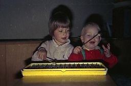

## Januar–März 1989

<table class="month">
<caption>Januar</caption>
<tr><th>Mo</th><th>Di</th><th>Mi</th><th>Do</th><th>Fr</th><th class="h2">Sa</th><th class="h1">So</th></tr>
<tr><td></td><td></td><td></td><td></td><td></td><td></td><td class="h1">1</td></tr>
<tr><td>2</td><td>3</td><td>4</td><td>5</td><td class="h1">6</td><td class="h2">7</td><td class="h1">8</td></tr>
<tr><td>9</td><td>10</td><td>11</td><td>12</td><td>13</td><td class="h2">14</td><td class="h1">15</td></tr>
<tr><td>16</td><td>17</td><td>18</td><td>19</td><td>20</td><td class="h2">21</td><td class="h1">22</td></tr>
<tr><td>23</td><td>24</td><td>25</td><td>26</td><td>27</td><td class="h2">28</td><td class="h1">29</td></tr>
<tr><td>30</td><td>31</td><td></td><td></td><td></td><td></td><td></td></tr>
</table>
<table class="month">
<caption>Februar</caption>
<tr><th>Mo</th><th>Di</th><th>Mi</th><th>Do</th><th>Fr</th><th class="h2">Sa</th><th class="h1">So</th></tr>
<tr><td></td><td></td><td>1</td><td>2</td><td>3</td><td class="h2">4</td><td class="h1">5</td></tr>
<tr><td class="h2">6</td><td>7</td><td>8</td><td>9</td><td>10</td><td class="h2">11</td><td class="h1">12</td></tr>
<tr><td>13</td><td>14</td><td>15</td><td>16</td><td>17</td><td class="h2">18</td><td class="h1">19</td></tr>
<tr><td>20</td><td>21</td><td>22</td><td>23</td><td>24</td><td class="h2">25</td><td class="h1">26</td></tr>
<tr><td>27</td><td>28</td><td></td><td></td><td></td><td></td><td></td></tr>
</table>
<table class="month">
<caption>März</caption>
<tr><th>Mo</th><th>Di</th><th>Mi</th><th>Do</th><th>Fr</th><th class="h2">Sa</th><th class="h1">So</th></tr>
<tr><td></td><td></td><td>1</td><td>2</td><td>3</td><td class="h2">4</td><td class="h1">5</td></tr>
<tr><td>6</td><td>7</td><td>8</td><td>9</td><td>10</td><td class="h2">11</td><td class="h1">12</td></tr>
<tr><td>13</td><td>14</td><td>15</td><td>16</td><td>17</td><td class="h2">18</td><td class="h1">19</td></tr>
<tr><td>20</td><td>21</td><td>22</td><td>23</td><td class="h1">24</td><td class="h2">25</td><td class="h1">26</td></tr>
<tr><td class="h1">27</td><td>28</td><td>29</td><td>30</td><td>31</td><td></td><td></td></tr>
</table>

Mit dem Januar 1989 klingt Weihnachten aus, das Spielzeugtelefon ist vermutlich ein Weihnachtsgeschenk (und so ungefähr das letzte Mal, dass ich freiwillig ein Telefon auch nur anfasse). Einen leuchtenden Stern, wie die Großmutter es [an meinem ersten Geburtstag wünschte](1988-01-01-a.md), gibt es nicht an der Krippe, aber schön ist sie trotzdem. Als Figuren stehen dort die Heilige Familie, Ochs und Esel, ein Hirte und ein Schaf sowie die drei Könige.

{:.gallery}
* [{: width="171" height="256"}<!--[-->](../files/1989-01/telefon1.jpg)
* [{: width="173" height="256"}<!--[-->](../files/1989-01/telefon2.jpg)
* [{: width="174" height="256"}<!--[-->](../files/1989-01/telefon3.jpg)
* [{: width="480" height="328"}<!--[-->](../files/1989-01/krippe.jpg)

Am 12. Januar bin ich im Schwimmbad, dabei ist auch mein Freund Florian (wenige Tage älter als ich).

{:.gallery}
* [{: width="171" height="256"}<!--[-->](../files/1989-01/schwimmbad1.jpg)
* [{: width="172" height="256"}<!--[-->](../files/1989-01/schwimmbad2.jpg)
* [{: width="171" height="256"}<!--[-->](../files/1989-01/schwimmbad3.jpg)
* [{: width="172" height="256"}<!--[-->](../files/1989-01/schwimmbad4.jpg)

Und mit Gloria (ein paar Jahre älter als ich), dem Patenkind meiner Mama, spiele ich Xylophon am 20. Januar.

{:.gallery}
* [{: width="256" height="170"}<!--[-->](../files/1989-01/xylophon1.jpg)
* [{: width="256" height="169"}<!--[-->](../files/1989-01/xylophon2.jpg)

Gemütlich endet der Januar.

{:.gallery}
* [{: width="171" height="256"}<!--[-->](../files/1989-01/marmelade1.jpg)

  23\. Januar
* [{: width="172" height="256"}<!--[-->](../files/1989-01/marmelade2.jpg)
* [{: width="170" height="256"}<!--[-->](../files/1989-01/korb1.jpg)

  31\. Januar
* [{: width="168" height="256"}<!--[-->](../files/1989-01/korb2.jpg)

Im Hintergrund ist übrigens ein Spielzeugmüllauto (unten noch einmal auf einem späteren Foto) zu sehen, Müllautos faszinieren mich nämlich.

{:.gallery}
* [{: width="480" height="443"}<!--[-->](../files/1989-01/muellauto.jpg)

Am 4. Februar sind wir mal wieder bei Oma und Opa, dieser schneidet mir die Haare, sauber machen wir dann zusammen.

{:.gallery}
* [{: width="170" height="256"}<!--[-->](../files/1989-01/oma-opa1.jpg)
* [{: width="256" height="170"}<!--[-->](../files/1989-01/oma-opa2.jpg)
* [{: width="169" height="256"}<!--[-->](../files/1989-01/oma-opa3.jpg)
* [{: width="170" height="256"}<!--[-->](../files/1989-01/oma-opa4.jpg)

Florian kommt mal wieder zu Besuch.

{:.gallery}
* [{: width="256" height="171"}<!--[-->](../files/1989-01/florian.jpg)

Am 19. März besuchen wir meine Großeltern, sicher kein zufälliges Datum, sondern bewusst zum Namenstag meines Großvaters, auch wenn dieser nicht zu unserem Spaziergang und auf den Spielplatz mitkommen kann.

{:.gallery}
* [{: width="256" height="172"}<!--[-->](../files/1989-01/grosseltern1.jpg)
* [{: width="256" height="172"}<!--[-->](../files/1989-01/grosseltern2.jpg)
* [{: width="177" height="256"}<!--[-->](../files/1989-01/grosseltern3.jpg)
* [{: width="172" height="256"}<!--[-->](../files/1989-01/grosseltern4.jpg)