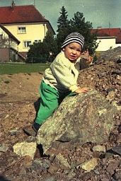
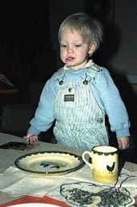
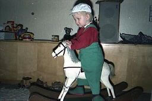

## April–Mai 1989

<table class="month">
<caption>April</caption>
<tr><th>Mo</th><th>Di</th><th>Mi</th><th>Do</th><th>Fr</th><th class="h2">Sa</th><th class="h1">So</th></tr>
<tr><td></td><td></td><td></td><td></td><td></td><td class="h2">1</td><td class="h1">2</td></tr>
<tr><td>3</td><td>4</td><td>5</td><td>6</td><td>7</td><td class="h2">8</td><td class="h1">9</td></tr>
<tr><td>10</td><td>11</td><td>12</td><td>13</td><td>14</td><td class="h2">15</td><td class="h1">16</td></tr>
<tr><td>17</td><td>18</td><td>19</td><td>20</td><td>21</td><td class="h2">22</td><td class="h1">23</td></tr>
<tr><td>24</td><td>25</td><td>26</td><td>27</td><td>28</td><td class="h2">29</td><td class="h1">30</td></tr>
</table>
<table class="month">
<caption>Mai</caption>
<tr><th>Mo</th><th>Di</th><th>Mi</th><th>Do</th><th>Fr</th><th class="h2">Sa</th><th class="h1">So</th></tr>
<tr><td class="h1">1</td><td>2</td><td>3</td><td class="h1">4</td><td>5</td><td class="h2">6</td><td class="h1">7</td></tr>
<tr><td>8</td><td>9</td><td>10</td><td>11</td><td>12</td><td class="h2">13</td><td class="h1">14</td></tr>
<tr><td class="h1">15</td><td>16</td><td>17</td><td>18</td><td>19</td><td class="h2">20</td><td class="h1">21</td></tr>
<tr><td>22</td><td>23</td><td>24</td><td class="h1">25</td><td>26</td><td class="h2">27</td><td class="h1">28</td></tr>
<tr><td>29</td><td>30</td><td>31</td><td></td><td></td><td></td><td></td></tr>
</table>

Der April beginnt mit einem Ausflug nach Bonndorf am 9. April.

{:.gallery}
* [{: width="172" height="256"}<!--[-->](../files/1989-04/bonndorf1.jpg)
* [{: width="171" height="256"}<!--[-->](../files/1989-04/bonndorf2.jpg)
* [{: width="171" height="256"}<!--[-->](../files/1989-04/bonndorf3.jpg)
* [{: width="173" height="256"}<!--[-->](../files/1989-04/bonndorf4.jpg)

Anschließend kommt schon mein zweiter Geburtstag. (Übrigens bin ich inzwischen 87&nbsp;cm groß.)

{:.gallery}
* [{: width="165" height="256"}<!--[-->](../files/1989-04/geburtstag1.jpg)
* [{: width="166" height="256"}<!--[-->](../files/1989-04/geburtstag2.jpg)
* [{: width="170" height="256"}<!--[-->](../files/1989-04/geburtstag3.jpg)
* [{: width="256" height="169"}<!--[-->](../files/1989-04/geburtstag4.jpg)
* [{: width="256" height="169"}<!--[-->](../files/1989-04/geburtstag5.jpg)

Florian schickt mir eine Glückwunschkarte (zumindest nehme ich an, dass es sich um diesen Geburtstag handelt, datiert ist die Karte nicht):

{:.letter}
> Liebe Grüße zum Geburtstag
>
> sendet Dir 
> lieber Michael 
> Dein Freund Florian
>
> Ich wünsche Dir ein schönes Fest, viel Geschenke und einen ganz, ganz feinen Kuchen.
>
> Viele Grüße auch von 
> meiner Mama

Ich bekomme zwei Bücher geschenkt: <i>Zwei im alten Baum</i>, ein Bilderbuch mit Text von Käthe Recheis und Illustrationen von Alicia Sancha, sowie <i>Die Grüne Uhr</i>, ein Sachbilderbuch von Christa Spangenberg mit Bildern von Irmgard Lucht. (Die Altersempfehlung lautet [„ab acht“](https://www.jugendliteratur.org/buch/die-gruene-uhr-3228), ich bin also etwas früh dran.)

Von meiner Großmutter bekomme ich diese Karte, wie immer etwas schwer zu lesen:

{:.letter}
> Die Vögelein, sie zwitschern u. überbringen Michael zu Deinem 2. Geb. die herzl. Glückwünsche.
>
> Werde für Dich beten 
> Großmutter

Außerdem schenken mir meine Großeltern Hahn-und-Henne-Geschirr, das dann gleich mit dem Geburtstagskuchen, einem Hefezopf in Kranzform mit zwei Kerzen, eingeweiht wird.

Das Geschirr wird in der Folgezeit auch noch weiter ergänzt, es gibt noch mehr Teller und Tassen, Eierbecher und eine Platte für hartgekochte Eier, eine Suppentasse und weitere Stücke.

Ob ich zu meinem Geburtstag auch das Schaukelpferd geschenkt bekomme, auf dem ich hier fünf Tage später reite, weiß ich nicht mehr, schon auf einem Bild vom letzten Dezember könnte eine Kufe zu sehen sein.

{:.gallery}
* [{: width="256" height="171"}<!--[-->](../files/1989-04/schaukelpferd1.jpg)
* [{: width="172" height="256"}<!--[-->](../files/1989-04/schaukelpferd2.jpg)

Im Hintergrund sind noch mehr Spielzeuge zu sehen: Auf der Truhe das Telefon, das schon im Januar auf einigen Fotos war, eine Ente – mein erstes Puzzle – und (am Boden) ein Zug auf Holz mit Lokomotive und zwei Wagen mit Tieren.

Ein weiterer Ausflug geht am 23. April nach Waldshut oder nach Staufen (die Notizen widersprechen sich und ich kann das Motiv nicht identifizieren).

{:.gallery}
* [{: width="256" height="171"}<!--[-->](../files/1989-04/waldshut.jpg)

Während ich bisher <i>Junior</i>- und <i>Marc-&-Penny</i>-Heften nur ab und zu gesammelt habe, beginnt nun die Zeit mit einer (fast) lückenlosen Sammlung an <i>Junior</i>-, <i>Medizini</i>- und <i>Marc-&-Penny</i>-Heften. Besonders mag ich die Bastelvorlagen in den <i>Marc-&-Penny</i>-Heften, auch wenn anfangs meine Mama für mich basteln muss. Damit ich immer ein ganzes Heft habe, bringt mir mein Papa meist zwei Exemplare mit.

{:.gallery}
* [{: width="480" height="697"}<!--[-->](../files/1989-04/karussell.jpg)