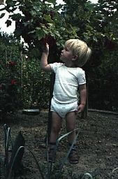

## Juni–Juli 1989

<table class="month">
<caption>Juni</caption>
<tr><th>Mo</th><th>Di</th><th>Mi</th><th>Do</th><th>Fr</th><th class="h2">Sa</th><th class="h1">So</th></tr>
<tr><td></td><td></td><td></td><td>1</td><td>2</td><td class="h2">3</td><td class="h1">4</td></tr>
<tr><td>5</td><td>6</td><td>7</td><td>8</td><td>9</td><td class="h2">10</td><td class="h1">11</td></tr>
<tr><td>12</td><td>13</td><td>14</td><td>15</td><td>16</td><td class="h1">17</td><td class="h1">18</td></tr>
<tr><td>19</td><td>20</td><td>21</td><td>22</td><td>23</td><td class="h2">24</td><td class="h1">25</td></tr>
<tr><td>26</td><td>27</td><td>28</td><td>29</td><td>30</td><td></td><td></td></tr>
</table>
<table class="month">
<caption>Juli</caption>
<tr><th>Mo</th><th>Di</th><th>Mi</th><th>Do</th><th>Fr</th><th class="h2">Sa</th><th class="h1">So</th></tr>
<tr><td></td><td></td><td></td><td></td><td></td><td class="h2">1</td><td class="h1">2</td></tr>
<tr><td>3</td><td>4</td><td>5</td><td>6</td><td>7</td><td class="h2">8</td><td class="h1">9</td></tr>
<tr><td>10</td><td>11</td><td>12</td><td>13</td><td>14</td><td class="h2">15</td><td class="h1">16</td></tr>
<tr><td>17</td><td>18</td><td>19</td><td>20</td><td>21</td><td class="h2">22</td><td class="h1">23</td></tr>
<tr><td>24</td><td>25</td><td>26</td><td>27</td><td>28</td><td class="h2">29</td><td class="h1">30</td></tr>
<tr><td>31</td><td></td><td></td><td></td><td></td><td></td><td></td></tr>
</table>

Am 8. Juni 1989 stirbt mein Großvater. Kurz davor fand noch eine Feier mit der Familie statt, auf der Fotos gemacht wurden, auch eines von ihm und der Großmutter.

{:.gallery}
* [{: width="256" height="166"}<!--[-->](../files/1989-06/grosseltern.jpg)

Bei der Beerdigung am 12. Juni fragt mich ein Verwandter, ob ich wüsste, was nun passiere. „Ja“, antworte ich, „Großvater rein, Loch zu!“

{:.gallery}
* [{: width="170" height="256"}<!--[-->](../files/1989-06/beerdigung1.jpg)
* [{: width="256" height="169"}<!--[-->](../files/1989-06/beerdigung2.jpg)

Weitere Fotos vom Juni und Juli:

{:.gallery}
* [{: width="169" height="256"}<!--[-->](../files/1989-06/bild1.jpg)

  13\. Juni, mit einem „Luftapong“ (Was könnte wohl meine Lieblingsfarbe sein?)
* [{: width="168" height="256"}<!--[-->](../files/1989-06/bild2.jpg)

  15\. Juni
* [{: width="170" height="256"}<!--[-->](../files/1989-06/bild3.jpg)

  18\. Juni
* [{: width="173" height="256"}<!--[-->](../files/1989-06/bild4.jpg)
* [{: width="173" height="256"}<!--[-->](../files/1989-06/bild7.jpg)

  9\. Juli
* [{: width="174" height="256"}<!--[-->](../files/1989-06/bild5.jpg)
* [{: width="172" height="256"}<!--[-->](../files/1989-06/bild6.jpg)
* [{: width="192" height="256"}<!--[-->](../files/1989-06/bild8.jpg)

Wie man sieht, habe ich ein Dreirad bekommen.

Ende Juli besuchen wir mal wieder Oma und Opa. Im Garten sind die Johannisbeeren reif und ich kann sie direkt vom Strauch essen.

{:.gallery}
* [{: width="169" height="256"}<!--[-->](../files/1989-06/oma-opa1.jpg)
* [{: width="170" height="256"}<!--[-->](../files/1989-06/oma-opa2.jpg)

Auch einer meiner Onkel ist zu Besuch.

{:.gallery}
* [{: width="167" height="256"}<!--[-->](../files/1989-06/oma-opa3.jpg)

Auf weitere Fotos verzichte ich, da ich auf denen noch weniger anhabe.