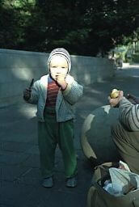
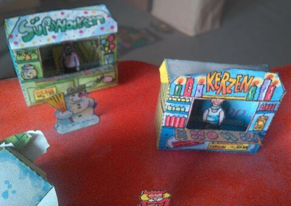
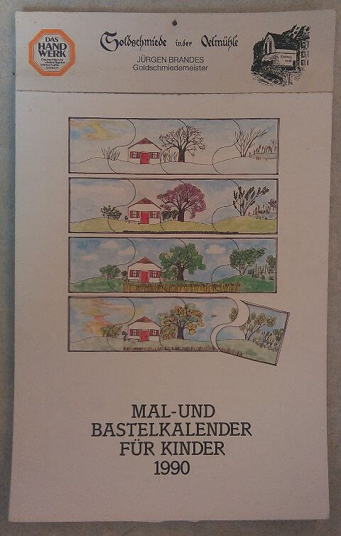

## Oktober–Dezember 1989

<table class="month">
<caption>Oktober</caption>
<tr><th>Mo</th><th>Di</th><th>Mi</th><th>Do</th><th>Fr</th><th class="h2">Sa</th><th class="h1">So</th></tr>
<tr><td></td><td></td><td></td><td></td><td></td><td></td><td class="h1">1</td></tr>
<tr><td>2</td><td>3</td><td>4</td><td>5</td><td>6</td><td class="h2">7</td><td class="h1">8</td></tr>
<tr><td>9</td><td>10</td><td>11</td><td>12</td><td>13</td><td class="h2">14</td><td class="h1">15</td></tr>
<tr><td>16</td><td>17</td><td>18</td><td>19</td><td>20</td><td class="h2">21</td><td class="h1">22</td></tr>
<tr><td>23</td><td>24</td><td>25</td><td>26</td><td>27</td><td class="h2">28</td><td class="h1">29</td></tr>
<tr><td>30</td><td>31</td><td></td><td></td><td></td><td></td><td></td></tr>
</table>
<table class="month">
<caption>November</caption>
<tr><th>Mo</th><th>Di</th><th>Mi</th><th>Do</th><th>Fr</th><th class="h2">Sa</th><th class="h1">So</th></tr>
<tr><td></td><td></td><td class="h1">1</td><td>2</td><td>3</td><td class="h2">4</td><td class="h1">5</td></tr>
<tr><td>6</td><td>7</td><td>8</td><td>9</td><td>10</td><td class="h2">11</td><td class="h1">12</td></tr>
<tr><td>13</td><td>14</td><td>15</td><td>16</td><td>17</td><td class="h2">18</td><td class="h1">19</td></tr>
<tr><td>20</td><td>21</td><td class="h1">22</td><td>23</td><td>24</td><td class="h2">25</td><td class="h1">26</td></tr>
<tr><td>27</td><td>28</td><td>29</td><td>30</td><td></td><td></td><td></td></tr>
</table>
<table class="month">
<caption>Dezember</caption>
<tr><th>Mo</th><th>Di</th><th>Mi</th><th>Do</th><th>Fr</th><th class="h2">Sa</th><th class="h1">So</th></tr>
<tr><td></td><td></td><td></td><td></td><td>1</td><td class="h2">2</td><td class="h1">3</td></tr>
<tr><td>4</td><td>5</td><td>6</td><td>7</td><td>8</td><td class="h2">9</td><td class="h1">10</td></tr>
<tr><td>11</td><td>12</td><td>13</td><td>14</td><td>15</td><td class="h2">16</td><td class="h1">17</td></tr>
<tr><td>18</td><td>19</td><td>20</td><td>21</td><td>22</td><td class="h2">23</td><td class="h1">24</td></tr>
<tr><td class="h1">25</td><td class="h1">26</td><td>27</td><td>28</td><td>29</td><td class="h2">30</td><td class="h1">31</td></tr>
</table>

Der Rest des Jahres 1989 ist kaum dokumentiert.

Es gibt nur ein Foto, das vermutlich in dieser Zeit entstanden ist. Wir machen wohl mal wieder einen Ausflug und ich esse dabei einen Apfel.

{:.gallery}
* [{: width="172" height="256"}<!--[-->](../files/1989-10/ausflug.jpg)

Aus dem <i>Marc-&-Penny</i>-Heft vom Dezember bastle ich diesen Weihnachtsmarkt (ein späteres Foto, als er schon nicht mehr im besten Zustand ist):

{:.gallery}
* [{: width="480" height="340"}<!--[-->](../files/1989-10/weihnachtsmarkt.jpg)

Zu Weihnachten bekomme ich sicher wieder Bücher geschenkt, außerdem auch wieder einen Kalender, dessen Umfang sich im Vergleich zum Vorjahr etwas erweitert hat und der nun ein Mal- und Bastelkalender ist.

{:.gallery}
* [{: width="480" height="754"}<!--[-->](../files/1989-10/kalender.jpg)