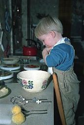

## Januar–April 1990

<table class="month">
<caption>Januar</caption>
<tr><th>Mo</th><th>Di</th><th>Mi</th><th>Do</th><th>Fr</th><th class="h2">Sa</th><th class="h1">So</th></tr>
<tr><td class="h1">1</td><td>2</td><td>3</td><td>4</td><td>5</td><td class="h1">6</td><td class="h1">7</td></tr>
<tr><td>8</td><td>9</td><td>10</td><td>11</td><td>12</td><td class="h2">13</td><td class="h1">14</td></tr>
<tr><td>15</td><td>16</td><td>17</td><td>18</td><td>19</td><td class="h2">20</td><td class="h1">21</td></tr>
<tr><td>22</td><td>23</td><td>24</td><td>25</td><td>26</td><td class="h2">27</td><td class="h1">28</td></tr>
<tr><td>29</td><td>30</td><td>31</td><td></td><td></td><td></td><td></td></tr>
</table>
<table class="month">
<caption>Februar</caption>
<tr><th>Mo</th><th>Di</th><th>Mi</th><th>Do</th><th>Fr</th><th class="h2">Sa</th><th class="h1">So</th></tr>
<tr><td></td><td></td><td></td><td>1</td><td>2</td><td class="h2">3</td><td class="h1">4</td></tr>
<tr><td>5</td><td>6</td><td>7</td><td>8</td><td>9</td><td class="h2">10</td><td class="h1">11</td></tr>
<tr><td>12</td><td>13</td><td>14</td><td>15</td><td>16</td><td class="h2">17</td><td class="h1">18</td></tr>
<tr><td>19</td><td>20</td><td>21</td><td>22</td><td>23</td><td class="h2">24</td><td class="h1">25</td></tr>
<tr><td class="h2">26</td><td>27</td><td>28</td><td></td><td></td><td></td><td></td></tr>
</table>
<table class="month">
<caption>März</caption>
<tr><th>Mo</th><th>Di</th><th>Mi</th><th>Do</th><th>Fr</th><th class="h2">Sa</th><th class="h1">So</th></tr>
<tr><td></td><td></td><td></td><td>1</td><td>2</td><td class="h2">3</td><td class="h1">4</td></tr>
<tr><td>5</td><td>6</td><td>7</td><td>8</td><td>9</td><td class="h2">10</td><td class="h1">11</td></tr>
<tr><td>12</td><td>13</td><td>14</td><td>15</td><td>16</td><td class="h2">17</td><td class="h1">18</td></tr>
<tr><td>19</td><td>20</td><td>21</td><td>22</td><td>23</td><td class="h2">24</td><td class="h1">25</td></tr>
<tr><td>26</td><td>27</td><td>28</td><td>29</td><td>30</td><td class="h2">31</td><td></td></tr>
</table>
<table class="month">
<caption>April</caption>
<tr><th>Mo</th><th>Di</th><th>Mi</th><th>Do</th><th>Fr</th><th class="h2">Sa</th><th class="h1">So</th></tr>
<tr><td></td><td></td><td></td><td></td><td></td><td></td><td class="h1">1</td></tr>
<tr><td>2</td><td>3</td><td>4</td><td>5</td><td>6</td><td class="h2">7</td><td class="h1">8</td></tr>
<tr><td>9</td><td>10</td><td>11</td><td>12</td><td class="h1">13</td><td class="h2">14</td><td class="h1">15</td></tr>
<tr><td class="h1">16</td><td>17</td><td>18</td><td>19</td><td>20</td><td class="h2">21</td><td class="h1">22</td></tr>
<tr><td>23</td><td>24</td><td>25</td><td>26</td><td>27</td><td class="h2">28</td><td class="h1">29</td></tr>
<tr><td>30</td><td></td><td></td><td></td><td></td><td></td><td></td></tr>
</table>

Aus dem Jahr 1990 gibt es nur seltsam wenige Fotos, sodass sich kaum etwas berichten lässt.

{:.gallery}
* [{: width="221" height="256"}<!--[-->](../files/1990-01/kueche1.jpg)

  11\. Januar
* [{: width="172" height="256"}<!--[-->](../files/1990-01/kueche2.jpg)
* [{: width="176" height="256"}<!--[-->](../files/1990-01/kueche3.jpg)
* [{: width="174" height="256"}<!--[-->](../files/1990-01/park1.jpg)
* [{: width="168" height="256"}<!--[-->](../files/1990-01/park2.jpg)
* [{: width="167" height="256"}<!--[-->](../files/1990-01/ausflug.jpg)

Aber ein paar Ereignisse sind in dem <i>Medizini</i>-Kalenderposter vermerkt, das an der Wohnungstür hängt, sodass sich zumindest die Ausflüge gut datieren lassen.

Oft sind wir für ein paar Tage bei Oma und Opa: Gleich zu Beginn des Jahres vom 1. bis zum 4. Januar, dann wieder zu Fastnacht vom 23. bis zum 26. Februar. Auf der Rückfahrt machen wir meistens noch einen kleinen Abstecher zu meinem Onkel J.

Auch von meinem Geburtstag bis zum Ostermontag sind wir bei Oma und Opa, also stammt die folgende Karte meiner Cousine wohl aus diesem Jahr:

{:.letter}
> Lieber Michael!
>
> Wie ich gerade gehört habe, bist Du an Deinem Geburtstag nicht zu Hause.
>
> Aber Dein Geschenk sollst Du trotzdem von mir haben.
>
> Alles alles Gute zum Geburtstag wünscht 
> S.
>
> Feiere schön!
>
> Komm mich mal wieder besuchen!

Von meiner Großmutter und meiner Tante bekomme ich diese Postkarte:

{:.letter}
> Du, lieber Michael, 
> marschierst in Dein neues Lebensjahr hinein. Bald gehst Du dann schon in die Schule. Deine Großmutter und Tante I. wünschen Dir viel Freude und Unternehmungsgeist und Glück zu allem.
>
> Lieber Michael 
> schon leuchtet z. 3. Geb. beinah das Osterlicht. Es möge leuchten in D. neuen Lebensj.

Den zweiten Teil hat meine Großmutter wieder selbst geschrieben, entsprechend schwer ist er zu lesen.

Die folgenden Fotos aus dem Garten von Oma und Opa sind zwar nicht datiert, aber vermutlich entstehen sie in diesen drei Tagen:

{:.gallery}
* [{: width="173" height="256"}<!--[-->](../files/1990-01/oma-opa1.jpg)

  Rampe für ein Duplo-Auto
* [{: width="256" height="175"}<!--[-->](../files/1990-01/oma-opa2.jpg)

  Der Osterhase bringt auch einen Kran

Ein paar Tage danach bekomme ich ein Paket mit dieser Postkarte:

{:.letter}
> 
21. 4. 90

>
> Lieber Michael!
>
> Jetzt ist Deine Strickjacke wieder schön lang u. auch die Hosen dürften passen.
>
> Den Käfer habe ich im Garten gefunden, den hat der Osterhase verloren.
>
> Hast Du neue Schuhe bekommen bei der Großmutter?
>
> Liebe Grüße an Euch alle 
> Mutter u. Oma

Also waren wir in diesen Tagen wohl auch bei der Großmutter (wie ich schon einmal schrieb, wohnt sie direkt über einem Schuhgeschäft, sodass wir Besuche bei ihr oft mit einem Schuhkauf verbinden). Das sind übrigens nur Tagesausflüge, sie hat keinen Platz, dass wir zu dritt übernachten könnten, aber sie wohnt auch näher als Oma und Opa. Und noch eine Kleinigkeit am Rande: Die Räume ihrer Wohnung sind so verbunden, dass man im Kreis immer wieder hindurchrennen kann, was ich gern und ausdauernd tue.

Vielleicht ebenfalls in diesem Zeitraum male ich dieses abstrakte Bild:

{:.image}
> [{: width="1500" height="1050"}<!--[-->](../files/1990-01/bild.jpg)

Außerdem bekomme ich wohl um diese Zeit herum ein ferngesteuertes Polizeiauto geschenkt. Und falls sich jemand das fragt: Eine elektrische Eisenbahn gibt es auch, aber die ist so alt, dass sie einerseits nicht zuverlässig fährt, andererseits ohnehin eher ein museales Objekt als ein Kinderspielzeug ist.

{:.gallery}
* [{: width="480" height="423"}<!--[-->](../files/1990-01/auto.jpg)