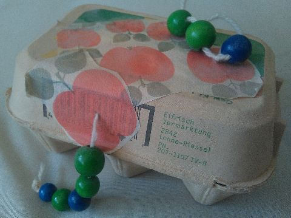

## Mai–August 1990

<table class="month">
<caption>Mai</caption>
<tr><th>Mo</th><th>Di</th><th>Mi</th><th>Do</th><th>Fr</th><th class="h2">Sa</th><th class="h1">So</th></tr>
<tr><td></td><td class="h1">1</td><td>2</td><td>3</td><td>4</td><td class="h2">5</td><td class="h1">6</td></tr>
<tr><td>7</td><td>8</td><td>9</td><td>10</td><td>11</td><td class="h2">12</td><td class="h1">13</td></tr>
<tr><td>14</td><td>15</td><td>16</td><td>17</td><td>18</td><td class="h2">19</td><td class="h1">20</td></tr>
<tr><td>21</td><td>22</td><td>23</td><td class="h1">24</td><td>25</td><td class="h2">26</td><td class="h1">27</td></tr>
<tr><td>28</td><td>29</td><td>30</td><td>31</td><td></td><td></td><td></td></tr>
</table>
<table class="month">
<caption>Juni</caption>
<tr><th>Mo</th><th>Di</th><th>Mi</th><th>Do</th><th>Fr</th><th class="h2">Sa</th><th class="h1">So</th></tr>
<tr><td></td><td></td><td></td><td></td><td>1</td><td class="h2">2</td><td class="h1">3</td></tr>
<tr><td class="h1">4</td><td>5</td><td>6</td><td>7</td><td>8</td><td class="h2">9</td><td class="h1">10</td></tr>
<tr><td>11</td><td>12</td><td>13</td><td class="h1">14</td><td>15</td><td class="h2">16</td><td class="h1">17</td></tr>
<tr><td>18</td><td>19</td><td>20</td><td>21</td><td>22</td><td class="h2">23</td><td class="h1">24</td></tr>
<tr><td>25</td><td>26</td><td>27</td><td>28</td><td>29</td><td class="h2">30</td><td></td></tr>
</table>
<table class="month">
<caption>Juli</caption>
<tr><th>Mo</th><th>Di</th><th>Mi</th><th>Do</th><th>Fr</th><th class="h2">Sa</th><th class="h1">So</th></tr>
<tr><td></td><td></td><td></td><td></td><td></td><td></td><td class="h1">1</td></tr>
<tr><td>2</td><td>3</td><td>4</td><td>5</td><td>6</td><td class="h2">7</td><td class="h1">8</td></tr>
<tr><td>9</td><td>10</td><td>11</td><td>12</td><td>13</td><td class="h2">14</td><td class="h1">15</td></tr>
<tr><td>16</td><td>17</td><td>18</td><td>19</td><td>20</td><td class="h2">21</td><td class="h1">22</td></tr>
<tr><td>23</td><td>24</td><td>25</td><td>26</td><td>27</td><td class="h2">28</td><td class="h1">29</td></tr>
<tr><td>30</td><td>31</td><td></td><td></td><td></td><td></td><td></td></tr>
</table>
<table class="month">
<caption>August</caption>
<tr><th>Mo</th><th>Di</th><th>Mi</th><th>Do</th><th>Fr</th><th class="h2">Sa</th><th class="h1">So</th></tr>
<tr><td></td><td></td><td>1</td><td>2</td><td>3</td><td class="h2">4</td><td class="h1">5</td></tr>
<tr><td>6</td><td>7</td><td>8</td><td>9</td><td>10</td><td class="h2">11</td><td class="h1">12</td></tr>
<tr><td>13</td><td>14</td><td>15</td><td>16</td><td>17</td><td class="h2">18</td><td class="h1">19</td></tr>
<tr><td>20</td><td>21</td><td>22</td><td>23</td><td>24</td><td class="h2">25</td><td class="h1">26</td></tr>
<tr><td>27</td><td>28</td><td>29</td><td>30</td><td>31</td><td></td><td></td></tr>
</table>

Wie ich schon beim letzten Mal geschrieben habe, gibt es aus dem Jahr 1990 nur wenige Fotos. Eines ist ein bisschen verrückt und zeigt mich in der Küche, zwei weitere auf dem Balkon. Ähnliche Bilder gab es schon häufiger, neu ist der Hocker aus blauem Plastik.

{:.gallery}
* [{: width="171" height="256"}<!--[-->](../files/1990-05/kueche.jpg)
* [{: width="168" height="256"}<!--[-->](../files/1990-05/balkon1.jpg)
* [{: width="170" height="256"}<!--[-->](../files/1990-05/balkon2.jpg)

Welche Freundin zu Besuch da ist, kann ich nicht mehr feststellen, nur, dass sie wohl öfter kommt (und im Hintergrund taucht mal wieder neues Spielzeug auf, diesmal eine Kasse und ein Ball in Marienkäferoptik):

{:.gallery}
* [{: width="256" height="166"}<!--[-->](../files/1990-05/freundin1.jpg)
* [{: width="256" height="165"}<!--[-->](../files/1990-05/freundin2.jpg)
* [{: width="256" height="167"}<!--[-->](../files/1990-05/freundin3.jpg)

Anfang Juni sind wir wieder für ein paar Tage bei Oma und Opa, dort gibt es gerade ein Karussell in der Stadt:

{:.gallery}
* [{: width="166" height="256"}<!--[-->](../files/1990-05/oma-opa1.jpg)
* [{: width="167" height="256"}<!--[-->](../files/1990-05/oma-opa2.jpg)

Auch daheim gehe ich regelmäßig auf die zwei Mal im Jahr stattfindende Mess’. Dort fahre ich ebenfalls gern eine Runde auf einem Kinderkarussell, meist wie auf dem Foto auf einem Motorrad. Eine Runde Riesenrad mit meiner Mama gehört auch dazu, aber wilde Fahrten mag ich keine. Ab und zu laufe ich noch durch ein Spiegellabyrinth. Ansonsten mag ich auch Buden mit Geschicklichkeitsspielen, besonders Münzschieber. Außerdem bekomme ich meist noch ein Lebkuchenherz, eine Portion Magenbrot und einen Mohrenkopf. In späteren Jahren gehört noch das Abschluss-Feuerwerk zum Messbesuch dazu.

Mein Papa bringt mir das Schachspielen bei (zumindest die Regeln):

{:.gallery}
* [{: width="256" height="167"}<!--[-->](../files/1990-05/schach1.jpg)
* [{: width="256" height="168"}<!--[-->](../files/1990-05/schach2.jpg)
* [{: width="256" height="169"}<!--[-->](../files/1990-05/schach3.jpg)
* [{: width="256" height="185"}<!--[-->](../files/1990-05/schach4.jpg)

Neben diesen undatierten Bildern, bei denen ich nur raten kann, dass sie in diesem Zeitraum entstanden sind, gibt es noch ein paar Kunstwerke, die sich besser datieren lassen:

Aus dem Bastelkalender bastle ich zusammen mit meiner Mama im Mai einen Wurm aus Perlen, der aus einer Eierschachtel kriecht. Im Juli gibt es dann einen Wicht (vom Juni-Kalenderblatt) und im August eine Brieftaube, die anschließend für lange Zeit von meiner Zimmerdecke hängt.

{:.gallery}
* [{: width="480" height="359"}<!--[-->](../files/1990-05/wurm.jpg)
* [{: width="423" height="960"}<!--[-->](../files/1990-05/wicht.jpg)
* [{: width="480" height="539"}<!--[-->](../files/1990-05/brieftaube.jpg)

Noch ein Bild gibt es, dieses von mir gemalt und in zweierlei Hinsicht besonders: Zum einen ist es datiert und betitelt, zum anderen ist es unter unzähligen Bildern das einzige, das so etwas wie Kopffüßler zeigt:

{:.image}
> [{: width="1500" height="1062"}<!--[-->](../files/1990-05/mutter-mit-kind.jpg)
>
> Mutter mit Kind (Aug. ’90)

Mit diesem Eintrag endet die Zeit der zusammengefassten Monate, ab sofort wird jeder Monat seine eigene Seite haben.