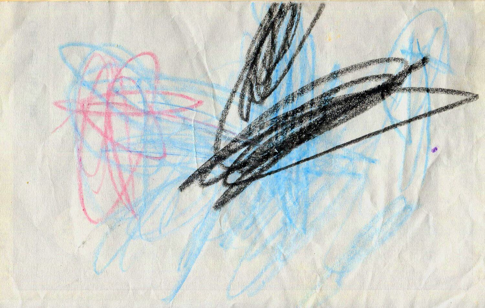
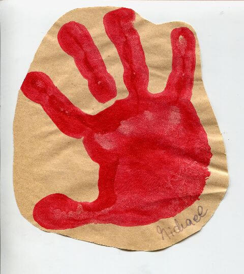

## September 1990

<table class="month">
<tr><th>Mo</th><th>Di</th><th>Mi</th><th>Do</th><th>Fr</th><th class="h2">Sa</th><th class="h1">So</th></tr>
<tr><td></td><td></td><td></td><td></td><td></td><td class="h2">1</td><td class="h1">2</td></tr>
<tr><td>3</td><td>4</td><td>5</td><td>6</td><td>7</td><td class="h2">8</td><td class="h1">9</td></tr>
<tr><td>10</td><td>11</td><td>12</td><td>13</td><td>14</td><td class="h2">15</td><td class="h1">16</td></tr>
<tr><td>17</td><td>18</td><td>19</td><td>20</td><td>21</td><td class="h2">22</td><td class="h1">23</td></tr>
<tr><td>24</td><td>25</td><td>26</td><td>27</td><td>28</td><td class="h2">29</td><td class="h1">30</td></tr>
</table>

Im September komme ich in den Kindergarten. Meistens bringt und holt mich meine Mama, es ist ein kurzer Fußweg von etwa 400 Metern. Auch zwei andere Kinder aus unserer Straße im gleichen Alter gehen mit mir dorthin: Kim, der direkt im Nachbarhaus wohnt und genau eine Woche nach mir geboren ist, sowie Sandra ein paar Häuser weiter, die etwa eine Woche älter ist als ich. Die beiden treffe ich natürlich auch außerhalb des Kindergartens, vor allem auf dem Spielplatz am Ende der Straße.

Der Kindergarten hat unter anderem drei große Räume direkt unterhalb der evangelischen Kirche, in denen gespielt und geredet wird, gesungen und getanzt, gemalt und gebastelt, außerdem einen großen Hof, sodass wir bei gutem Wetter auch draußen spielen können.

Das folgende Bild ist zwar nicht sehr aussagekräftig, aber zumindest ist auf der Rückseite festgehalten, dass es sich um eines meiner ersten Kindergartenbilder handelt:

{:.image}
> [{: width="1500" height="955"}<!--[-->](../files/1990-09/kindergarten-bild.jpg)

Im Kindergarten bastle ich auch viel (wesentlich mehr als ich male), leider lassen sich die meisten Werke nur ungefähr datieren, sodass ich einfach raten muss und in diesem Monat einen Handabdruck vorstelle und einen Pinnwand-Apfel.

{:.gallery}
* [{: width="480" height="539"}<!--[-->](../files/1990-09/hand.jpg)

Vermutlich gestalten wir ein großes Plakat mit den Händen aller neuer Kinder und bekommen unseren Abdruck erst später mit nach Hause.

Der Pinnwand-Apfel (er wird später mal klein im Hintergrund eines Fotos auftauchen) besteht aus einem Karton-Untergrund in Form und Bemalung eines Apfels, darauf sind Scheiben von Flaschenkorken geklebt. Bei unserer großen Korkpinnwand ist sein Nutzen natürlich nicht so riesig, aber hübsch ist er trotzdem.

In <i>Mit Spiel und Spaß durch’s Jahr</i> schreibt Reinhild Heuer: „Bei jüngeren Kindern ist der Bastelabfall sehr begehrt. Solange Erfahrungen damit sammeln und Ausdauer üben lassen, wie sie wollen.“ Und ja, ich habe sehr ausdauernd damit Erfahrungen gesammelt.

Zum Namenstag bekomme ich wieder eine Brief von meiner Oma, und (vermutlich, da die Karte undatiert ist) eine Postkarte von meiner Großmutter und meiner Tante:

{:.letter}
> 
Zum Michaelstag 1990

>
> Lieber Michael!
>
> Nachdem ich kein schönes Bild vom großen heiligen Michael gefunden habe, schicken wir Dir einige Bilder vom lieben kleinen Michael. Aber so klein bist Du ja nicht mehr, da Du ja schon einige Zeit in den Kindergarten gehst. Wir wünschen, daß es Dir dort immer mehr Freude macht u. Du vieles lernst. Es grüßen Dich zum Namenstag recht herzlich 
> Oma u. Opa, Onkel T. u. T.

{:.letter}
> Lieber Michael, 
> zu Deinem Namenstag senden wir Dir einen lieben Gruß.
>
> Der hl. Engel Michael soll Dich immer und überall beschützen und Dich begleiten.
>
> Deine Großmutter und Tante I.