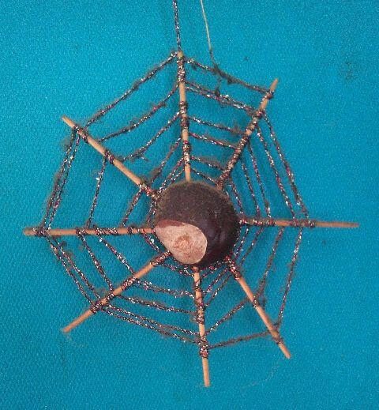
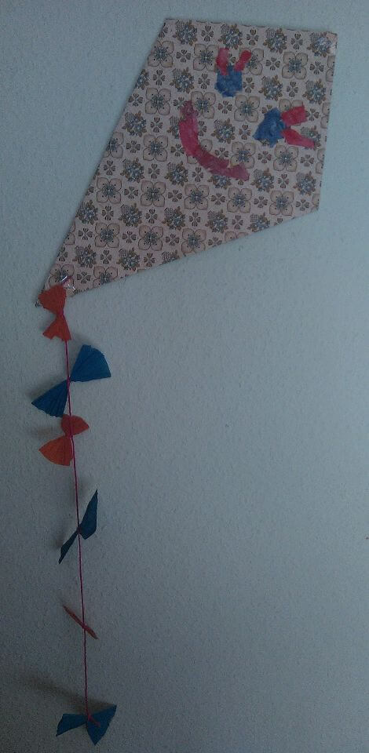

## Oktober 1990

<table class="month">
<tr><th>Mo</th><th>Di</th><th>Mi</th><th>Do</th><th>Fr</th><th class="h2">Sa</th><th class="h1">So</th></tr>
<tr><td>1</td><td>2</td><td class="h1">3</td><td>4</td><td>5</td><td class="h2">6</td><td class="h1">7</td></tr>
<tr><td>8</td><td>9</td><td>10</td><td>11</td><td>12</td><td class="h2">13</td><td class="h1">14</td></tr>
<tr><td>15</td><td>16</td><td>17</td><td>18</td><td>19</td><td class="h2">20</td><td class="h1">21</td></tr>
<tr><td>22</td><td>23</td><td>24</td><td>25</td><td>26</td><td class="h2">27</td><td class="h1">28</td></tr>
<tr><td>29</td><td>30</td><td>31</td><td></td><td></td><td></td><td></td></tr>
</table>

Viel berichten kann ich nicht über diesen Monat, sicher ist nur, dass wir im Kindergarten wieder etwas basteln.

Darunter ist vielleicht auch diese Kastanien-Spinne:

{:.gallery}
* [{: width="480" height="519"}<!--[-->](../files/1990-10/spinne.jpg)

Der Körper besteht aus einer Kastanie, in die man acht Löcher bohrt und dann Zahnstocher steckt. Die äußeren Spitzen der Zahnstocher sollte man abknipsen, damit man sich nicht daran verletzen kann. Anschließend spinnt man das Netz, indem man einen Faden spiralförmig an den Zahnstochern festknotet. An diesem Faden kann man die Spinne dann auch aufhängen. Besonders schön sieht es aus, wenn der Faden wie hier noch ein bisschen glitzert.

Vermutlich ebenfalls in diesem Monat bastle ich im Kindergarten auch einen Drachen, der zwar nicht fliegen kann, sich aber als Dekoration gut macht:

{:.gallery}
* [{: width="470" height="960"}<!--[-->](../files/1990-10/drachen.jpg)

Gefaltet ist er aus einem Stück Tapete, anschließend mit gerissenem Papier verziert und mit einem Schwanz mit Krepppapierschleifen versehen. Der Faden zum Aufhängen ist übrigens an der linken Ecke befestigt, wodurch der Drachen absichtlich unsymmetrisch hängt.