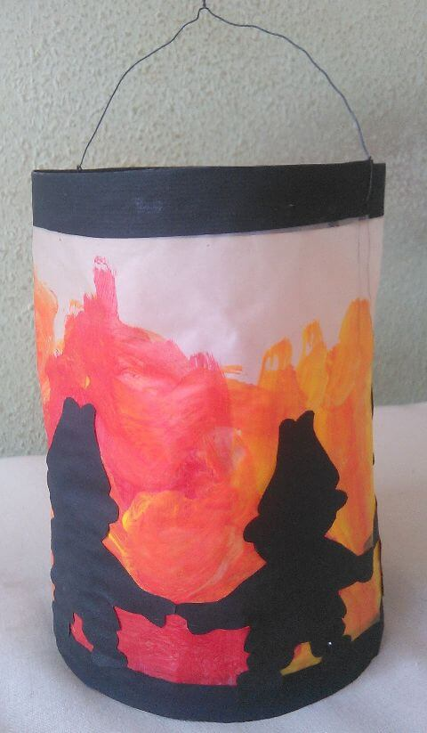
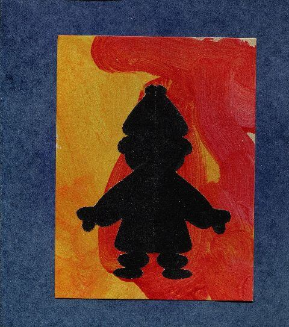
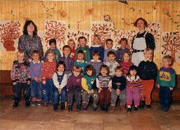
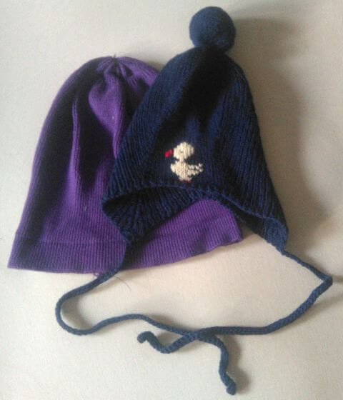

## November 1990

<table class="month">
<tr><th>Mo</th><th>Di</th><th>Mi</th><th>Do</th><th>Fr</th><th class="h2">Sa</th><th class="h1">So</th></tr>
<tr><td></td><td></td><td></td><td class="h1">1</td><td>2</td><td class="h2">3</td><td class="h1">4</td></tr>
<tr><td>5</td><td>6</td><td>7</td><td>8</td><td>9</td><td class="h2">10</td><td class="h1">11</td></tr>
<tr><td>12</td><td>13</td><td>14</td><td>15</td><td>16</td><td class="h2">17</td><td class="h1">18</td></tr>
<tr><td>19</td><td>20</td><td class="h1">21</td><td>22</td><td>23</td><td class="h2">24</td><td class="h1">25</td></tr>
<tr><td>26</td><td>27</td><td>28</td><td>29</td><td>30</td><td></td><td></td></tr>
</table>

Im November basteln wir im Kindergarten natürlich eine Martinslaterne für den Laternenumzug am 12. November. Die Laterne zeigt (mit schwarzem Papier aufgeklebte) Wichte, die um ein Feuer (aus aufgemalten Flammen) tanzen. Die Einladung zum Umzug ist passend dazu gestaltet.

{:.gallery}
* [{: width="480" height="823"}<!--[-->](../files/1990-11/laterne.jpg)
* [{: width="480" height="543"}<!--[-->](../files/1990-11/einladung.jpg)

Der Umzug führt vom Kindergarten aus in einer größeren Runde vor allem über das Gelände der nahegelegenen Klinik, sodass auch die Kranken unsere Laternenlieder zu hören bekommen. Im Kindergarten gibt es anschließend noch etwas Warmes zu trinken und ein paar belegte Brötchen.

Außerdem wird um diese Zeit herum ein Gruppenfoto im Kindergarten gemacht, ich bin der ganz am rechten Rand, der sich etwas abseits hält. (Ein Einzelfoto wird übrigens auch gemacht, aber es ist nicht bemerkenswert genug um es hier zu zeigen.)

{:.gallery}
* [{: width="256" height="185"}<!--[-->](../files/1990-11/kindergarten.jpg)

So nebenbei bemerkt: Im Gegensatz zu den meisten anderen Kindern trage ich gerne eine Mütze und bin im Herbst einer der ersten und im Frühling einer der letzten, der eine Mütze anhat. Ich habe aber auch so schöne Mützen, dass ich sie einfach tragen muss.

{:.gallery}
* [{: width="480" height="560"}<!--[-->](../files/1990-11/muetzen.jpg)