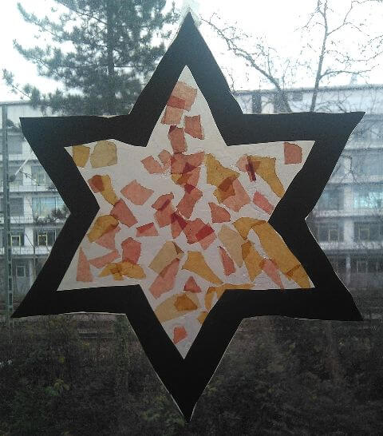
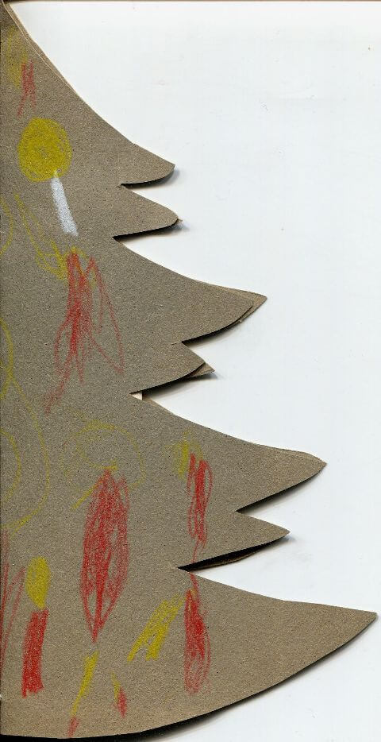
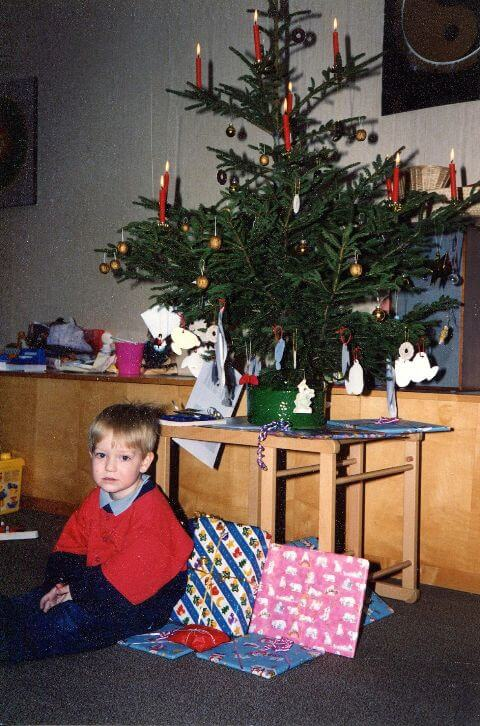
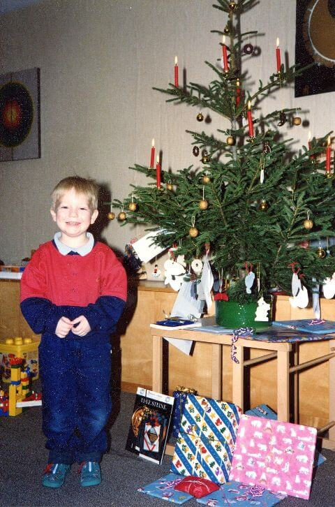
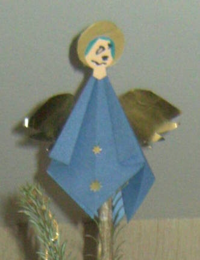
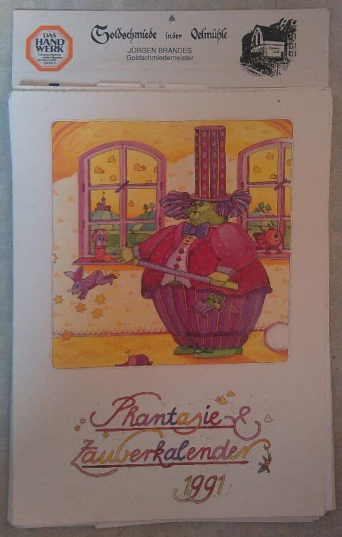

## Dezember 1990

<table class="month">
<tr><th>Mo</th><th>Di</th><th>Mi</th><th>Do</th><th>Fr</th><th class="h2">Sa</th><th class="h1">So</th></tr>
<tr><td></td><td></td><td></td><td></td><td></td><td class="h2">1</td><td class="h1">2</td></tr>
<tr><td>3</td><td>4</td><td>5</td><td>6</td><td>7</td><td class="h2">8</td><td class="h1">9</td></tr>
<tr><td>10</td><td>11</td><td>12</td><td>13</td><td>14</td><td class="h2">15</td><td class="h1">16</td></tr>
<tr><td>17</td><td>18</td><td>19</td><td>20</td><td>21</td><td class="h2">22</td><td class="h1">23</td></tr>
<tr><td class="h2">24</td><td class="h1">25</td><td class="h1">26</td><td>27</td><td>28</td><td class="h2">29</td><td class="h1">30</td></tr>
<tr><td class="h2">31</td><td></td><td></td><td></td><td></td><td></td><td></td></tr>
</table>

Im Dezember gibt es natürlich viele adventliche und weihnachtliche Basteleien, darunter auch dieser Stern:

{:.gallery}
* [{: width="480" height="546"}<!--[-->](../files/1990-12/stern.jpg)

Der Stern besteht aus transparentem Papier hinter einem Papprahmen. Anschließend verziert man ihn mit gerissenen Stücken von buntem Transparentpapier.

Feiern gibt es auch viele, auch die Einladung dafür wird gebastelt und steckt in einem gefalteten Weihnachtsbaum.

{:.gallery}
* [{: width="480" height="934"}<!--[-->](../files/1990-12/einladung.jpg)

Los geht es am 6. Dezember mit einer Nikolausfeier im Kindergarten. Am 16. Dezember gestalten wir einen Familiengottesdienst in der Kirche beim Kindergarten mit. Eine Woche später kommt dann schon Weihnachten.

Die Weihnachtsfeier im Kindergarten findet am 21. Dezember statt, anschließend sind Ferien bis zum 6. Januar.

Daheim feiern wir mit einem Baum geschmückt mit echten Kerzen, kleinen goldenen Kugeln, vergoldeten Nüssen, Schokoringen und einigen Papierfiguren – die meisten davon etwas unpassend Hasen. (Die Fotos sind zwar alt, aber ausnahmsweise, sozusagen als Weihnachtsgeschenk für meine Leser, trotzdem in hoher Auflösung.)

{:.gallery}
* [{: width="480" height="726"}<!--[-->](../files/1990-12/weihnachten1.jpg)
* [{: width="480" height="726"}<!--[-->](../files/1990-12/weihnachten2.jpg)

Auf der Spitze des Tannenbaums thront (auf den Fotos leider nicht zu sehen, daher unten nochmal ein späteres Foto) ein Engel, den ich auch im Kindergarten gebastelt habe.

{:.gallery}
* [{: width="332" height="432"}<!--[-->](../files/1990-12/engel.jpg)

Mit der richtigen Falttechnik lässt sich so ein Engel leicht basteln: Der Körper besteht aus einem quadratischen Blatt Papier. Dieses wird durch einen waagerechten und einen senkrechten Falz jeweils halbiert, außerdem von der Rückseite her einmal diagonal. (Eventuell faltet man auch die andere Diagonale als Markierung für später.) Jetzt lassen sich zwei Ecken so eindrücken, dass ein kleineres Quadrat mit der halben Seitenlänge des ursprünglichen entsteht. Die von der Spitze ausgehenden Kanten werden nun sowohl vorne als auch hinten zur Mittellinie gefaltet. Hinten klebt man diesen Teil fest, auf der Vorderseite faltet man sie erneut zur Außenkante. Damit hat man den Körper fertig gefaltet. An diesen Körper klebt man den Kopf aus Papier und Flügel und Heiligenschein aus Goldfolie an. Zum Schluss verziert man den Engel nach Belieben.

Was da wohl für Geschenke unter dem Baum liegen?

Sicher wieder Bücher. Vielleicht bekomme ich auch ein Puzzle geschenkt. Auf dem zweiten Foto ist im Hintergrund ganz links auf der Truhe eine Ravensburger-Puzzle-Schachtel zu sehen, drei Motive zu je 49 Teile, auch wenn ich nicht sagen kann, ob es die <i>Waldtiere</i> oder die <i>Tierkinder</i> sind. Gut möglich, dass ich die anderen Puzzle jetzt zu Weihnachten bekomme.

Und wie schon in den vergangenen Jahren gibt es einen Kalender. Auch in diesem Jahr hat er sich gewandelt, diesmal ist es ein Fantasie- und Zauberkalender. (Meine Eltern bekommen vom Goldschmied ihren eigenen Kalender, wie man auf dem zweiten Foto sehen kann.)

{:.gallery}
* [{: width="480" height="753"}<!--[-->](../files/1990-12/kalender.jpg)

Von einer Bekannten meiner Mama bekomme ich ein Buch mit diesem Brief:

{:.letter}
> 
Weihnachten 1990

>
> für Michael und gemütliche Vorlese-Stunden oder auch nur zum Anschauen! Viel Spaß, frohe Weihnachten und ein gutes Neues Jahr 
> Ihre I. P.

Welches Buch genau ich geschenkt bekomme, kann ich nicht mehr sagen, aber es könnte <i>Jedes Jahr ist Weihnachten</i> sein, herausgegeben von Hanna Bautze, eine vielfältige Sammlung weihnachtlicher Texte aus verschiedenen Büchern, die Lust macht auf mehr.