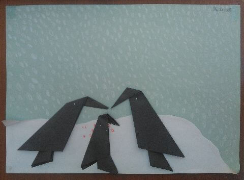
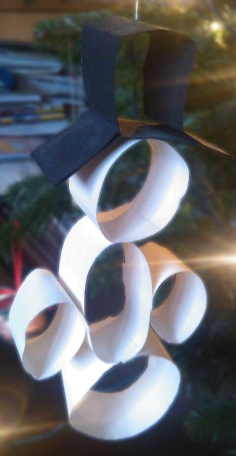
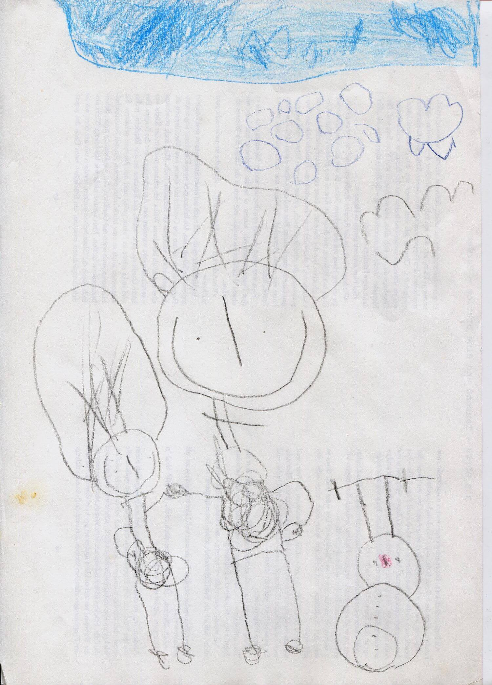

## Januar 1991

<table class="month">
<tr><th>Mo</th><th>Di</th><th>Mi</th><th>Do</th><th>Fr</th><th class="h2">Sa</th><th class="h1">So</th></tr>
<tr><td></td><td class="h1">1</td><td>2</td><td>3</td><td>4</td><td class="h2">5</td><td class="h1">6</td></tr>
<tr><td>7</td><td>8</td><td>9</td><td>10</td><td>11</td><td class="h2">12</td><td class="h1">13</td></tr>
<tr><td>14</td><td>15</td><td>16</td><td>17</td><td>18</td><td class="h2">19</td><td class="h1">20</td></tr>
<tr><td>21</td><td>22</td><td>23</td><td>24</td><td>25</td><td class="h2">26</td><td class="h1">27</td></tr>
<tr><td>28</td><td>29</td><td>30</td><td>31</td><td></td><td></td><td></td></tr>
</table>

Nachdem mit der zweiten Januar-Woche der Kindergarten wieder beginnt, wird wieder viel gebastelt.

{:.gallery}
* [{: width="480" height="353"}<!--[-->](../files/1991-01/pinguine.jpg)

Die Pinguine werden aus je zwei unterschiedlich großen Quadraten gefaltet. Die Faltungen sind bei beiden gleich. Zunächst wird das Quadrat diagonal halbiert und wieder aufgefaltet. Zwei Kanten werden zu dieser Mittellinie gefaltet, sodass ein Drachen entsteht. Schließlich wird der Drachen an der Mittellinie erneut zusammengefaltet. (Kleine Matheaufgabe am Rande: Wie groß sind die Winkel in dem Dreieck, das dabei entsteht? Wie lang sind seine Kanten?) Das kleine Dreieck wird in das große geschoben und dort festgeklebt, beim großen Dreieck knickt man die Spitze als Schnabel um. Dann kann man die Pinguine wie hier auf eine Schneelandschaft aufkleben.

{:.gallery}
* [{: width="480" height="927"}<!--[-->](../files/1991-01/schneemann.jpg)

Außerdem basteln wir einen Schneemann aus Papierstreifen, der in den Folgejahren fest zum Weihnachtsbaumschmuck dazugehört.

{:.gallery}
* [{: width="480" height="512"}<!--[-->](../files/1991-01/schneegloeckchen.jpg)

Noch eine winterliche Bastelei: Die Blüte des Schneeglöckchens wird wieder einfach aus einem quadratischen Papier gefaltet. Dann wird sie zusammen mit Stengel und Blättern in einen runden Rahmen geklebt. Und obwohl die Form des Rahmens wie auch der Blätter zeigen, dass ich noch nicht so gut mit einer Schere umgehen kann, sieht das Ergebnis trotzdem nicht wirklich schlecht aus.

Und auch zu Hause bin ich kreativ mit Wintermotiven, vermutlich entsteht in dieser Zeit folgendes Schneemannbild:

{:.image}
> [{: width="1500" height="2085"}<!--[-->](../files/1991-01/schneemannbild.jpg)

Gegen Ende des Monats bekomme ich mal wieder ein Päckchen von meiner Oma mit dieser Postkarte:

{:.letter}
> 
Ld., 22. 1. 91

>
> Lieber Michael!
>
> Oma hat Deinen Bärenpullover angestrickt, damit Du ihn wieder anziehen kannst und das Bäuchlein auch gut warm bleibt. Die Kartoffel-Bärchen versuchst Du mal und sagst es mir dann, ob sie gut schmecken. Es müssen ja nicht immer süße Bären sein.
>
> Liebe Grüße, auch an Mama u. Pappa 
> von Oma