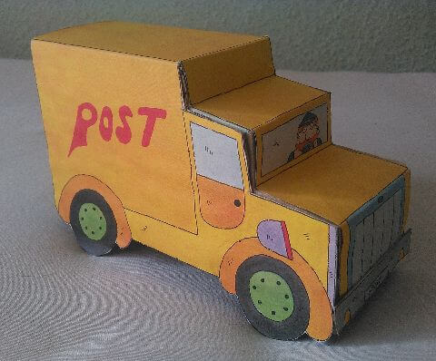
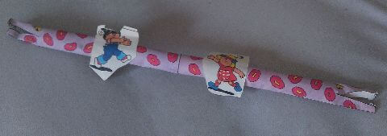
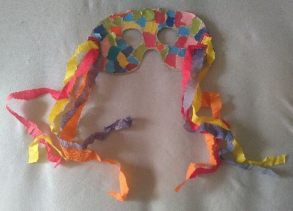
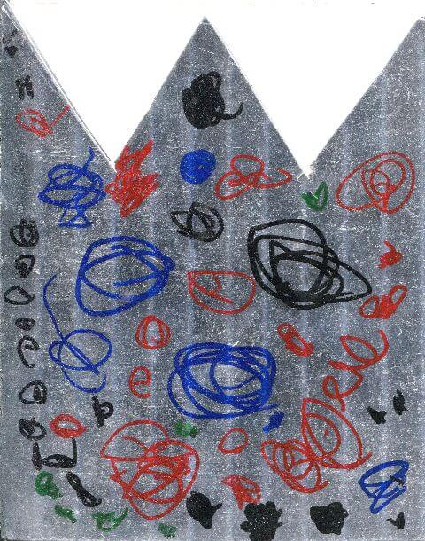
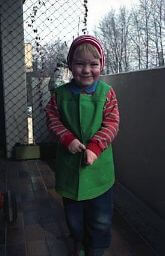
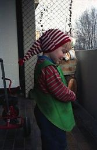
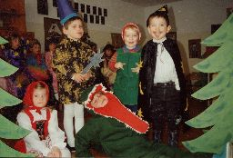
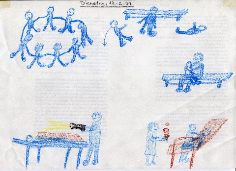

## Februar 1991

<table class="month">
<tr><th>Mo</th><th>Di</th><th>Mi</th><th>Do</th><th>Fr</th><th class="h2">Sa</th><th class="h1">So</th></tr>
<tr><td></td><td></td><td></td><td></td><td>1</td><td class="h2">2</td><td class="h1">3</td></tr>
<tr><td>4</td><td>5</td><td>6</td><td>7</td><td>8</td><td class="h2">9</td><td class="h1">10</td></tr>
<tr><td class="h2">11</td><td>12</td><td>13</td><td>14</td><td>15</td><td class="h2">16</td><td class="h1">17</td></tr>
<tr><td>18</td><td>19</td><td>20</td><td>21</td><td>22</td><td class="h2">23</td><td class="h1">24</td></tr>
<tr><td>25</td><td>26</td><td>27</td><td>28</td><td></td><td></td><td></td></tr>
</table>

Im Februar bastle ich mal wieder viel: Aus dem <i>Marc-&-Penny</i>-Heft ein Postauto und eine „Luftschlange“, im Kindergarten eine Fastnachtsmaske.

{:.gallery}
* [{: width="480" height="398"}<!--[-->](../files/1991-02/postauto.jpg)
* [{: width="480" height="169"}<!--[-->](../files/1991-02/schlange.jpg)
* [{: width="480" height="346"}<!--[-->](../files/1991-02/maske.jpg)

Zwar sind die meisten Fastnachtsveranstaltungen wegen des Zweiten Golfkriegs abgesagt, im Kindergarten wird dennoch am 8. Februar Fastnacht gefeiert. Die Einladung dazu steckt in einer Krone aus glänzendem Karton, das Motto lautet „Ein Fest im Märchenwald“. Ob ich da als Gartenzwerg (oder so) mit Zipfelmütze und Schürze so richtig reinpasse, kann ich nicht sagen, beim Gruppenfoto lande ich in einer Gruppe mit Zauberern und Rotkäppchen und Krokodil.

{:.gallery}
* [{: width="480" height="610"}<!--[-->](../files/1991-02/einladung.jpg)
* [{: width="165" height="256"}<!--[-->](../files/1991-02/fastnacht1.jpg)
* [{: width="167" height="256"}<!--[-->](../files/1991-02/fastnacht2.jpg)
* [{: width="256" height="174"}<!--[-->](../files/1991-02/fastnacht3.jpg)

Am 12. Februar stürze ich während eines Kreisspiels, weil die Kinder neben mir so gezerrt haben. Ich falle so ungeschickt, dass ich mir einen Zahn anschlage und dieser in der Klinik behandelt werden muss. Meine Mama hat für mich dieses Ereignis als Bild festgehalten:

{:.gallery}
* [{: width="480" height="349"}<!--[-->](../files/1991-02/zahn.jpg)