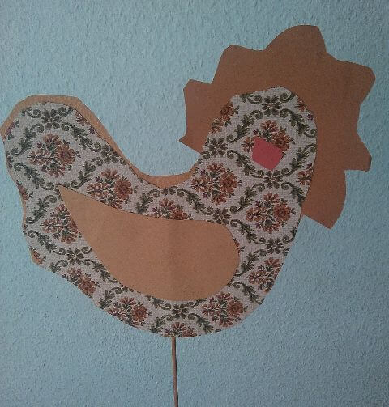
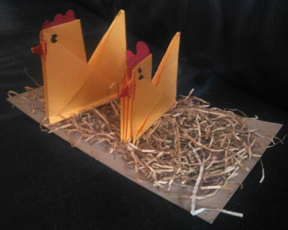
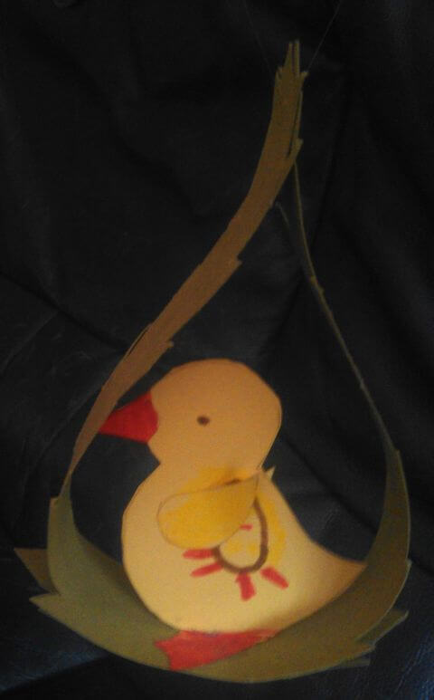
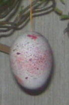
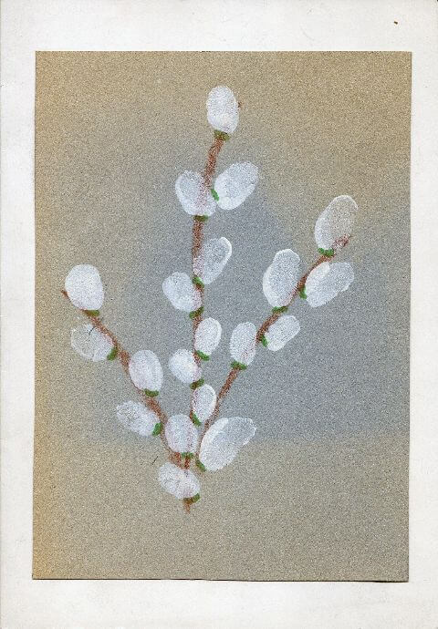
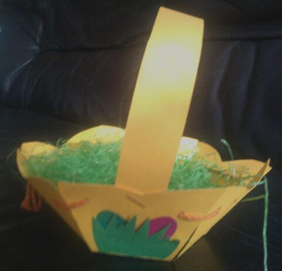

## März 1991

<table class="month">
<tr><th>Mo</th><th>Di</th><th>Mi</th><th>Do</th><th>Fr</th><th class="h2">Sa</th><th class="h1">So</th></tr>
<tr><td></td><td></td><td></td><td></td><td>1</td><td class="h2">2</td><td class="h1">3</td></tr>
<tr><td>4</td><td>5</td><td>6</td><td>7</td><td>8</td><td class="h2">9</td><td class="h1">10</td></tr>
<tr><td>11</td><td>12</td><td>13</td><td>14</td><td>15</td><td class="h2">16</td><td class="h1">17</td></tr>
<tr><td>18</td><td>19</td><td>20</td><td>21</td><td>22</td><td class="h2">23</td><td class="h1">24</td></tr>
<tr><td>25</td><td>26</td><td>27</td><td>28</td><td class="h1">29</td><td class="h2">30</td><td class="h1">31</td></tr>
</table>

Auch im März bastle ich wieder jede Menge im Kindergarten. Am Ende des Monats steht Ostern an, daher sind verschiedene österliche Objekte: ein Huhn aus Tapete, zwei Hühner im Gras, ein Küken, sowie ein Ei für den Osterstrauß.

{:.gallery}
* [{: width="480" height="503"}<!--[-->](../files/1991-03/huhn.jpg)
* [{: width="480" height="384"}<!--[-->](../files/1991-03/huehner.jpg)
* [{: width="480" height="773"}<!--[-->](../files/1991-03/kueken.jpg)
* [{: width="137" height="210"}<!--[-->](../files/1991-03/ei.jpg)

Die Anleitung zum Falten der Hühner ist etwas länger, aber man findet sie, wenn man nach Origami-Hühnern sucht, sodass ich sie hier nicht wiederholen will. Anschließend kann man sie auf ein Stück Pappe mit Ostergras kleben.

Das Ei für den Osterstrauß färben wir, indem wir Farbe durch ein Sieb hindurch auf das Ei sprenkeln.

Auch die Einladung für die Osterfeier im Kindergarten am 27. März basteln wir, die Blüten sind weiße Fingerabdrücke und sehen doch wirklich hübsch aus. Bei der Feier suchen und finden wir Osternester, die Körbchen wurden von einigen Eltern gebastelt. Anschließend sind Ferien bis zum 7. April.

{:.gallery}
* [{: width="480" height="690"}<!--[-->](../files/1991-03/einladung.jpg)
* [{: width="480" height="461"}<!--[-->](../files/1991-03/koerbchen.jpg)