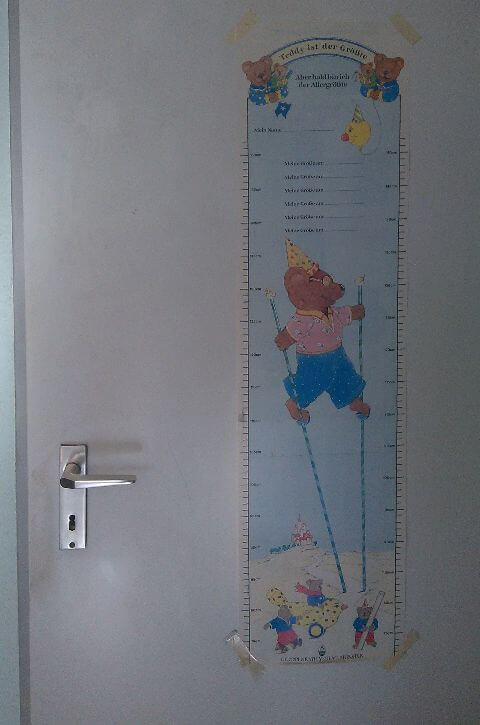
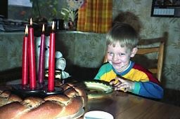
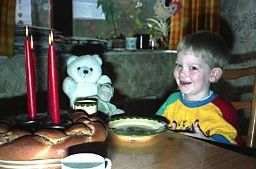
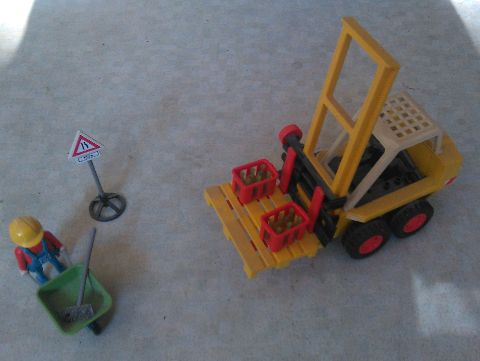
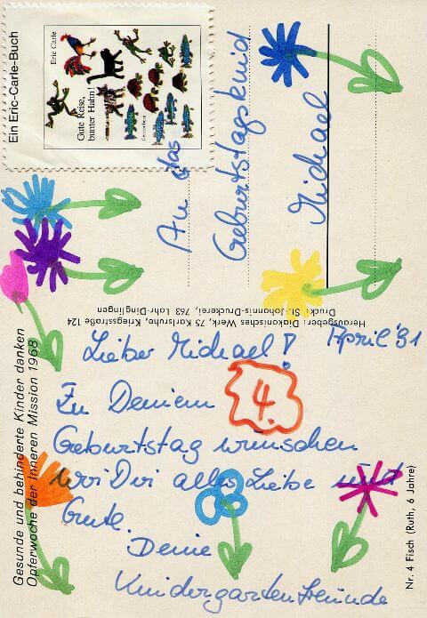
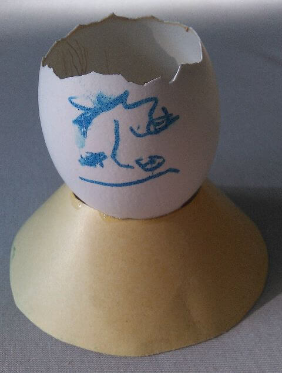

## April 1991

<table class="month">
<tr><th>Mo</th><th>Di</th><th>Mi</th><th>Do</th><th>Fr</th><th class="h2">Sa</th><th class="h1">So</th></tr>
<tr><td class="h1">1</td><td>2</td><td>3</td><td>4</td><td>5</td><td class="h2">6</td><td class="h1">7</td></tr>
<tr><td>8</td><td>9</td><td>10</td><td>11</td><td>12</td><td class="h2">13</td><td class="h1">14</td></tr>
<tr><td>15</td><td>16</td><td>17</td><td>18</td><td>19</td><td class="h2">20</td><td class="h1">21</td></tr>
<tr><td>22</td><td>23</td><td>24</td><td>25</td><td>26</td><td class="h2">27</td><td class="h1">28</td></tr>
<tr><td>29</td><td>30</td><td></td><td></td><td></td><td></td><td></td></tr>
</table>

Im April bekomme ich eine neue Zimmereinrichtung: Der Fußboden wird neu gemacht, statt des bisherigen Teppichbodens, der auch in den meisten anderen Räumen liegt, gibt es nun einen PVC-Boden. Außerdem bekomme ich einen großen Schrank (mit dem die Spediteure gleich ein paar Schrammen in den neuen Boden hauen) und ein Hochbett, sodass ich – sowohl unter dem Bett als auch im Schrank – viel Platz für meine Spiel- und sonstigen Sachen habe. Der Schrank ist dreigeteilt, hat vier Schubladen und viele Fächer, teils offen, teils hinter Türen. Selbstverständlich lässt sich auch der Platz auf dem Schrank nutzen, wenn auch nur für selten verwendete Dinge, denn schon an die oberen Fächer reiche ich nicht heran.

Der alte Kleiderschrank bleibt in der Zimmerecke neben dem Bett stehen, das Sofa dagegen, das sich bisher in meinem Zimmer befand, kommt nun ins Wohnzimmer, während das alte Sofa dort hochkant an die Wand gestellt wird und als Ablage für alles Mögliche dient.

Am 14. April kann ich dann meinen vierten Geburtstag feiern. Zur Feier des Tages hängen wir an meiner Zimmertür ein Poster mit Messleiste auf, an dem meine Größe gemessen und markiert wird, ich bin jetzt 1,04&nbsp;m groß. Wie auch in den Vorjahren gibt es einen Hefezopf, neben mir am Tisch sitzen meine liebsten Kuscheltiere, ein großer Bär und eine Puppe; im Hintergrund ist nochmal das Huhn vom letzten Monat zu sehen.

{:.gallery}
* [{: width="480" height="725"}<!--[-->](../files/1991-04/messleiste.jpg)

  (späteres Foto)
* [{: width="256" height="170"}<!--[-->](../files/1991-04/geburtstag1.jpg)
* [{: width="256" height="169"}<!--[-->](../files/1991-04/geburtstag2.jpg)

Geschenkt bekomme ich mein erstes Playmobil-Spielzeug, vermutlich einen Gabelstapler. (Ich kann auch nicht an einer Baustelle vorbeigehen, ohne zumindest ein bisschen zuzuschauen.)

{:.gallery}
* [{: width="480" height="361"}<!--[-->](../files/1991-04/gabelstapler.jpg)

Außerdem erhalte ich viele Postkarten. Meine Großmutter datiert ihre Karten nicht, daher kann ich nur raten, dass ich in diesem Jahr von ihr eine 3-D-Faltkarte mit diesem Inhalt bekomme:

{:.letter}
> An Deinem Geburtstag, mein lieber Michael, denke ich ganz fest an Dich!
>
> Deine Dich segnende Großmutter– 
> und Deine Tante I. wünscht Dir auch Glück u. Segen

Aber das Buch, das ich von ihr bekomme, hat einen kurzen Text mit Jahr, sie schenkt mir <i>Ich weiß einen Kastanienbaum</i> von Karl-Otto und Paul Rentmeister. Das Buch enthält 24 ausgewählte kurze Bibelstellen mit dazu von Kindern gemalten Bildern und Einordnungen in den Alltag.

Auch meine Cousine („der Rest“ sind ihre Eltern und vielleicht auch ihre Schwester) datiert ihre Karte mit den Bremer Stadtmusikanten nicht:

{:.letter}
> Lieber Michael!
>
> Wir wünschen Dir alles Gute zum Geburtstag und daß Du viel Freude besonders im Kindergarten hast.
>
> S. und der Rest

Aber zumindest eine Karte ist mit Datum, ich bekomme sie im Kindergarten:

{:.letter}
> 
April ’91

>
> Lieber Michael!
>
> Zu Deinem **4.** Geburtstag wünschen wir Dir alles Liebe und Gute.
>
> Deine Kindergartenfreunde
>
> {:.gallery}
> * [{: width="480" height="695"}<!--[-->](../files/1991-04/karte.jpg)

Am 19. April steht dann die vorerst letzte regelmäßige Untersuchung U8 durch meinen Kinderarzt an. Zum Abschluss diagnostiziert er noch Lispeln, Grobmotorik und leichte Zurückhaltung.

Von Ostern ist im Kindergarten noch ein ausgeblasenes Ei übrig. Daraus basteln wir einen Kopf, in den Kresse gesät wird, die – bis zu ihrer Ernte – dem Kopf grüne Haare beschert.

{:.gallery}
* [{: width="480" height="635"}<!--[-->](../files/1991-04/eierkopf.jpg)