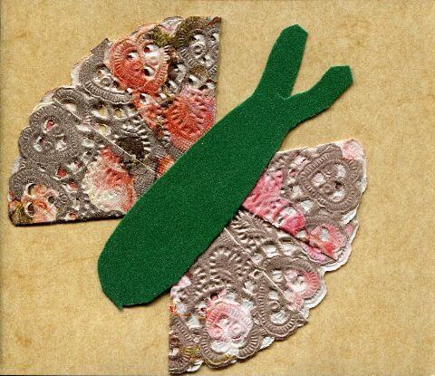
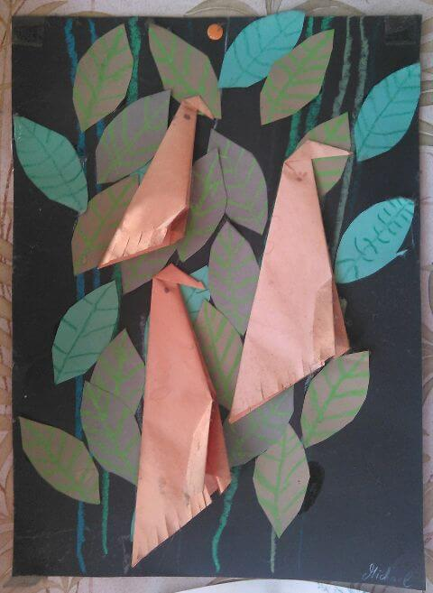
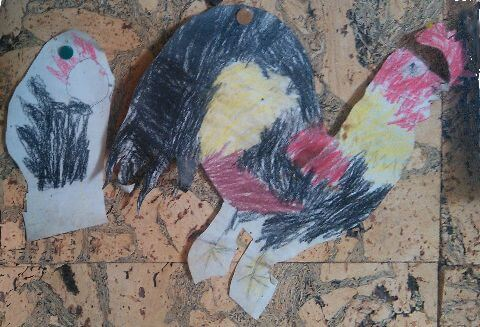
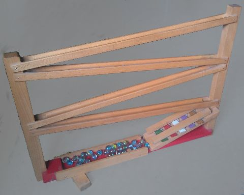

## Mai 1991

<table class="month">
<tr><th>Mo</th><th>Di</th><th>Mi</th><th>Do</th><th>Fr</th><th class="h2">Sa</th><th class="h1">So</th></tr>
<tr><td></td><td></td><td class="h1">1</td><td>2</td><td>3</td><td class="h2">4</td><td class="h1">5</td></tr>
<tr><td>6</td><td>7</td><td>8</td><td class="h1">9</td><td>10</td><td class="h2">11</td><td class="h1">12</td></tr>
<tr><td>13</td><td>14</td><td>15</td><td>16</td><td>17</td><td class="h2">18</td><td class="h1">19</td></tr>
<tr><td class="h1">20</td><td>21</td><td>22</td><td>23</td><td>24</td><td class="h2">25</td><td class="h1">26</td></tr>
<tr><td>27</td><td>28</td><td>29</td><td class="h1">30</td><td>31</td><td></td><td></td></tr>
</table>

Auch im Mai bastle ich wieder. Zunächst im Kindergarten eine Einladung zum Muttertag am 13. Mai:

{:.gallery}
* [{: width="480" height="415"}<!--[-->](../files/1991-05/muttertag.jpg)

Der Schmetterling besteht aus einer gefalteten Tortenspitze mit einem Körper aus Tonkarton.

Ebenfalls aus dem Kindergarten stammt dieses Vogelbild:

{:.gallery}
* [{: width="480" height="657"}<!--[-->](../files/1991-05/vogelbild.jpg)

Wer ein bisschen zurückblättert zum [Januar](1991-01-01-a.md), der wird feststellen, dass es im Grunde die gleichen Tiere wie die damaligen Pinguine sind, nur etwas anders gestaltet. Die Winkelgrößen des Dreiecks sind übrigens 22,5°, 45° und 112,5°. Wenn das Ausgangsquadrat die Kantenlänge 1 hat, dann hat das Dreieck die Kantenlängen <math><mrow><mn>2</mn><mo>−</mo><msqrt><mn>2</mn></msqrt></mrow></math>, <math><msqrt><mrow><mn>4</mn><mo>−</mo><mn>2</mn><msqrt><mn>2</mn></msqrt></mrow></msqrt></math> und <math><msqrt><mn>2</mn></msqrt></math>. (Wer hier keine Wurzelzeichen sieht, sollte sich einen [anständigen Browser](https://www.firefox.com/de/) zulegen.)

Für meinen Papa male ich zum Geburtstag einen Hahn. Welcher der beiden es in diesem Jahr ist, kann ich nicht mehr sagen, auch nicht, wann der andere entstanden ist.

{:.gallery}
* [{: width="480" height="327"}<!--[-->](../files/1991-05/haehne.jpg)

Was ich aber sagen kann, ist, dass der große Hahn nach der Vorlage aus <i>Herders großes Bilderlexikon</i> (Bilder von Robert André) entstanden ist. Mein Exemplar ist ein Mängelexemplar der 10. Auflage, der Buchblock sitzt verkehrt herum im Einband.

Was ich auch nicht sagen kann, ist, wann ich meine Murmelbahn bekommen habe. Aber in diesem Monat ist noch so viel Platz, dass es hier mal ein Foto von ihr gibt. Am Ende hat sie ein kleines Xylophon, sodass sie ziemlich viel Lärm macht.

{:.gallery}
* [{: width="480" height="383"}<!--[-->](../files/1991-05/murmelbahn.jpg)