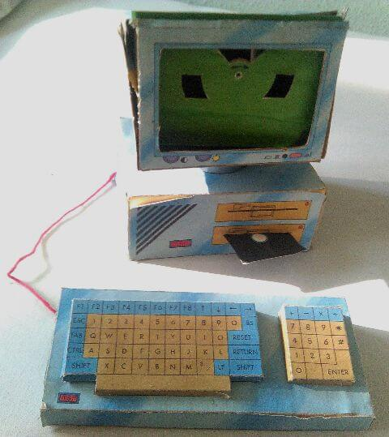
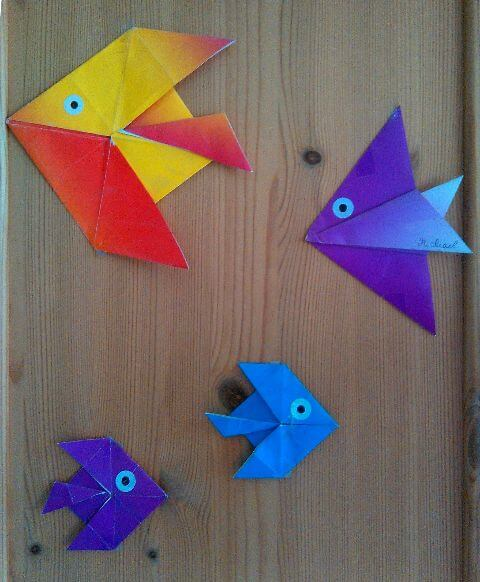
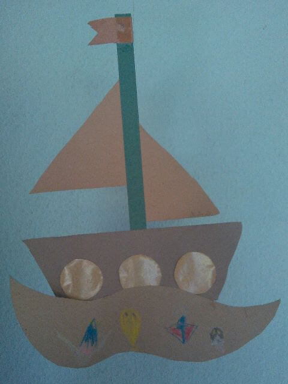
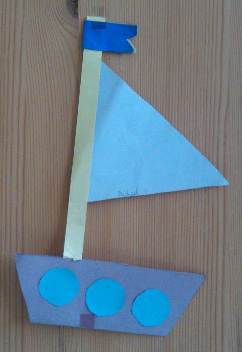
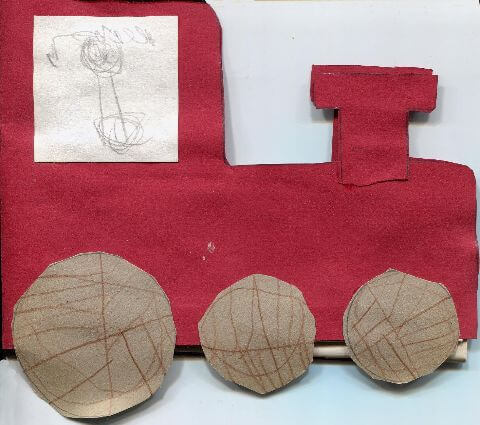
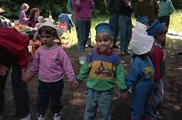
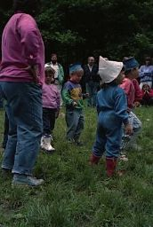
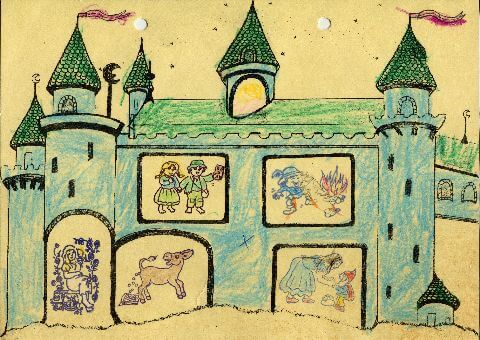

## Juni 1991

<table class="month">
<tr><th>Mo</th><th>Di</th><th>Mi</th><th>Do</th><th>Fr</th><th class="h2">Sa</th><th class="h1">So</th></tr>
<tr><td></td><td></td><td></td><td></td><td></td><td class="h2">1</td><td class="h1">2</td></tr>
<tr><td>3</td><td>4</td><td>5</td><td>6</td><td>7</td><td class="h2">8</td><td class="h1">9</td></tr>
<tr><td>10</td><td>11</td><td>12</td><td>13</td><td>14</td><td class="h2">15</td><td class="h1">16</td></tr>
<tr><td>17</td><td>18</td><td>19</td><td>20</td><td>21</td><td class="h2">22</td><td class="h1">23</td></tr>
<tr><td>24</td><td>25</td><td>26</td><td>27</td><td>28</td><td class="h2">29</td><td class="h1">30</td></tr>
</table>

Im Juni bastle ich mal wieder etwas aus dem <i>Marc-&-Penny</i>-Heft. Da es sich bei dem Computer um ein zweiteiliges Modell handelt, habe ich wohl schon im Mai damit angefangen. Auch wenn er auf diesem später entstandenen Foto nicht mehr im besten Zustand ist, kann man doch den Detailreichtum des Modells bewundern.

{:.gallery}
* [{: width="480" height="539"}<!--[-->](../files/1991-06/computer.jpg)

Auch im Kindergarten bastle ich. Zum einen gefaltete Fische. Die Anleitung dazu ist wieder etwas länger, aber man findet sie, wenn man nach Origami-Fischen sucht. Die Augen sind aufgeklebte und ausgemalte Lochverstärker.

{:.gallery}
* [{: width="480" height="582"}<!--[-->](../files/1991-06/fische.jpg)

Und auch diese Segelschiffe aus Tonkarton entstehen im Kindergarten.

{:.gallery}
* [{: width="480" height="639"}<!--[-->](../files/1991-06/schiff1.jpg)
* [{: width="480" height="696"}<!--[-->](../files/1991-06/schiff2.jpg)

Da – neben zahlreichen Seegeistern – auch ein Zitronendoktor im Meer schwimmt, gehe ich davon aus, dass ich kurz zuvor im Basler Zoo war.

Noch eine Art Ausflug gibt es: Das Kindergarten-Sommerfest am 29. Juni steht unter dem Motto „Wir wollen eine Reise machen“. Die Einladung steckt entsprechend in einer gebastelten Lokomotive. Das Sommerfest findet auf einem großen Abenteuerspielplatz am Stadtrand statt, es wird gegrillt und gepicknickt, es gibt eine Tombola und offenbar führen wir auch irgendeinen Kreistanz mit gebastelten Mützen auf. Außerdem gibt es kleine Spiele an verschiedenen Stationen. Wir bekommen alle eine Karte mit einem Schloss, und an jeder Station gibt es einen Stempel mit einem Märchen.

{:.gallery}
* [{: width="480" height="425"}<!--[-->](../files/1991-06/einladung.jpg)
* [{: width="256" height="169"}<!--[-->](../files/1991-06/sommerfest1.jpg)
* [{: width="172" height="256"}<!--[-->](../files/1991-06/sommerfest2.jpg)
* [{: width="480" height="340"}<!--[-->](../files/1991-06/maerchenschloss.jpg)