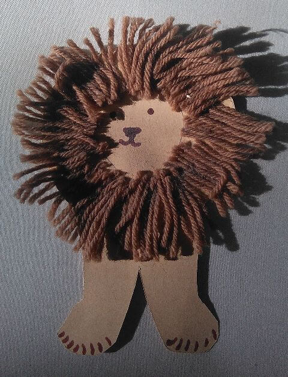
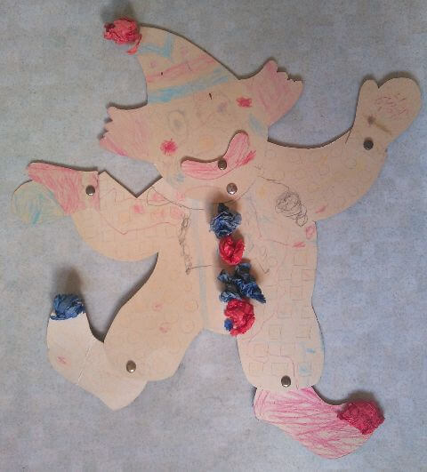
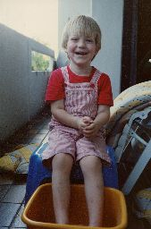
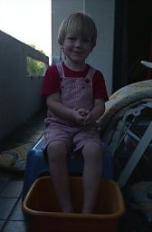
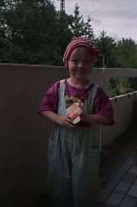
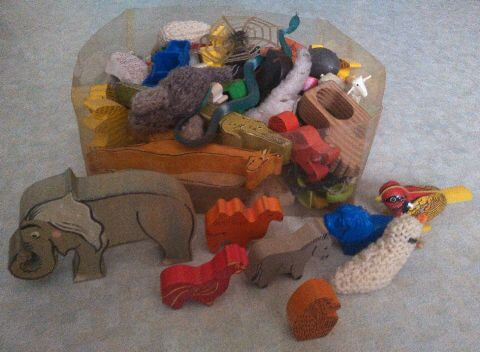

## Juli 1991

<table class="month">
<tr><th>Mo</th><th>Di</th><th>Mi</th><th>Do</th><th>Fr</th><th class="h2">Sa</th><th class="h1">So</th></tr>
<tr><td>1</td><td>2</td><td>3</td><td>4</td><td>5</td><td class="h2">6</td><td class="h1">7</td></tr>
<tr><td>8</td><td>9</td><td>10</td><td>11</td><td>12</td><td class="h2">13</td><td class="h1">14</td></tr>
<tr><td>15</td><td>16</td><td>17</td><td>18</td><td>19</td><td class="h2">20</td><td class="h1">21</td></tr>
<tr><td>22</td><td>23</td><td>24</td><td>25</td><td>26</td><td class="h2">27</td><td class="h1">28</td></tr>
<tr><td>29</td><td>30</td><td>31</td><td></td><td></td><td></td><td></td></tr>
</table>

Bevor am Ende des Monats die Sommerferien im Kindergarten beginnen, basteln wir nochmal ein bisschen. Dieser Löwe besteht aus Karton mit aufgeklebten Wollfäden.

{:.gallery}
* [{: width="480" height="627"}<!--[-->](../files/1991-07/loewe.jpg)

Auch daheim bastle ich, nämlich diesen Clown mit beweglichen Gliedmaßen. Die Vorlage dazu stammt aus der Kinderzeitschrift <i>Spatz</i>, aber es bleibt bei dieser einen Ausgabe.

{:.gallery}
* [{: width="480" height="531"}<!--[-->](../files/1991-07/clown.jpg)

Außerdem gehe ich unter die Zeitungsleser. Natürlich lese ich nicht selber, aber jeden Samstag liest mir mein Papa die Kinderseite in der Zeitung vor, die ich dann in einem großen Ordner sammle. Auch Fotos von Verkehrsunfällen und Bränden interessieren mich, die sammle ich ebenfalls. Einer der ersten Zeitungsausschnitte ist wohl ein bebilderter Bericht über die Sprengung eines hohen Schornsteins, den ich auch selbst miterlebt habe, aber wann genau das war, kann ich nicht mehr herausfinden.

Es gibt auch mal wieder Fotos auf dem Balkon:

{:.gallery}
* [{: width="169" height="256"}<!--[-->](../files/1991-07/balkon1.jpg)
* [{: width="168" height="256"}<!--[-->](../files/1991-07/balkon2.jpg)
* [{: width="169" height="256"}<!--[-->](../files/1991-07/balkon3.jpg)

Und weil auf dieser Seite noch etwas Platz ist, zeige ich einfach mal meine große Sammlung an Holz- und anderen Spielzeugtieren:

{:.gallery}
* [{: width="480" height="352"}<!--[-->](../files/1991-07/tiere.jpg)

Der Affe im Vordergrund ist eine meiner Lieblingsfiguren. Eine Zeit lang war er mal verschwunden, bis er im Auto unter einer Fußmatte zur großen Freude wieder auftauchte.