## August 1991

<table class="month">
<tr><th>Mo</th><th>Di</th><th>Mi</th><th>Do</th><th>Fr</th><th class="h2">Sa</th><th class="h1">So</th></tr>
<tr><td></td><td></td><td></td><td>1</td><td>2</td><td class="h2">3</td><td class="h1">4</td></tr>
<tr><td>5</td><td>6</td><td>7</td><td>8</td><td>9</td><td class="h2">10</td><td class="h1">11</td></tr>
<tr><td>12</td><td>13</td><td>14</td><td>15</td><td>16</td><td class="h2">17</td><td class="h1">18</td></tr>
<tr><td>19</td><td>20</td><td>21</td><td>22</td><td>23</td><td class="h2">24</td><td class="h1">25</td></tr>
<tr><td>26</td><td>27</td><td>28</td><td>29</td><td>30</td><td class="h2">31</td><td></td></tr>
</table>

In den Sommerferien sind wir mal wieder bei Oma und Opa. Dort bekomme ich ein Fahrrad und lerne das Radfahren.

{:.gallery}
* [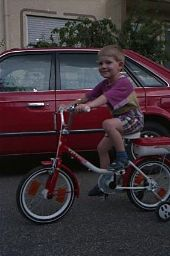{: width="170" height="256"}<!--[-->](../files/1991-08/fahrrad1.jpg)
* [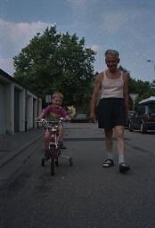{: width="174" height="256"}<!--[-->](../files/1991-08/fahrrad2.jpg)
* [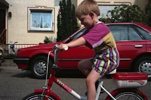{: width="256" height="170"}<!--[-->](../files/1991-08/fahrrad3.jpg)
* [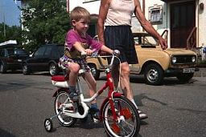{: width="256" height="171"}<!--[-->](../files/1991-08/fahrrad4.jpg)
* [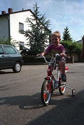{: width="173" height="256"}<!--[-->](../files/1991-08/fahrrad5.jpg)
* [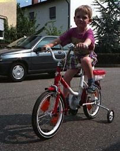{: width="203" height="256"}<!--[-->](../files/1991-08/fahrrad6.jpg)

Zurück zu Hause bekomme ich dann einen Helm. Den brauche ich auch dringend, ich lerne nämlich bald ohne Stützräder zu fahren: Es gibt ganz in der Nähe eine ziemlich steile Unterführung für Radfahrer, wenn man sich einfach rollen lässt, hat man schnell eine genügend hohe Geschwindigkeit um einigermaßen stabil zu fahren – eine etwas gefährliche, aber sehr effektive Art das Fahren zu lernen.

{:.gallery}
* [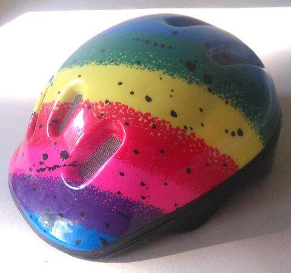{: width="480" height="451"}<!--[-->](../files/1991-08/helm.jpg)

Aus den <i>Marc-&-Penny</i>-Heften von Juli und August bastle ich wieder, diesmal einen Ferienkoffer mit Papier-Anziehpuppen. Und wenn ich einen Helm habe, soll Marc auch einen haben, also bastle ich den noch selber dazu.

{:.gallery}
* [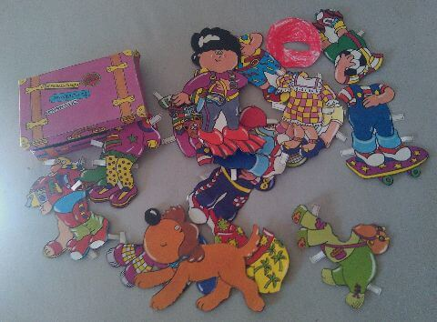{: width="480" height="354"}<!--[-->](../files/1991-08/koffer.jpg)

Vielleicht male ich auch ein paar Bilder. Datiert sind diese Wasserfarben-Bilder nicht, aber möglicherweise sind sie ja doch um diese Zeit herum entstanden.

{:.gallery}
* [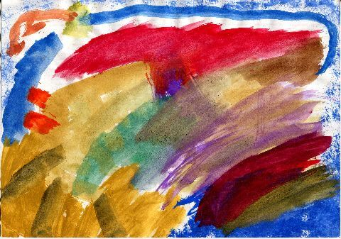{: width="480" height="337"}<!--[-->](../files/1991-08/wasserfarben1.jpg)
* [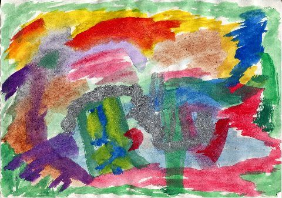{: width="480" height="337"}<!--[-->](../files/1991-08/wasserfarben2.jpg)
* [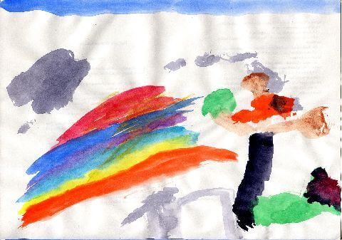{: width="480" height="337"}<!--[-->](../files/1991-08/wasserfarben3.jpg)

Am 27. August fängt der Kindergarten wieder an. Neu dabei ist ein weiterer Freund aus dem Nachbarhaus, Benjamin, etwa 7½ Monate jünger als ich.