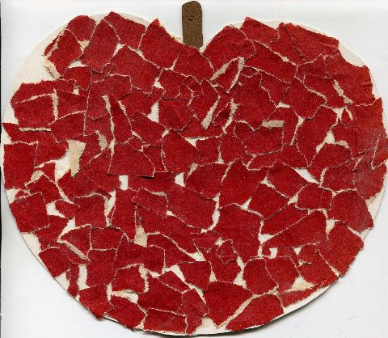
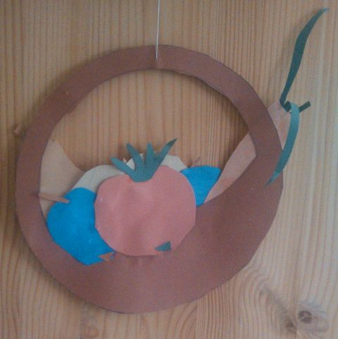
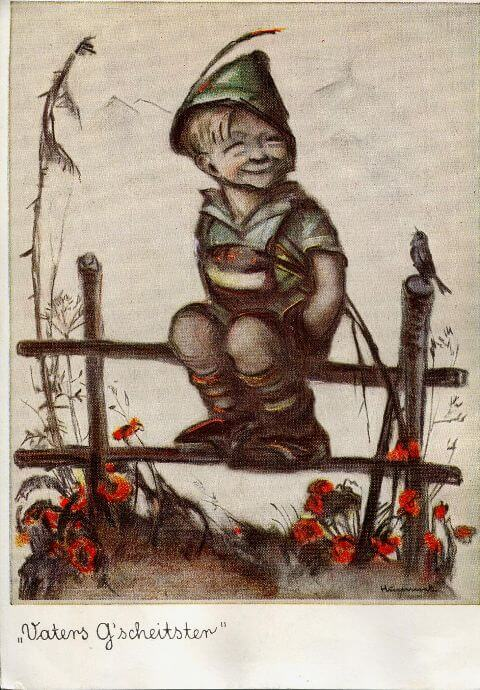

## September 1991

<table class="month">
<tr><th>Mo</th><th>Di</th><th>Mi</th><th>Do</th><th>Fr</th><th class="h2">Sa</th><th class="h1">So</th></tr>
<tr><td></td><td></td><td></td><td></td><td></td><td></td><td class="h1">1</td></tr>
<tr><td>2</td><td>3</td><td>4</td><td>5</td><td>6</td><td class="h2">7</td><td class="h1">8</td></tr>
<tr><td>9</td><td>10</td><td>11</td><td>12</td><td>13</td><td class="h2">14</td><td class="h1">15</td></tr>
<tr><td>16</td><td>17</td><td>18</td><td>19</td><td>20</td><td class="h2">21</td><td class="h1">22</td></tr>
<tr><td>23</td><td>24</td><td>25</td><td>26</td><td>27</td><td class="h2">28</td><td class="h1">29</td></tr>
<tr><td>30</td><td></td><td></td><td></td><td></td><td></td><td></td></tr>
</table>

Im Kindergarten wird wieder herbstlich gebastelt: Ein Apfel in Collage-Technik und ein Obstkorb mit verschiedenen Früchten aus Pappkarton. (So hübsch sie auch aussehen mögen, trotzdem esse ich kaum Obst und Gemüse.)

{:.gallery}
* [{: width="480" height="418"}<!--[-->](../files/1991-09/apfel.jpg)
* [{: width="480" height="481"}<!--[-->](../files/1991-09/obstkorb.jpg)

Und wie jedes Jahr bekomme ich zu meinem Namenstag Postkarten, eine von meiner Oma, eine von meiner Großmutter:

{:.letter}
> {:.gallery}
> * [{: width="480" height="690"}<!--[-->](../files/1991-09/vaters-gscheitster.jpg)
>
> 
Zum 29. Sept. 91

>
> Lieber Michael! 
> Wir gratulieren Dir zu Deinem Namenstag und wünschen alles Gute.
>
> Eine Karte von Deinem Namenspatron konnte ich wieder nicht finden, aber ich glaube, der Bub auf dem Zaun könntest auch Du sein; oder? Ich würde mich sehr freuen, wenn Du mal richtig mit mir telefonieren würdest. Wollen wir es am Dienstag mal probieren? Kannst mir ja erzählen, was Ihr gerade im Kindergarten bastelt.
>
> Bis bald liebe Grüße auch an Deine Eltern 
> Oma u. Opa

{:.letter}
> Lieber Michael
>
> Als Erinnerung an Deine Taufe feierst Du jedes Jahr Deinen Namenstag.
>
> Der große Erzengel Michael sei Dir stets Fürsprecher bei Gott.
>
> Deine Dich segnende Großmutter