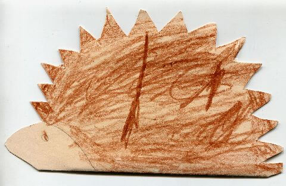
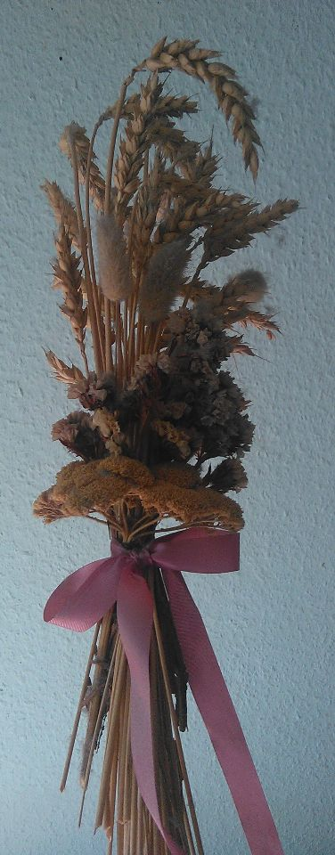
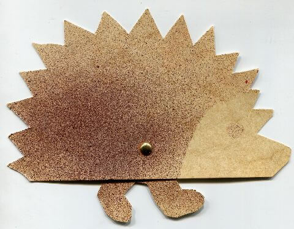
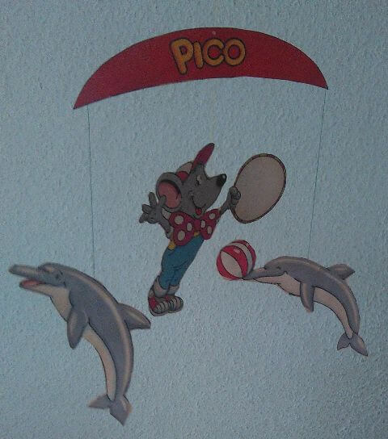
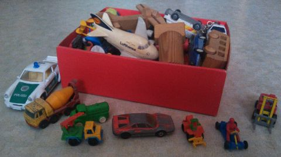

## Oktober 1991

<table class="month">
<tr><th>Mo</th><th>Di</th><th>Mi</th><th>Do</th><th>Fr</th><th class="h2">Sa</th><th class="h1">So</th></tr>
<tr><td></td><td>1</td><td>2</td><td class="h1">3</td><td>4</td><td class="h2">5</td><td class="h1">6</td></tr>
<tr><td>7</td><td>8</td><td>9</td><td>10</td><td>11</td><td class="h2">12</td><td class="h1">13</td></tr>
<tr><td>14</td><td>15</td><td>16</td><td>17</td><td>18</td><td class="h2">19</td><td class="h1">20</td></tr>
<tr><td>21</td><td>22</td><td>23</td><td>24</td><td>25</td><td class="h2">26</td><td class="h1">27</td></tr>
<tr><td>28</td><td>29</td><td>30</td><td>31</td><td></td><td></td><td></td></tr>
</table>

Zum Erntedankfest am 6. Oktober gestalten wir vom Kindergarten wieder einen Gottesdienst mit. Wie üblich steckt die Einladung dazu in einer gebastelten Hülle, diesmal recht schlicht ein Igel aus Karton, ein bisschen bemalt. Aufwändiger sind die Erntestecken, die wir ebenfalls gebastelt haben und mit denen wir in die Kirche einziehen.

{:.gallery}
* [{: width="480" height="313"}<!--[-->](../files/1991-10/einladung.jpg)
* [{: width="376" height="960"}<!--[-->](../files/1991-10/erntestecken.jpg)

Und noch einen Igel basteln wir, dieser kann sogar laufen, wenn man ihn schiebt. Er hat nämlich mehrere Beine, die kreisförmig angeordnet und mit einer Musterbeutelklammer befestigt sind. Gefärbt wird er wieder mal, indem wir Farbe durch ein Sieb spritzen, mit einer Schablone für das Gesicht.

{:.gallery}
* [{: width="480" height="375"}<!--[-->](../files/1991-10/laufigel.jpg)

Daheim bastle ich auch, nämlich ein Delfin-Mobile aus der Zeitschrift <i>Pico</i>, das anschließend lange von meiner Zimmerdecke hängt. Von <i>Pico</i> bekomme ich später auch noch eine weitere Ausgabe, höre dann aber wieder auf damit.

{:.gallery}
* [{: width="480" height="544"}<!--[-->](../files/1991-10/mobile.jpg)

Und weil auf dieser Seite noch etwas Platz ist, zeige ich als Ergänzung zu den Spielzeugtieren von neulich diesmal meine Sammlung von Spielzeugautos (die auch ein paar Flugzeuge und Schiffe enthält):

{:.gallery}
* [{: width="480" height="269"}<!--[-->](../files/1991-10/autos.jpg)