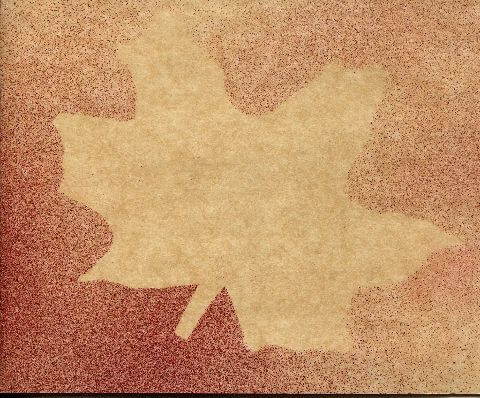
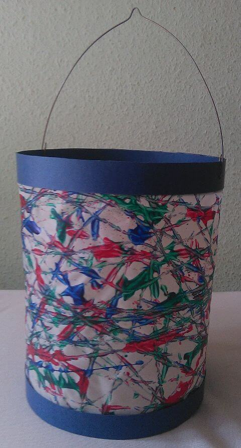
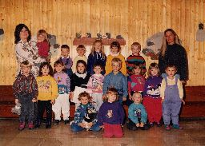
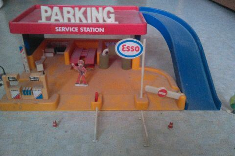

## November 1991

<table class="month">
<tr><th>Mo</th><th>Di</th><th>Mi</th><th>Do</th><th>Fr</th><th class="h2">Sa</th><th class="h1">So</th></tr>
<tr><td></td><td></td><td></td><td></td><td class="h1">1</td><td class="h2">2</td><td class="h1">3</td></tr>
<tr><td>4</td><td>5</td><td>6</td><td>7</td><td>8</td><td class="h2">9</td><td class="h1">10</td></tr>
<tr><td>11</td><td>12</td><td>13</td><td>14</td><td>15</td><td class="h2">16</td><td class="h1">17</td></tr>
<tr><td>18</td><td>19</td><td class="h1">20</td><td>21</td><td>22</td><td class="h2">23</td><td class="h1">24</td></tr>
<tr><td>25</td><td>26</td><td>27</td><td>28</td><td>29</td><td class="h2">30</td><td></td></tr>
</table>

Mit der gleichen Spritztechnik wie der Igel vom Oktober ist auch die Einladung zum Laternenumzug am 11. November verziert. Dieses Jahr gestalten wir die Laternen, indem wir Murmeln mit Farbe bestreichen und sie dann in einer großen Schachtel auf dem Laternenpapier hin- und herkullern lassen. Dadurch ergeben sich interessante zufällige Muster.

{:.gallery}
* [{: width="480" height="398"}<!--[-->](../files/1991-11/einladung.jpg)
* [{: width="480" height="892"}<!--[-->](../files/1991-11/laterne.jpg)

Auch ein Gruppenfoto wird wieder gemacht, diesmal stehe ich in der hinteren Reihe neben der Erzieherin. (Wie im Vorjahr gibt es auch Einzelfotos, diesmal sogar zwei, aber es gibt wieder keinen Grund sie zu zeigen.)

{:.gallery}
* [{: width="256" height="183"}<!--[-->](../files/1991-11/kindergarten.jpg)

Und auch diesen Monat ist noch etwas Platz: Zu den Spielzeugautos vom letzten Mal gibt es auch noch ein Parkhaus mit Tankstelle, Werkstatt (mit funktionsfähiger Hebebühne) und Waschanlage:

{:.gallery}
* [{: width="480" height="318"}<!--[-->](../files/1991-11/parkhaus.jpg)