## Dezember 1991

<table class="month">
<tr><th>Mo</th><th>Di</th><th>Mi</th><th>Do</th><th>Fr</th><th class="h2">Sa</th><th class="h1">So</th></tr>
<tr><td></td><td></td><td></td><td></td><td></td><td></td><td class="h1">1</td></tr>
<tr><td>2</td><td>3</td><td>4</td><td>5</td><td>6</td><td class="h2">7</td><td class="h1">8</td></tr>
<tr><td>9</td><td>10</td><td>11</td><td>12</td><td>13</td><td class="h2">14</td><td class="h1">15</td></tr>
<tr><td>16</td><td>17</td><td>18</td><td>19</td><td>20</td><td class="h2">21</td><td class="h1">22</td></tr>
<tr><td>23</td><td class="h2">24</td><td class="h1">25</td><td class="h1">26</td><td>27</td><td class="h2">28</td><td class="h1">29</td></tr>
<tr><td>30</td><td class="h2">31</td><td></td><td></td><td></td><td></td><td></td></tr>
</table>

Gerade im Dezember entwickeln sich sehr schnell Traditionen, sodass vieles so ähnlich passiert wie ein Jahr zuvor, aber natürlich gibt es auch Neues:

Mit Korken als Stempeln gestalte ich daheim ein Tannenbaum-Bild.

{:.image}
> [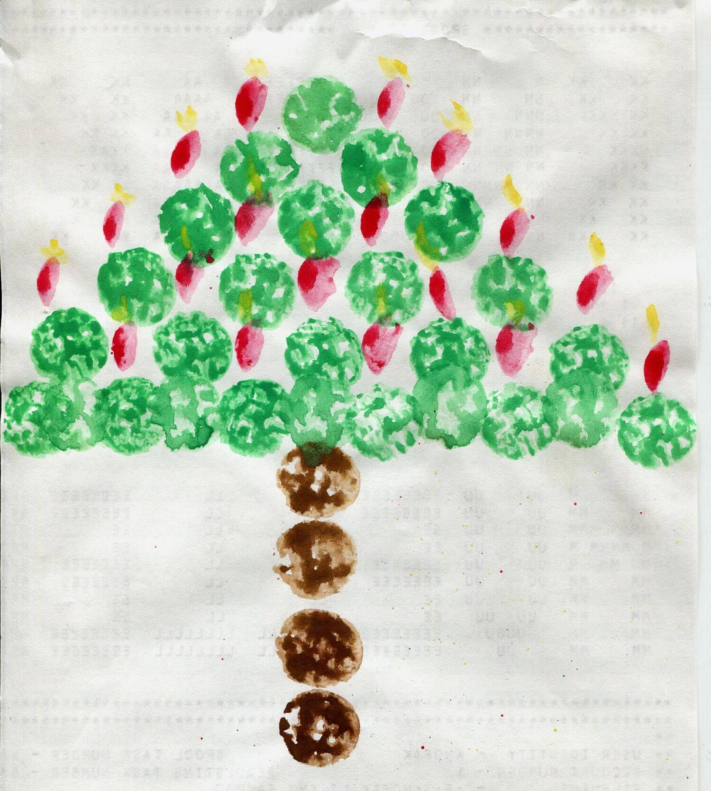{: width="1500" height="1667"}<!--[-->](../files/1991-12/korken.jpg)

Am 6. Dezember ist Nikolaus mit einer Feier im Kindergarten. (Wer die Einladung dazu vermisst, dem sei gesagt: Die vermisse ich auch.) Auch von Oma und Opa bekomme ich wieder ein Päckchen, diesmal enthält es wohl auch meine ersten Kinderüberraschungseier. Lieber als fertige Figuren mag ich Inhalte, die ich selber zusammenbauen kann. Mit einem Drachenflieger ist bei meinen ersten Überraschungseiern auch ein solcher Bausatz dabei, aber an diesem hat der Zahn der Zeit ziemlich genagt.

{:.gallery}
* [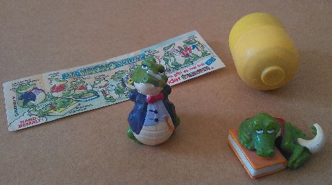{: width="480" height="268"}<!--[-->](../files/1991-12/eier.jpg)
* [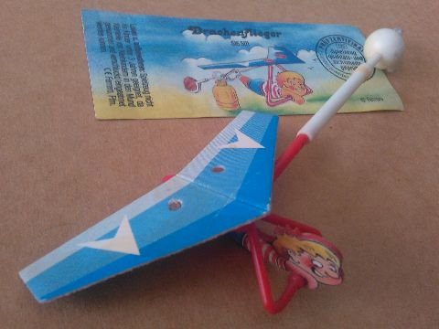{: width="480" height="360"}<!--[-->](../files/1991-12/drachenflieger.jpg)

Im Kindergarten gestalten wir auch dieses Jahr den Familiengottesdienst am 3. Advent mit und feiern am 20. Dezember Weihnachten.

Gebastelt wird natürlich auch wieder, nämlich drei Aufhänger mit verschiedenen Motiven, die wir uns teils selbst aussuchen dürfen.

{:.gallery}
* [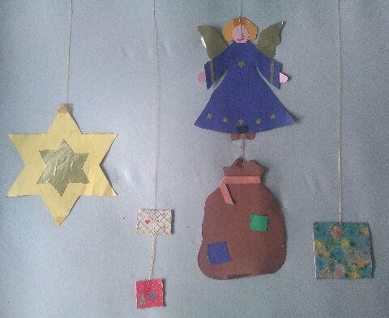{: width="480" height="393"}<!--[-->](../files/1991-12/aufhaenger.jpg)

Neben dem Stern (aus Tonkarton und Goldfolie), den alle basteln, und dem Engel, den alle aus meiner Altersgruppe basteln, entscheide ich mich für den Sack mit Geschenken. Zu Weihnachten hänge ich sie über meinem Bett neben der [Brieftaube](1990-05-01-a.md) auf, wo sie dann lange (auch außerhalb der Weihnachtszeit) bleiben werden.

Die Ferien beginnen wohl am 23. Dezember, und dann ist auch schon Weihnachten.

{:.gallery}
* [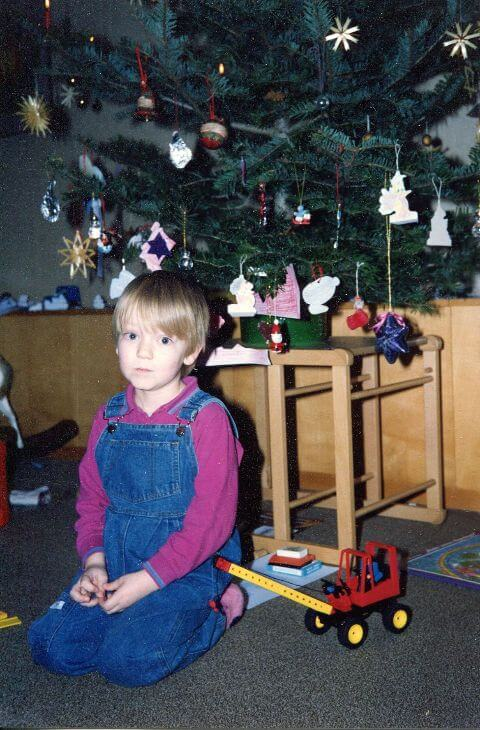{: width="480" height="730"}<!--[-->](../files/1991-12/baum1.jpg)
* [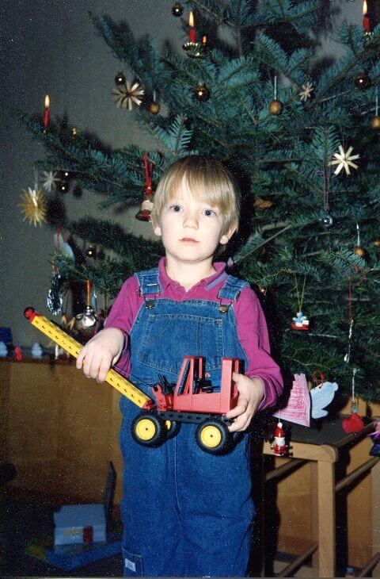{: width="480" height="730"}<!--[-->](../files/1991-12/baum2.jpg)

Der Weihnachtsbaum ist ähnlich geschmückt wie im Vorjahr (und wie im Vorjahr sind die Fotos auch in höherer Auflösung als üblich), neu sind die Strohsterne, außerdem zwei Kugeln und eine Glocke aus Pappmaché sowie drei Schneemänner aus Glas (die es günstig im Schlussverkauf gab), und schließlich der marmorierte Plastikstern, den ich ebenfalls im Kindergarten gestaltet habe. Möglicherweise hängen auch zum ersten Mal ein paar Aufhänger aus Wachs am Baum, auch diese aus dem Kindergarten.

{:.gallery}
* [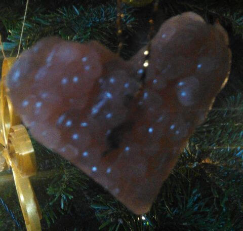{: width="480" height="456"}<!--[-->](../files/1991-12/wachs1.jpg)
* [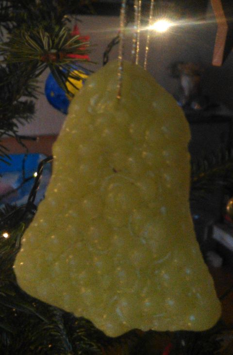{: width="480" height="732"}<!--[-->](../files/1991-12/wachs2.jpg)

Als Vorlage dienen Ausstechförmchen. Diese füllt man einfach mit Wachstropfen einer farbigen Kerze, dadurch sind die Aufhänger auf einer Seite flach und haben auf der anderen Seite eine interessante hügelige Struktur. Zuletzt sticht man ein Loch für eine Kordel zum Aufhängen ein.

Ich bekomme wieder viele Geschenke, und da die Fotos vom Baum diesmal kurz nach Weihnachten gemacht werden, sind diese schon ausgepackt. Im Hintergrund zu sehen sind ein paar Spiele aus dem Missio-Verlag, Geschenke von meiner Cousine und ihren Eltern: Rahmenpuzzle, <i>Leoparden und Rinder</i> (eine Variante von <i>Fuchs und Gänse</i>) und <i>Pachesi</i> (eine wunderschön gestaltete Variante, mit Spiegelchen auf dem Spielplan aus Stoff und Glöckchen am Beutel für die Steine und Muscheln; nur die Spielsteine passen nicht dazu, denen sieht man die industrielle Massenproduktion an). Außerdem bekomme ich einen Namensstempel mit Stempelkissen sowie den inzwischen traditionellen Kalender, der nun wieder „Mal- und Bastelkalender“ heißt, wobei es sich eher um einen Mal- und Rätselkalender handelt.

{:.gallery}
* [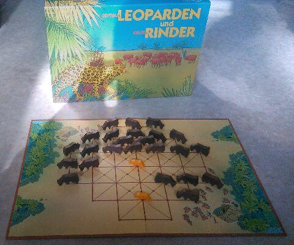{: width="480" height="401"}<!--[-->](../files/1991-12/leoparden-rinder.jpg)
* [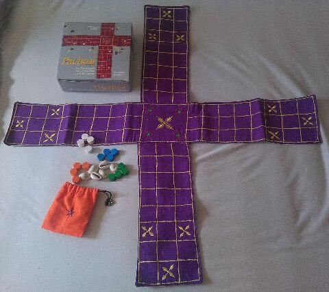{: width="480" height="426"}<!--[-->](../files/1991-12/pachesi.jpg)
* [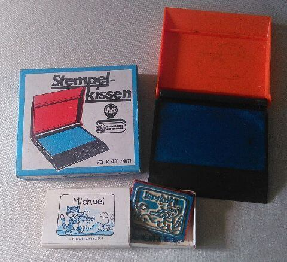{: width="480" height="438"}<!--[-->](../files/1991-12/stempel.jpg)
* [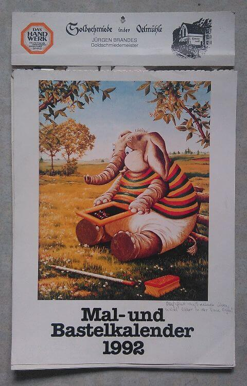{: width="480" height="751"}<!--[-->](../files/1991-12/kalender.jpg)

Mein Hauptgeschenk aber ist der Fischertechnik-Baukasten <i>Junior</i>. Wie auf den Fotos vom Weihnachtsbaum zu sehen ist, baue ich als eines der ersten Modelle einen Kranwagen. Ich trete auch gleich dem Fischertechnik-Fanclub bei.

Meine Oma backt mir ein Lebkuchenhaus (und im Hintergrund ist nochmal der gebastelte Obstkorb vom Herbst zu sehen).

{:.gallery}
* [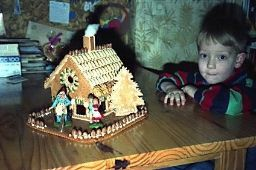{: width="256" height="170"}<!--[-->](../files/1991-12/lebkuchenhaus.jpg)