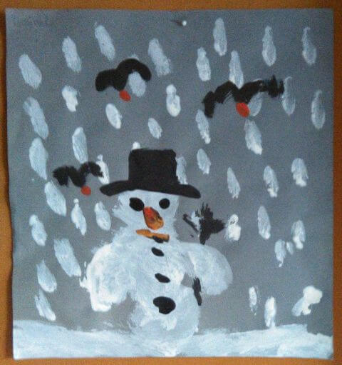
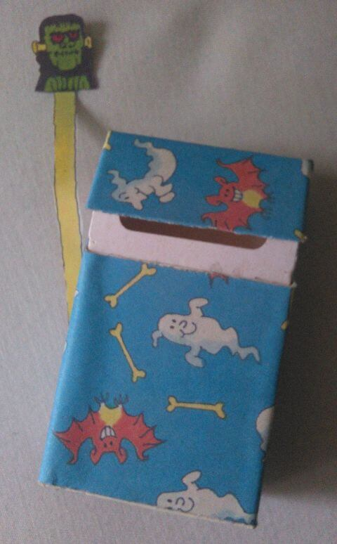
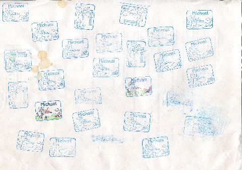
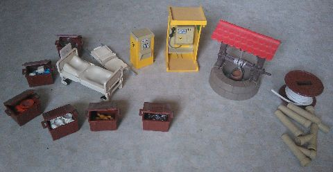

## Januar 1992

<table class="month">
<tr><th>Mo</th><th>Di</th><th>Mi</th><th>Do</th><th>Fr</th><th class="h2">Sa</th><th class="h1">So</th></tr>
<tr><td></td><td></td><td class="h1">1</td><td>2</td><td>3</td><td class="h2">4</td><td class="h1">5</td></tr>
<tr><td class="h1">6</td><td>7</td><td>8</td><td>9</td><td>10</td><td class="h2">11</td><td class="h1">12</td></tr>
<tr><td>13</td><td>14</td><td>15</td><td>16</td><td>17</td><td class="h2">18</td><td class="h1">19</td></tr>
<tr><td>20</td><td>21</td><td>22</td><td>23</td><td>24</td><td class="h2">25</td><td class="h1">26</td></tr>
<tr><td>27</td><td>28</td><td>29</td><td>30</td><td>31</td><td></td><td></td></tr>
</table>

Nach dem ereignisreichen Dezember beginnt das Jahr ohne besondere Vorkommnisse nur mit ein paar kleinen Bastelarbeiten.

Im Kindergarten gestalten wir ein Schneemann-Bild. Die Schneeflocken sind dabei weiße Fingerabdrücke. Zu Hause mache ich gleich noch ein zweites Bild, das ich meiner Tante I. schenke.

{:.gallery}
* [{: width="480" height="511"}<!--[-->](../files/1992-01/schneemann.jpg)

Aus dem <i>Marc-&-Penny</i>-Heft bastle ich ebenfalls, nämlich diese Gespenster-Bühne in einer Zigarettenschachtel. (Da bei uns zum Glück niemand raucht, stammt die Schachtel aus der Papiermülltonne.)

{:.gallery}
* [{: width="480" height="774"}<!--[-->](../files/1992-01/gespenster.jpg)

Und natürlich beschäftige ich mich mit meinen Weihnachtsgeschenken. Ich probiere meinen neuen Stempel aus und baue Modelle aus Fischertechnik, meist nach Plan, seltener nach eigenen Vorstellungen.

{:.gallery}
* [{: width="480" height="337"}<!--[-->](../files/1992-01/stempel.jpg)

Ich bekomme auch noch ein verspätetes Weihnachtsgeschenk: Wir bestellen ein Paket mit verschiedenen Playmobil-Einzelteilen, gerade so viel, dass es über 50&nbsp;DM kostet und wir dafür einen Playmobil-Clown als Schlüsselanhänger für mein Fahrradschloss kostenlos dazu bekommen.

{:.gallery}
* [{: width="480" height="248"}<!--[-->](../files/1992-01/playmobil.jpg)

Für den Ziehbrunnen müsste man eigentlich ein Loch in den Boden bohren, damit man den Eimer hinablassen kann, aber das geht natürlich nicht.

Schon länger besitze ich mehrere Kassetten, vor allem mit Kinderliedern. In diesem Jahr kommen nun die ersten Benjamin-Blümchen-Kassetten dazu, zunächst <i>… als Ballonfahrer</i> und <i>Meine schönsten Lieder</i>.
