## Februar 1992

<table class="month">
<tr><th>Mo</th><th>Di</th><th>Mi</th><th>Do</th><th>Fr</th><th class="h2">Sa</th><th class="h1">So</th></tr>
<tr><td></td><td></td><td></td><td></td><td></td><td class="h2">1</td><td class="h1">2</td></tr>
<tr><td>3</td><td>4</td><td>5</td><td>6</td><td>7</td><td class="h2">8</td><td class="h1">9</td></tr>
<tr><td>10</td><td>11</td><td>12</td><td>13</td><td>14</td><td class="h2">15</td><td class="h1">16</td></tr>
<tr><td>17</td><td>18</td><td>19</td><td>20</td><td>21</td><td class="h2">22</td><td class="h1">23</td></tr>
<tr><td>24</td><td>25</td><td>26</td><td>27</td><td>28</td><td class="h2">29</td><td></td></tr>
</table>

Der Februar steht ganz im Zeichen von Fastnacht. Am 27. Februar findet im Kindergarten zunächst Hemdglunker statt, am Tag darauf das Kostümfest. Dieses Jahr lautet das Motto „Kinder aus aller Welt“ (nein, den Begriff „kulturelle Aneignung“ gibt es noch nicht), und so verkleide ich mich als Chinese. Schon vor einem Jahr habe ich den gelben Hut mit dem Zopf in einem Laden gefunden, auch wenn ich da noch nicht wissen konnte, dass er dieses Jahr perfekt passt. Das Hemd aus glattem gelben Stoff mit chinesischen Schriftzeichen näht meine Oma für mich. Wie auf dem Gruppenbild zu sehen ist, bin ich bin nicht der einzige Chinese.

{:.gallery}
* [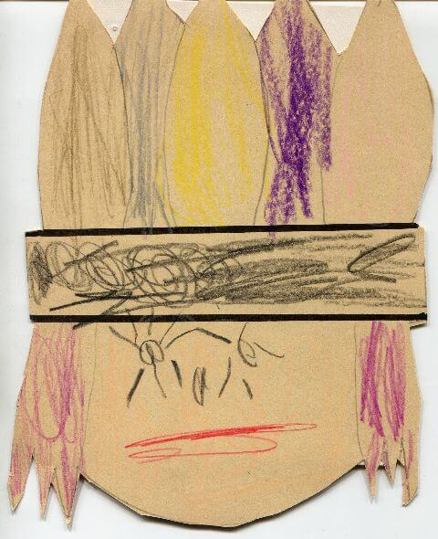{: width="480" height="590"}<!--[-->](../files/1992-02/einladung.jpg)

  Einladung
* [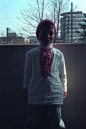{: width="171" height="256"}<!--[-->](../files/1992-02/hemdglunker1.jpg)
* [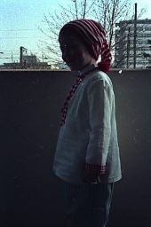{: width="170" height="256"}<!--[-->](../files/1992-02/hemdglunker2.jpg)
* [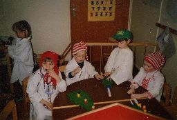{: width="256" height="174"}<!--[-->](../files/1992-02/hemdglunker3.jpg)
* [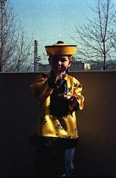{: width="167" height="256"}<!--[-->](../files/1992-02/fastnacht1.jpg)
* [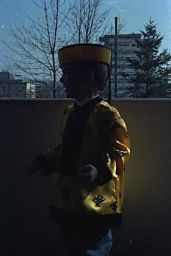{: width="171" height="256"}<!--[-->](../files/1992-02/fastnacht2.jpg)
* [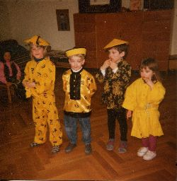{: width="250" height="256"}<!--[-->](../files/1992-02/fastnacht3.jpg)

Passend zu Fastnacht basteln wir auch im Kindergarten. Zum einen eine Rassel, zum anderen zwei gefaltete Männchen, von denen ich eines als Clown, das andere als Chinese gestalte. Noch einen Chinesen bringe ich aus dem Kindergarten nach Hause, ein Bild, das nicht ich gemalt habe, sondern Britta, eine Kindergartenfreundin, die es mir schenkt.

{:.gallery}
* [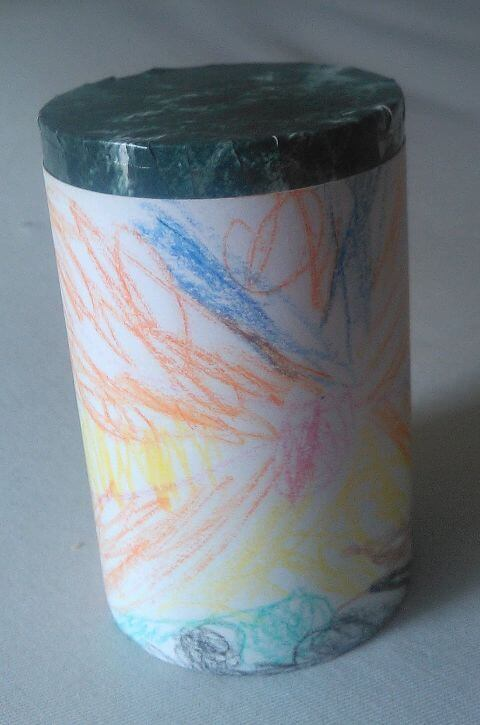{: width="480" height="725"}<!--[-->](../files/1992-02/rassel.jpg)
* [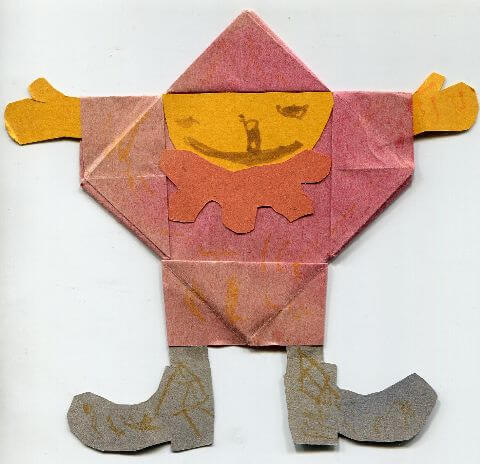{: width="480" height="464"}<!--[-->](../files/1992-02/clown.jpg)
* [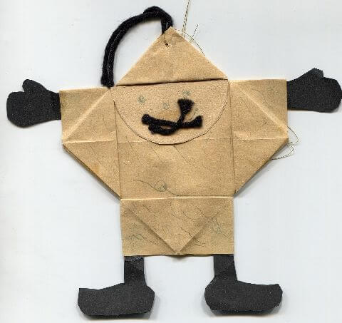{: width="480" height="453"}<!--[-->](../files/1992-02/chinese.jpg)
* [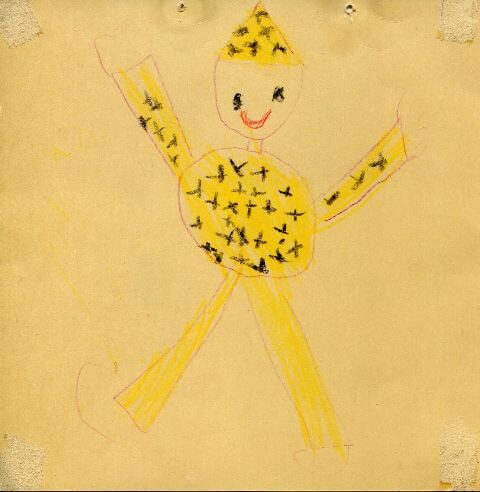{: width="480" height="492"}<!--[-->](../files/1992-02/chinese-britta.jpg)

  Von Britta für Michael

Auch bei meiner Großmutter und meiner Tante bin ich am Fastnachtswochenende in Verkleidung zu Besuch.

{:.gallery}
* [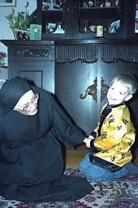{: width="170" height="256"}<!--[-->](../files/1992-02/fastnacht4.jpg)
* [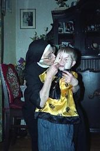{: width="170" height="256"}<!--[-->](../files/1992-02/fastnacht5.jpg)

Der Rest der Verwandtschaft ist ebenfalls zum großen Teil da, wir schauen dem Umzug vom offenen Fenster aus zu, jedenfalls so lange, bis eine Gruppe Hexen eine große Ladung Konfetti ins Zimmer wirft und mich damit erschreckt.

Meiner Großmutter kann man übrigens ihr hohes Alter von fast 90 Jahren deutlich ansehen.

{:.gallery}
* [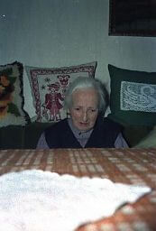{: width="173" height="256"}<!--[-->](../files/1992-02/grossmutter1.jpg)
* [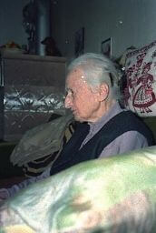{: width="172" height="256"}<!--[-->](../files/1992-02/grossmutter2.jpg)