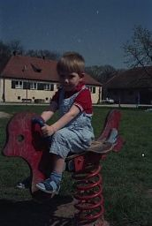
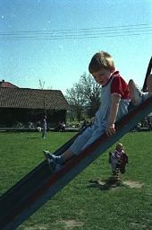
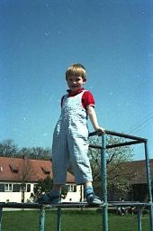
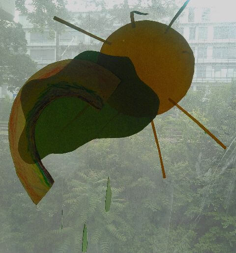
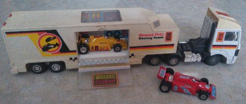
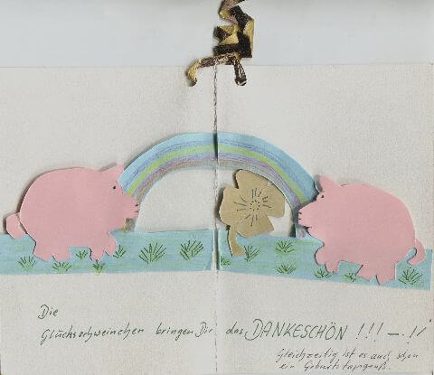

## März 1992

<table class="month">
<tr><th>Mo</th><th>Di</th><th>Mi</th><th>Do</th><th>Fr</th><th class="h2">Sa</th><th class="h1">So</th></tr>
<tr><td></td><td></td><td></td><td></td><td></td><td></td><td class="h1">1</td></tr>
<tr><td class="h2">2</td><td>3</td><td>4</td><td>5</td><td>6</td><td class="h2">7</td><td class="h1">8</td></tr>
<tr><td>9</td><td>10</td><td>11</td><td>12</td><td>13</td><td class="h2">14</td><td class="h1">15</td></tr>
<tr><td>16</td><td>17</td><td>18</td><td>19</td><td>20</td><td class="h2">21</td><td class="h1">22</td></tr>
<tr><td>23</td><td>24</td><td>25</td><td>26</td><td>27</td><td class="h2">28</td><td class="h1">29</td></tr>
<tr><td>30</td><td>31</td><td></td><td></td><td></td><td></td><td></td></tr>
</table>

Der März beginnt mit einem Ausflug; wohin er geht, kann ich nicht sagen, aber auf einem Spielplatz dort werden drei Fotos gemacht. (Zumindest vermute ich, dass die Fotos Anfang März entstanden sind, datiert sind sie jedoch nicht.)

{:.gallery}
* [{: width="172" height="256"}<!--[-->](../files/1992-03/spielplatz1.jpg)
* [{: width="170" height="256"}<!--[-->](../files/1992-03/spielplatz2.jpg)
* [{: width="170" height="256"}<!--[-->](../files/1992-03/spielplatz3.jpg)

Im Kindergarten basteln wir natürlich wieder, vielleicht ist es in diesem Monat diese Regenwolke.

{:.gallery}
* [{: width="480" height="515"}<!--[-->](../files/1992-03/wolke.jpg)

Damit wir die Farben des Regenbogens richtig anordnen, schauen wir uns vorher Bilder in einem Buch dazu an.

Zum Geburtstag meiner Mama kommen Oma und Opa zu Besuch und bringen dabei nicht nur eine Torte mit, die meine Oma gebacken hat, sondern auch ein Geschenk für mich: einen Autotransporter mit drei Rennautos.

{:.gallery}
* [{: width="480" height="204"}<!--[-->](../files/1992-03/transporter.jpg)

Und schließlich bedankt sich meine Tante mit einer gebastelten Faltkarte mit Regenbogen, Kleeblatt und Schweinchen für mein Bild vom [Januar](1992-01-01-a.md).

{:.letter}
> ♥lichen Glückwunsch Dir, lieber Michael, zum gut gelungenen Schneemannbild.
>
> {:.gallery}
> * [{: width="480" height="415"}<!--[-->](../files/1992-03/karte.jpg)
>
> Die Glücksschweinchen bringen Dir das DANKESCHÖN!!!–!¡
>
> Gleichzeitig ist es auch schon ein Geburtstagsgruß.