## April 1992

<table class="month">
<tr><th>Mo</th><th>Di</th><th>Mi</th><th>Do</th><th>Fr</th><th class="h2">Sa</th><th class="h1">So</th></tr>
<tr><td></td><td></td><td>1</td><td>2</td><td>3</td><td class="h2">4</td><td class="h1">5</td></tr>
<tr><td>6</td><td>7</td><td>8</td><td>9</td><td>10</td><td class="h2">11</td><td class="h1">12</td></tr>
<tr><td>13</td><td>14</td><td>15</td><td>16</td><td class="h1">17</td><td class="h2">18</td><td class="h1">19</td></tr>
<tr><td class="h1">20</td><td>21</td><td>22</td><td>23</td><td>24</td><td class="h2">25</td><td class="h1">26</td></tr>
<tr><td>27</td><td>28</td><td>29</td><td>30</td><td></td><td></td><td></td></tr>
</table>

Der April ist angefüllt mit vielen verschiedenen Ereignissen.

### Geburtstag

Zum Geburtstag bekomme ich wieder einige Glückwunschkarten.

Eine Karte kommt von meiner Oma:

{:.letter}
> 
Zum 14. April 1992

>
> Lieber Michael!
>
> Herzlichen Glückwunsch zu Deinem Geburtstag und viel Spaß bei Deiner ersten Feier mit Deinen Freunden.
>
> Nun bist du schon 5 Jahre alt und wir wünschen Dir, daß Du weiterhin gesund und fröhlich bleibst.
>
> Dein Geburtstagsgeschenk steht schon bereit und wartet auf dich, bis Du am Samstag kommst. Hoffentlich gefällt es dir?
>
> Dann kommt ja am Sonntag auch der Osterhase in Opas Garten. Ob er wieder etwas für Dich bringt?
>
> Ich ruf am Dienstagabend an; vielleicht sagst Du mir, wie alles war?
>
> Liebe Grüße von Oma, Opa u. Onkel T.

Meine Cousine gratuliert mir auch zusammen mit ihren Eltern, auf welche Erkrankung sie sich bezieht, kann ich nicht mehr feststellen, zur Auswahl stehen unter anderem Keuchhusten, Windpocken und eine Mittelohrentzündung.

{:.letter}
> Lieber Michael!
>
> Zum Geburtstag wünsche ich Dir alles Gute und vor allem, daß Du wieder richtig gesund wirst.
>
> Laß Dich reich beschenken und verwöhnen.
>
> Deine S. 
> mit W. u. A.

Die Karte aus dem Kindergarten ist [wie letztes Jahr](1991-04-01-a.md) mit vielen Blumen verziert:

{:.letter}
> 
April ’92

>
> Lieber Michael!
>
> Zu Deinem **5.** Geburtstag wünschen wir Dir alles Liebe und Gute.
>
> Deine Kindergartenfreunde

Und schließlich bekomme ich noch eine Glückwunschkarte aus dem Salamander-Schuhgeschäft, für die ich auch noch ein kleines Geschenk erhalte, vermutlich einen Kasten mit Holzbausteinen oder einen Ansteckbutton.

{:.gallery}
* [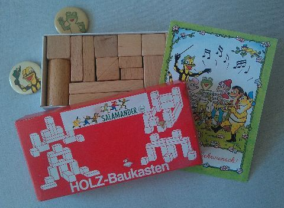{: width="480" height="352"}<!--[-->](../files/1992-04/bausteine.jpg)

Wie es in der Karte von meiner Oma steht, lade ich zum ersten Mal auch Freunde zu meiner Geburtstagsfeier ein: Kim und Benjamin.

{:.gallery}
* [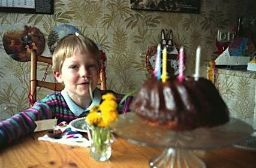{: width="256" height="168"}<!--[-->](../files/1992-04/geburtstag-1.jpg)
* [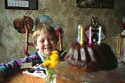{: width="256" height="169"}<!--[-->](../files/1992-04/geburtstag-2.jpg)

Die Sitzplätze sind gekennzeichnet mit kleinen Schiffen, auf deren Segel die Namen stehen. Gebastelt sind die Schiffe aus Walnussschalen mit einem Mast aus einem Zahnstocher, der mit etwas Knetmasse befestigt ist. Die Knetmasse stabilisiert das Schiff auch, vermutlich würde es sogar schwimmen. Zur Feier des Tages gibt es einen kleinen Strauß Löwenzahn und einen Schokoladenkuchen.

Wir spielen auch einige Spiele, wie etwa Topfschlagen oder Autos-Aufwickeln, ein etwas verändertes Spiel aus <i>Das große Spielebuch</i> von Hajo Bücken. Dazu nimmt man Spielzeugautos, befestigt an ihnen eine lange Schnur, das andere Schnurende kommt an eine leere Klopapierrolle. Auf ein Startzeichen beginnen nun alle, ihre Rolle zu drehen, dass sich die Schnur aufwickelt und das Auto heranrollt; gewonnen hat, wer dies am schnellsten schafft.

Was Kim mir schenkt, kann ich nicht mehr sagen, von Benjamin bekomme ich vermutlich ein Puzzle mit einem Baustellenmotiv.

Weitere Geburtstagsgeschenke sind wohl ein Spielzeug-Arztkoffer und – wie im Vorjahr – ein Playmobil-Baustellenfahrzeug.

{:.gallery}
* [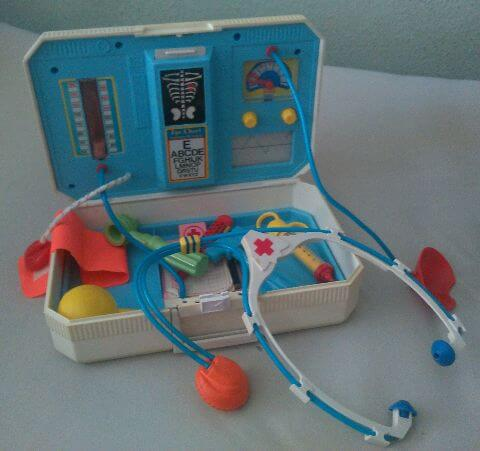{: width="480" height="451"}<!--[-->](../files/1992-04/arztkoffer.jpg)
* [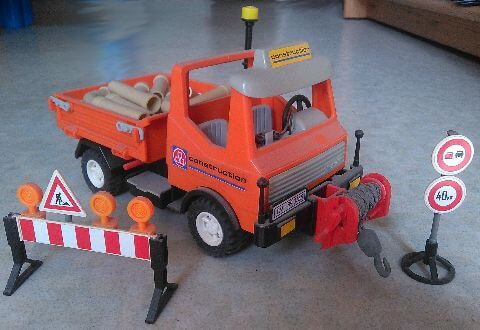{: width="480" height="330"}<!--[-->](../files/1992-04/baustelle.jpg)

### Ostern

Kurz nach meinem Geburtstag ist dann schon Ostern. Im Kindergarten feiern wir am 15. April wieder mit Eiersuche und einem neuen Osterkörbchen, anschließend sind Ferien bis zum 26. April.

{:.gallery}
* [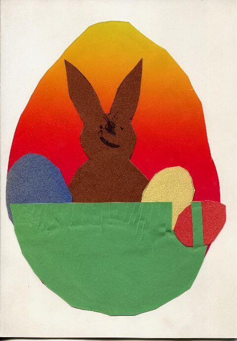{: width="480" height="690"}<!--[-->](../files/1992-04/einladung.jpg)

  Einladung
* [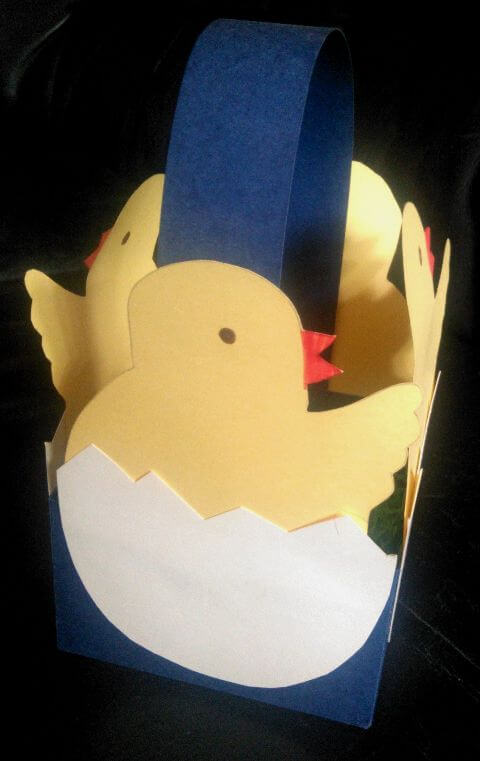{: width="480" height="761"}<!--[-->](../files/1992-04/koerbchen.jpg)

Gebastelt haben wir auch: Schon auf dem Geburtstagsfoto ist der Hase zu sehen, den wir im Kindergarten gebastelt haben (und dahinter der [Pinnwand-Apfel](1990-09-01-a.md)), außerdem gestalten wir ein ausgeblasenes Ei mit Fingerfarbe und eines aus Karton, bei dem ein Küken zum Vorschein kommt, wenn man an der Schnur zieht.

{:.gallery}
* [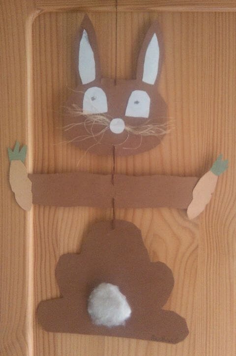{: width="480" height="722"}<!--[-->](../files/1992-04/hase.jpg)
* [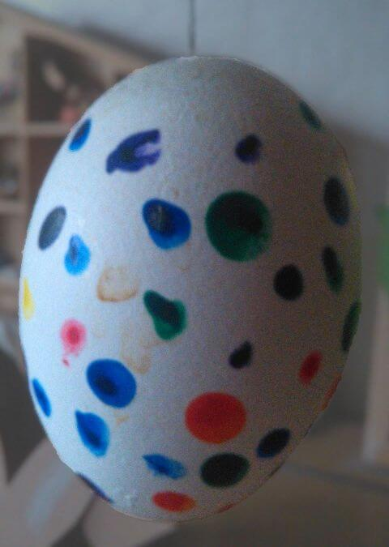{: width="480" height="675"}<!--[-->](../files/1992-04/ei.jpg)
* [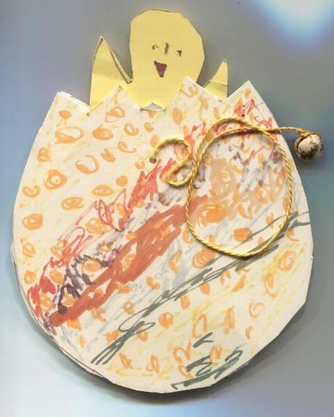{: width="480" height="598"}<!--[-->](../files/1992-04/ziehei.jpg)

Über Ostern fahren wir wieder zu Oma und Opa, wo im Garten die Blumen blühen. Das Gartenhäuschen ist übrigens – man kann es auf dem zweiten Foto fast erkennen – nach mir benannt.

{:.gallery}
* [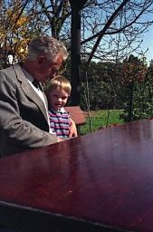{: width="169" height="256"}<!--[-->](../files/1992-04/oma-opa-1.jpg)
* [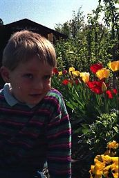{: width="172" height="256"}<!--[-->](../files/1992-04/oma-opa-2.jpg)
* [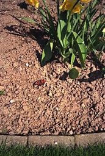{: width="172" height="256"}<!--[-->](../files/1992-04/oma-opa-3.jpg)
* [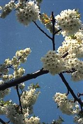{: width="171" height="256"}<!--[-->](../files/1992-04/oma-opa-4.jpg)
* [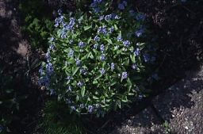{: width="256" height="169"}<!--[-->](../files/1992-04/oma-opa-5.jpg)

Vielleicht ist es auch dieses Osterfest, zu dem ich folgendes Lied – zu bekannter Melodie zu singen – dichte (aufgeschrieben hat es mein Papa für mich):

> Alle Jahre wieder 
> kommt der Osterhas’ 
> Auf die Wiesen nieder 
> in das grüne Gras.
>
> Bringt ganz bunte Eier 
> Echt und aus Schok’lad’ 
> Und verschwindet da-ann 
> Mit dem Fahrarad!

### Weiteres

Nach Ostern hat dann auch Kim Geburtstag, so wie ich ihn eingeladen habe, lädt er mich ein.

Noch ein weiteres Mal lade ich in diesem Monat Kim und Benjamin ein, aber es kann nicht mein Geburtstag sein, denn diesmal ist auch Britta dabei. Wir malen viele Bilder, hier eine kleine Auswahl (mit Schwerpunkt auf meinen Bildern, denn immerhin geht es auf diesen Seiten ja um mich):

{:.gallery}
* [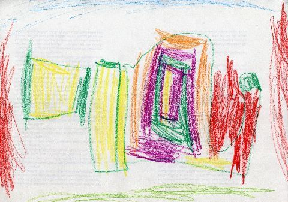{: width="480" height="337"}<!--[-->](../files/1992-04/kim.jpg)

  Kim
* [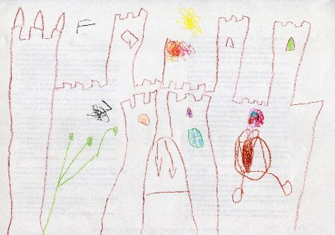{: width="480" height="338"}<!--[-->](../files/1992-04/benjamin.jpg)

  Benjamin
* [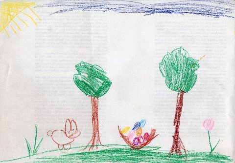{: width="480" height="334"}<!--[-->](../files/1992-04/britta.jpg)

  Britta

{:.image}
> [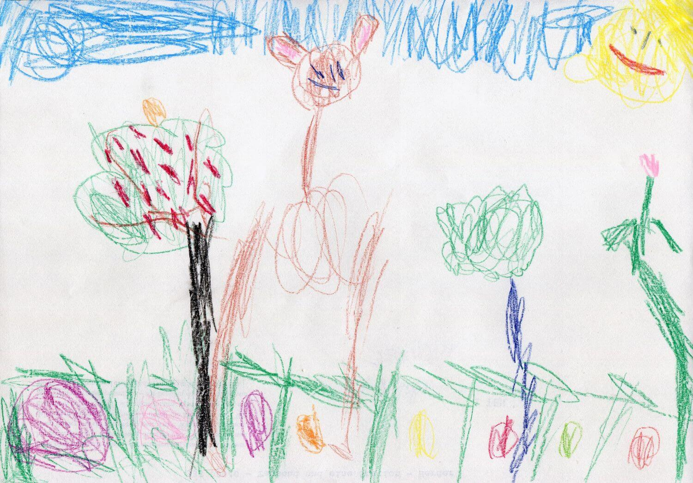{: width="1500" height="1046"}<!--[-->](../files/1992-04/bild-1.jpg)

{:.image}
> [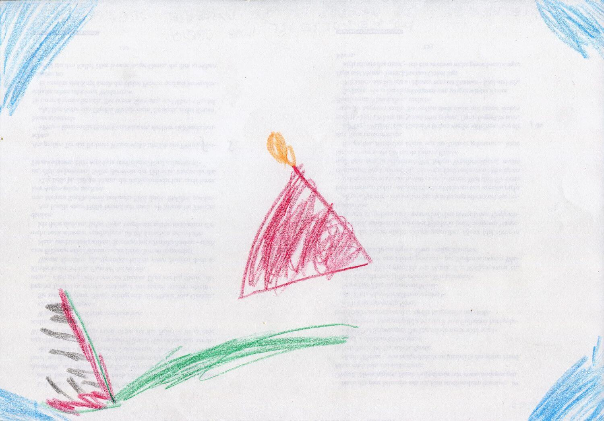{: width="1500" height="1046"}<!--[-->](../files/1992-04/bild-2.jpg)
>
> Kasperletheater: Das Krokodil hat das Kasperle aufgefressen, nur die Mütze ist noch übrig.

Und als wären all diese Ereignisse noch nicht genug, gibt es auch noch ein paar Fotos vom Malefiz-Spielen auf dem Balkon. Das Spiel ist Teil einer Spielesammlung (<i>Das Goldene Spielemagazin</i>), die auch noch weitere Klassiker enthält: Mensch ärgere Dich nicht, Fang den Hut, Backgammon, Mühle und Dame. Ich spiele natürlich immer mit den roten Figuren, meine Mama nimmt Gelb, mein Papa Blau.

{:.gallery}
* [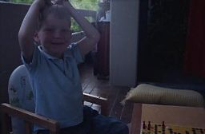{: width="256" height="168"}<!--[-->](../files/1992-04/balkon-1.jpg)
* [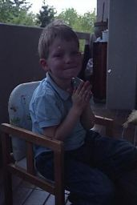{: width="171" height="256"}<!--[-->](../files/1992-04/balkon-2.jpg)
* [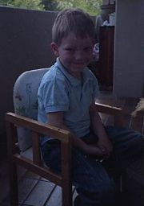{: width="180" height="256"}<!--[-->](../files/1992-04/balkon-3.jpg)