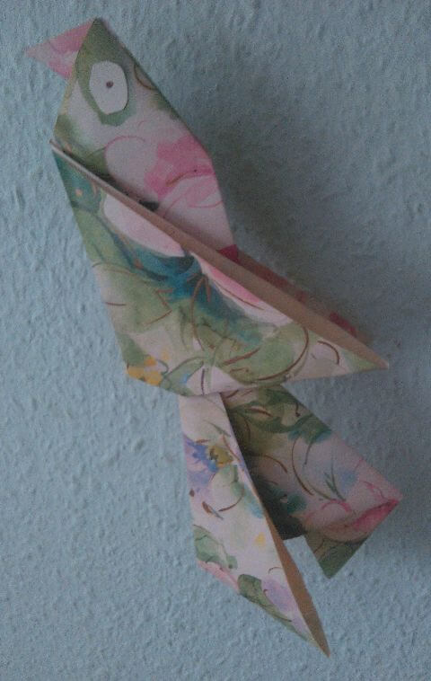
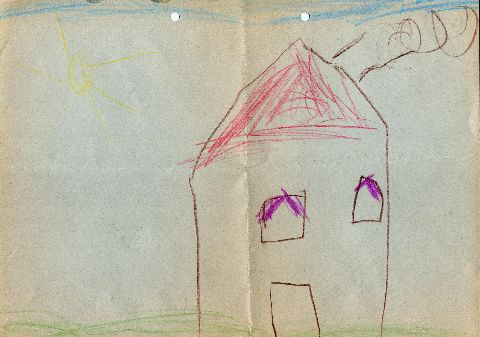
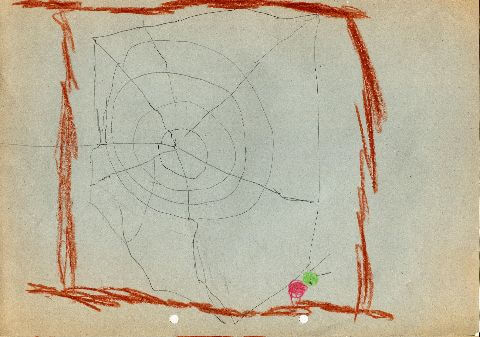
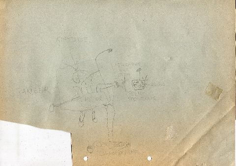

## Mai 1992

<table class="month">
<tr><th>Mo</th><th>Di</th><th>Mi</th><th>Do</th><th>Fr</th><th class="h2">Sa</th><th class="h1">So</th></tr>
<tr><td></td><td></td><td></td><td></td><td class="h1">1</td><td class="h2">2</td><td class="h1">3</td></tr>
<tr><td>4</td><td>5</td><td>6</td><td>7</td><td>8</td><td class="h2">9</td><td class="h1">10</td></tr>
<tr><td>11</td><td>12</td><td>13</td><td>14</td><td>15</td><td class="h2">16</td><td class="h1">17</td></tr>
<tr><td>18</td><td>19</td><td>20</td><td>21</td><td>22</td><td class="h2">23</td><td class="h1">24</td></tr>
<tr><td>25</td><td>26</td><td>27</td><td class="h1">28</td><td>29</td><td class="h2">30</td><td class="h1">31</td></tr>
</table>

Nachdem der April so voll war mit Ereignissen, ist im Kontrast dazu im Mai fast nichts los. Wie üblich basteln wir wohl im Kindergarten, vielleicht diesen Vogel.

{:.gallery}
* [{: width="480" height="758"}<!--[-->](../files/1992-05/vogel.jpg)

Gefaltet wird der Vogel aus zwei quadratischen Stücken Geschenkpapier. Das erste Quadrat wird diagonal zu einem Dreieck gefaltet und dieses durch eine weitere Faltung an der Mittellinie zu einem kleineren Dreieck halbiert. Ein Schenkel dieses Dreiecks ist geschlossen, der andere offen. Die Ecke am geschlossenen Schenkel faltet man für den Schnabel je einmal nach vorne und nach hinten, dann drückt man sie mittig ein (das lässt sich leichter durchführen als beschreiben). An der anderen Ecke faltet man beide Stücke als Flügel nach hinten. Das zweite Quadrat wird ebenfalls diagonal zu einem Dreieck gefaltet, die andere Diagonale kann man durch eine Faltung markieren. Nun faltet man die beiden Schenkel des Dreiecks zu dieser Mittellinie, den einen nach vorne, den anderen nach hinten. Zum Schluss klebt man die beiden Teile ineinander und klebt noch zwei Augen auf, fertig ist der Vogel.

Außerdem male ich daheim wohl wieder ein paar Bilder, möglicherweise diese hier:

{:.gallery}
* [{: width="480" height="337"}<!--[-->](../files/1992-05/haus.jpg)
* [{: width="480" height="337"}<!--[-->](../files/1992-05/spinne.jpg)
* [{: width="480" height="337"}<!--[-->](../files/1992-05/panzer.jpg)

Wenn das letzte Bild tatsächlich aus diesem Monat stammt, dann ist dieser Panzer wohl die erste von vielen Maschinen, die ich zeichne. Er ist offenbar elektrisch betrieben, ferngesteuert und kann Gift verspritzen.